# 章節 1 ｜ Web 基礎與環境建置

---

## <a id="toc"></a>目錄

- [1-1 網路基礎與 HTTP 協定](#CH1-1)
  - [1. 何謂 Server/Client?](#CH1-1-1)
  - [2. 網路通訊協定與 HTTP 基礎](#CH1-1-2)
  - [3. IP 位址與 Port](#CH1-1-3)
  - [4. URI 網址結構與網站運作流程](#CH1-1-4)
- [1-2 Web 伺服器與傳統 Web 開發基礎](#CH1-2)
  - [1. Java 手刻 HTTP 網頁伺服器](#CH1-2-1)
  - [2. Tomcat Server](#CH1-2-2)
  - [3. Servlet 介紹](#CH1-2-3)
  - [4. JSP 簡介與資料呈現](#CH1-2-4)
  - [5. 痛點反思與 Spring MVC 解決方案](#CH1-2-5)
- [1-3 Spring MVC 初探與環境建置](#CH1-3)
  - [1. 透過 Spring Initializr 建立專案](#CH1-3-1)
  - [2. 專案匯入、開啟與目錄結構解析](#CH1-3-2)
  - [3. 在 VS Code 中設定與啟動專案](#CH1-3-3)
  - [4. 啟動測試與靜態資源存取](#CH1-3-4)

---

> [!NOTE]
> 💡 **推薦閱讀工具設定**
> 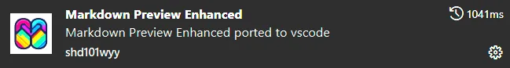
> 為了能在 VS Code 內流暢瀏覽本講義的排版與圖表，建議安裝擴充套件 **Markdown Preview Enhanced**。
> 同時，為獲得最佳的閱讀體驗，請在該套件的設定中進行以下調整：
>
> - **Preview Theme**：設定為 `Dark` > `github-dark.css`
> - **Code Block Theme**：設定為 `Dark` > `github-dark.css`

## <a id="CH1-1"></a>[1-1 網路基礎與 HTTP 協定](#toc)

網頁程式設計的基礎建立在網路通訊之上。在學習如何使用 Java 與 Spring 開發網站之前，我們必須先掌握網路世界的基本運作觀念。

### <a id="CH1-1-1"></a>[1. 何謂 Server/Client?](#toc)

- **伺服器端 Server**
  在電腦網路中，「Server 伺服器」是一個廣義的詞彙。它可以指看得見的硬體設備，也可以指運行在硬體之上、專門提供服務的軟體程式。

  | 分類         | 說明                                           | 舉例或特性                                             |
  | :----------- | :--------------------------------------------- | :----------------------------------------------------- |
  | **實體硬體** | 部署於機房的高效能電腦，負責提供運算資源。     | 比個人電腦更強大的 CPU、穩定的供電與 24 小時運作能力。 |
  | **軟體程式** | 安裝在作業系統上，專責處理特定需求的應用程式。 | Apache Tomcat、MySQL、Nginx 網頁伺服器。               |

  在開發領域中，我們更關注的是**軟體伺服器**。透過安裝適當的軟體，任何電腦都能成為特定功能的伺服器，來接收與處理客戶端的 **Request 請求**。

  > [!NOTE]
  > 💡 **常見的伺服器類型**
  > 包含 Web 網頁伺服器、資料庫伺服器、檔案伺服器與 Mail 郵件伺服器等。

<div style="display: flex; justify-content: center; align-items: end; gap: 80px; margin: 10px 0 10px 0; border: 3px solid #ccc; border-radius: 20px; padding: 10px;">
  <div style="text-align: center;">
    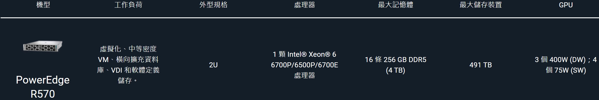
    <p style="margin-top: 10px;"><i>實體伺服器規格</i></p>
  </div>
</div>

<div style="display: flex; justify-content: center; align-items: end; gap: 80px; margin: 10px 0 10px 0;
border: 3px solid #ccc; border-radius: 20px; padding: 10px;"> 
  <div style="text-align: center;">
    
    <p style="margin-top: 10px;"><i>實體伺服器 Server</i></p>
  </div>
  <div style="text-align: center;">
    
    <p style="margin-top: 10px;"><i>機櫃</i></p>
  </div>
</div>

- **客戶端 Client**
  客戶端是指向伺服器發送 **Request 請求**，並接收 **Response 回應** 的程式或設備。其核心功能在於發起服務需求並展示處理結果。

  | 核心任務     | 說明                                                        |
  | :----------- | :---------------------------------------------------------- |
  | **發送請求** | 提供 UI 介面，協助使用者向伺服器發起資料查詢或操作指令。    |
  | **呈現結果** | 將伺服器回傳的資料（如 HTML）轉譯為圖形化介面呈現給使用者。 |

  最常見的客戶端為 Chrome 與 Edge 等網頁瀏覽器，其他亦包含智慧型手機、穿戴裝置以及各種具備連網能力的物聯網 IoT 設備。

  > [!TIP]
  > 💡 **生活化比喻：餐廳點餐**
  >
  > - **客戶端**：正在點餐的「顧客」，主動提出需求。
  > - **伺服器**：負責接收訂單、處理食材並出餐的「廚房」。
  > - **通訊網路**：在兩者之間傳遞菜單與餐點的「服務生」。

<div style="display: flex; gap: 80px; margin: 10px 0 10px 0;
border: 3px solid #ccc; border-radius: 20px; padding: 10px;">
  <div style="flex: 1; text-align: center;">
    
    <p style="margin-top: 10px;"><i>個人電腦</i></p>
  </div>
  <div style="flex: 1; text-align: center;">
    
    <p style="margin-top: 10px;"><i>其他客戶端裝置</i></p>
  </div>
</div>

客戶端與伺服器透過網路連線進行溝通，這就是經典的 **Client-Server 架構**，簡稱 C/S 架構。

<div style="display: flex; gap: 80px; margin: 10px 0 10px 0;
border: 3px solid #ccc; border-radius: 20px; padding: 10px;">
  <div style="flex: 1; text-align: center;">
    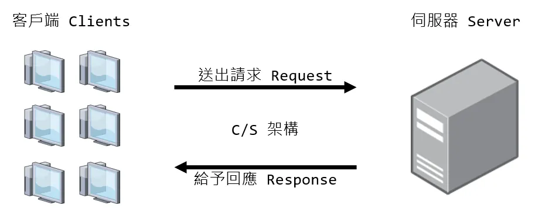
    <p style="margin-top: 10px;"><i>Client-Server 架構</i></p>
  </div>
</div>

---

### <a id="CH1-1-2"></a>[2. 網路通訊協定與 HTTP 基礎](#toc)

#### 1. 什麼是通訊協定 Protocol？

在 Server 與 Client 互相溝通之前，必須建立一套 **「共通的資料傳輸標準」**，這套標準即稱為 **通訊協定 Protocol**。就如同現實生活中，寄信必須填寫標準的地址格式、撥打電話必須遵守號碼規則一樣，網路設備也必須遵循特定的協定才能精準傳遞與解析資料。

**常見的網路通訊協定簡介**

|   協定名稱    | 英文全名                                          |         中文全名          | 說明                                                                                             |
| :-----------: | :------------------------------------------------ | :-----------------------: | :----------------------------------------------------------------------------------------------- |
|  **TCP/IP**   | Transmission Control Protocol / Internet Protocol | 傳輸控制協定/網際網路協定 | 網路通訊的基礎底層協定，以下所有連線都基於 TCP/IP 協定，負責將資料準確無誤地從 A 點傳送至 B 點。 |
|   **HTTP**    | HyperText Transfer Protocol                       |      超文本傳輸協定       | 網頁伺服器與瀏覽器之間傳送 HTML 網頁資料的核心協定。                                             |
|   **HTTPS**   | HyperText Transfer Protocol Secure                |    超文本傳輸安全協定     | HTTP 的安全加密版本，透過 SSL/TLS 加密傳輸資料，確保連線與資料安全。                             |
| **WebSocket** | -                                                 |        網路通訊端         | 能在 Server 與 Client 之間建立持久性雙向的連線，常運用於即時聊天室、報價系統或網頁遊戲。         |
|   **SMTP**    | Simple Mail Transfer Protocol                     |     簡易郵件傳輸協定      | 用於發送與傳輸電子郵件的標準網路協定。                                                           |
|    **FTP**    | File Transfer Protocol                            |       檔案傳輸協定        | 專門用來在網路上上傳與下載檔案的協定。                                                           |

#### 2. HTTP 超文本傳輸協定：Server 與 Client 的溝通主力

Web 開發中最常接觸的就是 **HTTP**，我們必須理解它的三大核心特性：

- **未加密明文傳輸**  
  HTTP 以**未加密明文**傳遞資料，被攔截即可直接讀取內容，因此現代網站幾乎都強制升級為 HTTPS。
  - `📌 設計原因：HTTP 誕生於 1991 年的學術網路環境，當時主要用途是共享論文與研究文件，網路使用者少且彼此信任，根本沒有加密的需求。`

- **基於請求與回應模型 Request-Response Model**  
  通訊必須由客戶端主動發起「請求 Request」，伺服器才會被動回傳「回應 Response」，伺服器無法主動推送資料。
  - `📌 設計原因：早期網路頻寬極為有限，若允許伺服器主動推送，將造成不可預期的流量與資源浪費。一問一答的模式讓通訊可控且易於實作。`

- **無狀態 Stateless**  
  每次請求與回應皆為獨立事件，伺服器預設不會保留前次連線的資訊。
  - `📌 設計原因：若伺服器必須記住每位使用者的狀態，將佔用大量記憶體與運算資源，嚴重限制可同時服務的連線數量。無狀態設計讓伺服器能更容易地水平擴展。`

#### 3. 常見的 HTTP 方法 Methods

| HTTP 方法 | 主要用途                   | 請求參數傳輸位置                   | 常見送出方式                                | 特性與安全性                                           |
| :-------: | :------------------------- | :--------------------------------- | :------------------------------------------ | :----------------------------------------------------- |
|  **GET**  | 取得資源 (Read)            | 附加於 URL 網址後方 (Query String) | 點選超連結、網址列直接輸入                  | 參數明文可見、長度受限，不適合傳輸機敏資料。           |
| **POST**  | 提交資料 (Create / Update) | 封裝於 Request Body 中             | `<form method="post">`、Ajax/Fetch 異步請求 | 稍微較具安全性、支援大容量資料，常用於登入或檔案上傳。 |

<div style="display: flex; gap: 80px; margin: 10px 0 10px 0;
border: 3px solid #ccc; border-radius: 20px; padding: 10px;">
  <div style="flex: 1; text-align: center;">
    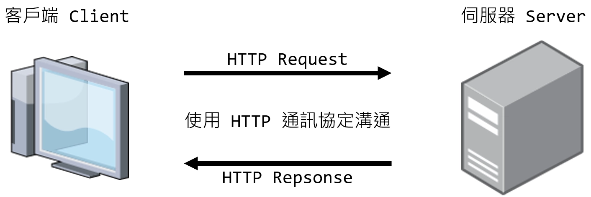
    <p style="margin-top: 10px;"><i>客戶端與伺服器溝通的手段：HTTP</i></p>
  </div>
</div>

---

### <a id="CH1-1-3"></a>[3. IP 位址與 Port](#toc)

我們現在知道了客戶端與伺服器之間，必須透過 HTTP 協定進行溝通，但它們在網路上要如何找到彼此？
這就需要 IP 位址與 Port 埠號。

<div style="display: flex; gap: 80px; margin: 10px 0 10px 0;
border: 3px solid #ccc; border-radius: 20px; padding: 10px;">
  <div style="flex: 1; text-align: center;">
    
    <p style="margin-top: 10px;"><i>Server 與 Client 如何找到對方？</i></p>
  </div>
</div>

- **IP 位址 Internet Protocol Address**
  就像是現實世界中的門牌號碼，用來定位網路上的一台裝置。沒有門牌，快遞員無法送達包裹；沒有 IP，資料封包也找不到目的地。

  接下來我們會從三個面向認識 IP 位址：**公開與私有的分類**、**IPv4 與 IPv6 的格式演進**，以及幫助延續 IPv4 壽命的**關鍵補充機制**。

  **1. 公開 IP 與私有 IP 比較**

  | 比較項目     | 公開 IP Public IP                  | 私有 IP Private IP                                                                              |
  | :----------- | :--------------------------------- | :---------------------------------------------------------------------------------------------- |
  | **定義**     | 網際網路上唯一的位址               | 區域網路內部專用的虛擬位址                                                                      |
  | **連線能力** | 可直接對外連線、被外部存取         | 僅限區網內部溝通，無法直接連上外部網路                                                          |
  | **取得方式** | 向中華電信等網路服務供應商申請分配 | 通常由家中的 Router 路由器自動分配                                                              |
  | **網段範圍** | 扣除私有與保留網段後的其餘 IP      | `10.0.0.0 ~ 10.255.255.255`<br>`172.16.0.0 ~ 172.31.255.255`<br>`192.168.0.0 ~ 192.168.255.255` |

  了解 IP 的「公私」分類後，接下來認識 IP 位址本身的**格式演進**，從目前主流的 IPv4 到為了解決位址枯竭而生的 IPv6。

  **2. IPv4 與 IPv6 比較**

  | 比較項目     | IPv4                                                                   | IPv6                                                                    |
  | :----------- | :--------------------------------------------------------------------- | :---------------------------------------------------------------------- |
  | **核心現況** | 目前最常見的格式                                                       | 為徹底解決 IPv4 數量耗盡問題而生                                        |
  | **格式長度** | 32 位元 (四組十進位數字)                                               | 128 位元 (八組 16 進位數字，以 `:` 分隔)                                |
  | **位址數量** | 約 43 億個 (已耗盡)                                                    | 號稱「能為地球上每一粒沙子分配」                                        |
  | **格式範例** | `8.8.8.8` (公開 IP)<br>`192.168.1.100` (私有 IP)<br>`127.0.0.1` (本機) | `2001:0db8:85a3:0000:0000:8a2e:0370:7334` (完整 IP)<br>`::1` (本機縮寫) |
  | **使用率**   | **現今主流約佔六至七成**。靠 NAT 技術延命                              | 逐年成長，但受限企業升級成本尚未完全取代                                |

  **3. 網路關鍵補充機制**
  - **子網路遮罩 Subnet Mask**
    用來區分 IP 位址中的「網路段」與「主機段」，例如常見的 `255.255.255.0`，幫助設備判斷目標 IP 是否與自己處在同一個區域網路內。

    > [!NOTE]
    > 💡 **知識補充（進階選讀）：如何計算子網路遮罩？**
    > 子網路遮罩與 IPv4 位址一樣是 32 位元，由 4 組 8 位元的二進位數字組成。
    > 計算規則是：**保留給「網路段」的部分全填 `1`，留給「主機段」的部分全填 `0`**。
    >
    > 以常見的 `/24` 網段為例，斜線後的數字代表前 24 個位元是網路段，皆為 1：
    >
    > - **二進位表示**：`11111111.11111111.11111111.00000000`
    > - **換算十進位**：`255.255.255.0`
    >
    > 設備會將自己的 IP 位址與子網路遮罩進行「AND 邏輯運算」_(提示：AND 運算規則就是「兩個都是 1 結果才是 1，其餘皆為 0」)_，藉此算出自己所在的子網路範圍，以便判斷欲連線的目標是否與自己在同一個區網。
    >
    > **【計算範例】：以 `192.168.1.123/24` 為例**
    >
    > - **IP 位址**：`192.168.1.123`
    > - **子網路遮罩**：`/24` 表示前 24 個位元為網路段，即 `255.255.255.0`。
    > - **網段範圍計算**
    >
    >   ```text
    >     11000000.10101000.00000001.01111011 (IP: 192.168.1.123)
    >   & 11111111.11111111.11111111.00000000 (Mask: 255.255.255.0)
    >   -----------------------------------------------------------
    >     11000000.10101000.00000001.00000000 (網段: 192.168.1.0)
    >   ```
    >
    >   兩者做 AND 運算，可得出網路段位址為 `192.168.1.0`。
    >
    > - **可用主機數 Hosts**：主機段剩下 8 個位元（即二進位的 `00000000` 到 `11111111`）。扣除全為 `0` 的「網路位址 192.168.1.0」與全為 `1` 的「廣播位址 192.168.1.255」，這個網段實際**可分配給設備的主機 IP 數量為 254 個**，範圍從 `192.168.1.1` 到 `192.168.1.254`。

  - **NAT 機制 Network Address Translation**
    為了解決 IPv4 枯竭的燃眉之急而誕生的技術。它可以讓區域網路內的多台設備，各自擁有私有 IP，**共用同一個對外的「公開 IP」** 來連上網際網路。這是目前最普遍的做法！

    以現實生活來比喻：一家公司雖然有數十位員工，但對外辦公室只有一組代表電話號碼。外部來電打這個號碼，總機再轉接給內部分機。NAT 就像這個公司的「總機系統」，Router 路由器讓所有家中的設備各自擁有私有 IP 分機，卻共用同一個公開 IP 代表號碼與外界通訊。

<div style="display: flex; gap: 80px; margin: 10px 0 10px 0;
border: 3px solid #ccc; border-radius: 20px; padding: 10px;">
  <div style="flex: 1; text-align: center;">
    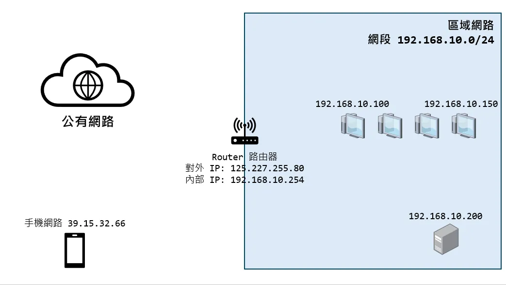
    <p style="margin-top: 10px;"><i>NAT 機制與區域網路</i></p>
  </div>
</div>

- **Port 埠號**
  一台電腦可以同時提供多種網路服務。Port 就像是這棟大樓中的「分機號碼」或「樓層門牌」，用來區分同一台電腦裡不同的網路服務。

  **Port 可用區間分類**
  在電腦網路中，Port 號的範圍是從 `0` 到 `65535`，總共 65536 個。根據 IANA（網際網路號碼分配局）的規定，大略被劃分為三大區間：
  1. **知名 / 系統通訊埠 (Well-Known Ports, 0 ~ 1023)**
     保留給系統核心與常見網路服務，如 HTTP, FTP, SSH 等的專用 Port。一般應用程式不建議、且通常沒有權限去使用這個範圍。
  2. **註冊通訊埠 (Registered Ports, 1024 ~ 49151)**
     提供給一般軟體或企業應用程式，如連線資料庫 MySQL 3306、伺服器 Tomcat 8080 等使用的範圍。開發者在撰寫自訂服務時，通常會選擇這個區間的數字。
  3. **動態 / 私有通訊埠 (Dynamic / Private Ports, 49152 ~ 65535)**
     通常是作業系統用來「動態分配」給客戶端發起連線時使用的臨時 Port。例如每次瀏覽器開新分頁連上網站，作業系統就會在這裡隨機挑一個 Port 使用，結束後隨即回收。

  **常見的系統與網路服務 Port 號一覽表**

  | 服務 / 應用程式 | 預設 Port 號 | 說明                                                         |
  | :-------------- | :----------- | :----------------------------------------------------------- |
  | **HTTP**        | `80`         | 一般未加密的網頁通訊預設通訊埠，在瀏覽器上輸入時會自動隱藏。 |
  | **HTTPS**       | `443`        | 加密安全的網頁通訊預設通訊埠，在瀏覽器上輸入時會自動隱藏。   |
  | **Tomcat**      | `8080`       | Java Web 開發環境中最常用的測試伺服器預設 Port。             |
  | **MySQL**       | `3306`       | 開源且極受歡迎的關聯式資料庫。                               |
  | **MSSQL**       | `1433`       | 微軟的 SQL Server 資料庫。                                   |
  | **SSH**         | `22`         | 安全的遠端終端機連線，是 Linux 系統管理必備。                |
  | **SMTP**        | `25`         | 發送 Email 電子郵件的通訊協定。                              |
  | **FTP**         | `21`         | 檔案傳輸協定，用來上傳與下載檔案。                           |
  | **DNS**         | `53`         | 網域名稱解析服務，負責將網址轉換為對應的 IP 位址。           |

---

### <a id="CH1-1-4"></a>[4. URI 網址結構與網站運作流程](#toc)

**URI 統一資源識別碼 Uniform Resource Identifier** 是用來唯一標識網路上資源的一串字元。它可以是資源的名稱，也可以是資源的位置，或者兩者皆是。而我們平常熟悉的 **URL 網址** 就是 URI 的一種最常見形式。

> [!NOTE]
> 💡 **知識補充：URI、URL 與 URN 的差異**
> 在網路上尋找資源時，除了 URI，我們也常聽到 URL 和 URN。它們的關係如下：
>
> - **URI 統一資源識別碼**
>   最廣義的統稱，只要能「唯一標識」資源的字串都是 URI。
> - **URL 統一資源定位器**
>   不僅標識資源，還提供「如何找到它」的具體路徑，例如 `https://www.ispan.com.tw` 。就像一個人的**「聯絡地址」**，告訴你怎麼去找他。
> - **URN 統一資源名稱**
>   只定義資源的「專有名字」，但不提供位置，例如書籍的 ISBN 碼 `978-0321965516` 。就像一個人的**「身分證字號」**，永遠唯一，但你不知道他在哪裡。
>
> **簡單來說，URL 和 URN 都是 URI 的子集，只要能唯一辨識出目標，什麼方式都可以統稱為 URI。**

讓我們拆解一個典型的 **URI**（以最常見的 URL 形式為例）：
`http://localhost:8080/users/info?id=123`

- **Protocol 通訊協定**：`http://`，告訴瀏覽器使用 HTTP 方式溝通
- **Host 主機 IP**：`localhost`，目標機器的位址
- **Port 埠號**：`:8080`，目標機器上的服務
- **Path 路徑**：`/users/info`，伺服器內的資源位置或路由
- **Query String 查詢字串**：`?id=123`，GET 請求附帶的參數，多個參數時可用 `&` 連接

當我們在瀏覽器送出這段網址後，直到網頁畫面順利渲染，背後實際上經歷了以下標準流程：

1. **分析 URL 與 DNS 解析**：瀏覽器分析網址找出網域後，透過 DNS 機制將網域翻譯成目標伺服器的真實 IP 位址。
2. **建立 TCP 連線**：找到 IP 後，客戶端與伺服器會透過「三次封包交換」確認彼此收發能力，建立起可靠的連線。
3. **發送 HTTP Request**：瀏覽器將請求打包成標準格式，包含 HTTP 方法、標頭與參數等，並發送封包給伺服器。
4. **Web 伺服器接收與處理**：伺服器軟體（如 Tomcat）接收網路封包後，轉換交由 Java 程式執行商業邏輯與資料庫存取。
5. **回傳 HTTP Response**：伺服器將執行結果，包含狀態碼、網頁資料打包成回應封包，傳送回瀏覽器。
6. **Browser 渲染畫面**：瀏覽器由上到下解析 HTML、建構 DOM 樹，途中並額外下載所需的 CSS/JS 等靜態資源後，最終渲染繪製出網頁。
7. **斷開連線**：資料傳輸完成且短期不再通訊後，雙方中斷 TCP 連線以釋放資源。

<div style="display: flex; gap: 80px; margin: 10px 0 10px 0;
border: 3px solid #ccc; border-radius: 20px; padding: 10px;">
  <div style="flex: 1; text-align: center;">
    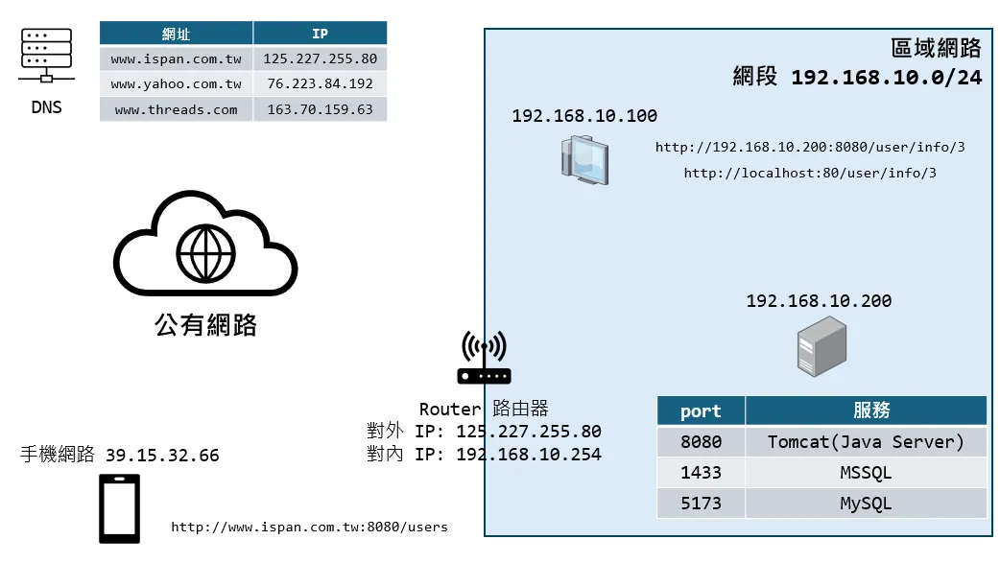
    <p style="margin-top: 10px;"><i>網路運作流程</i></p>
  </div>
</div>

### 🔁 章節回顧

|  #  | 對應小節                   | 回顧問題                                         | 參考解答                                                                                                                                                                                                                                                                   |
| :-: | :------------------------- | :----------------------------------------------- | :------------------------------------------------------------------------------------------------------------------------------------------------------------------------------------------------------------------------------------------------------------------------- |
|  1  | 何謂 Server/Client?        | Server 與 Client 各自的核心職責為何？            | Server 是處理請求並提供服務的一方；Client 是發出請求並呈現結果的一方。<br>兩者透過網路連線溝通，構成 Client-Server 架構。                                                                                                                                                  |
|  2  | 網路通訊協定與 HTTP 基礎   | HTTP 的三大核心特性為何？                        | ① 未加密明文傳輸。<br>② 基於請求與回應模型。 Request-Response<br>③ 無狀態 Stateless。                                                                                                                                                                                      |
|  3  | 網路通訊協定與 HTTP 基礎   | GET 與 POST 方法有何不同？                       | GET 用於取得資源，參數附加於 URL Query String。<br>POST 用於提交資料，參數封裝在 Request Body 內。                                                                                                                                                                         |
|  4  | IP 位址與 Port             | IP 位址與 Port 埠號各自的用途為何？              | IP 位址如同門牌號碼，用來定位網路上的一台裝置。<br>Port 埠號如同分機號碼，用來區分同一台裝置上不同的網路服務。                                                                                                                                                             |
|  5  | IP 位址與 Port             | 公開 IP 與私有 IP 的差異為何？                   | 公開 IP 是網際網路上的唯一位址，可直接對外連線。<br>私有 IP 是區域網路內部專用的虛擬位址，需透過 NAT 機制共用公開 IP 才能連上外部網路。                                                                                                                                    |
|  6  | URI 網址結構與網站運作流程 | 從瀏覽器輸入網址到看見畫面，背後經歷了哪些流程？ | ① 分析 URL 並進行 DNS 解析取得伺服器 IP。<br>② 透過 TCP 建立可靠連線。<br>③ 瀏覽器封裝並發送 HTTP Request。<br>④ 伺服器接收封包並執行業務邏輯。<br>⑤ 伺服器將結果封裝成 HTTP Response 回傳。<br>⑥ 瀏覽器解析 HTML、下載靜態資源並渲染畫面。<br>⑦ 傳輸結束，斷開 TCP 連線。 |

---

## <a id="CH1-2"></a>[1-2 Web 伺服器與傳統 Web 開發基礎](#toc)

### <a id="CH1-2-1"></a>[1. Java 手刻 HTTP 網頁伺服器](#toc)

**📍 單元目標**
體會親手用 Java 從零建立一台能接收瀏覽器請求的 Server 需要面臨什麼挑戰。

**🤔 為什麼需要它**
在進入框架之前，我們先試著「徒手」刻一個 Web Server 來接收請求，就會知道為什麼我們需要 Tomcat 等工具了。

**📖 操作實驗範例**

我們可以透過 Java 原生的 `ServerSocket` 監聽特定的通訊埠（如 8080）來接收前端連線。以下的簡化程式碼展示了一個「基礎 Web Server」如何運作的原型：

```java
import java.io.InputStream;
import java.io.OutputStream;
import java.net.ServerSocket;
import java.net.Socket;

public class MiniSimpleServer {
    public static void main(String[] args) {
        // 監聽 8080 port，準備接收請求
        try (ServerSocket serverSocket = new ServerSocket(8080)) {
            System.out.println("伺服器已啟動，正在監聽 8080 port...");

            while (true) {
                // 等待客戶端瀏覽器的請求，一旦有請求，就建立連線 Socket
                Socket clientSocket = serverSocket.accept();
                System.out.println("收到來自瀏覽器的連線！");

                // --- 1. 讀取瀏覽器傳來的請求資料 ---
                InputStream in = clientSocket.getInputStream();
                byte[] buffer = new byte[1024];
                int readBytes = in.read(buffer);
                // 你會看到一堆諸如 GET / HTTP/1.1... 等由瀏覽器整理好的標準格式文字
                System.out.println("=== 來自前端的請求內容 ===");
                System.out.println(new String(buffer, 0, readBytes));

                // --- 2. 回應準備好的網頁內容 ---
                OutputStream out = clientSocket.getOutputStream();

                // 把回傳的格式也按照 HTTP 規定格式寫上，否則瀏覽器會拒收
                // 為了結構清晰，我們把 HTML 的 head 跟 body 分段寫再拼起來
                String head = """
                        <head>
                            <title>My Java Server</title>
                        </head>
                        """;

                String body = """
                        <body style='background-color: #f8f9fa; font-family: sans-serif; text-align: center; padding-top: 50px;'>
                            <h1 style='color: #007bff;'>Hello I am a Hand-made Java Server!</h1>
                            <h3 style='color: #6c757d;'>這是我手刻的 Java 網頁伺服器回應！</h3>
                        </body>
                        """;

                String html = "<html>\n" + head + body + "</html>";

                // 第一行聲明「成功200」，換行後再告訴對方「我回傳的是網頁喔，編碼是 UTF-8」
                // 註：HTTP 協定標準換行為 \r\n，我們在 Text Block 中每行結尾加上 \r 來保留此格式
                String httpResponse = """
                        HTTP/1.1 200 OK\r
                        Content-Type: text/html;charset=UTF-8\r
                        \r
                        """ + html;

                out.write(httpResponse.getBytes("UTF-8"));
                out.close(); // 結束連線
                clientSocket.close();
            }
        } catch (Exception e) {
            e.printStackTrace();
        }
    }
}
```

> [!TIP]
> 💡 **編譯與執行指令**
> 若你在 Windows 的命令提示字元 (cmd) 下編譯遇到中文註解報錯（如 `unmappable character`），請加上 `-encoding UTF-8` 參數，明確告知編譯器檔案的編碼格式：
>
> ```cmd
> javac -encoding UTF-8 MiniSimpleServer.java
> java MiniSimpleServer
> ```

啟動後在瀏覽器輸入 `http://localhost:8080`，就能看到我們手刻回傳的網頁。
但你應該也感受到，光是處理一個最基本的請求，就得自己讀取位元組串流（Byte Stream）、拼出合規的 HTTP 標頭、手動設定狀態碼。若再加上多執行緒、安全性等需求，複雜度會快速失控。

因此，Java 生態系提供了 **Web Container（網頁容器，例如 Apache Tomcat）** 來幫我們扛下這些苦差事。它負責處理底層的 TCP/IP 連線與 HTTP 封包解析，再把結果包裝成好用的 Java 物件交給我們，讓開發者只需專注在商業邏輯上。

<div style="display: flex; gap: 80px; margin: 10px 0 10px 0;
border: 3px solid #ccc; border-radius: 20px; padding: 10px;">
  <div style="flex: 1; text-align: center;">
    
    <p style="margin-top: 10px;"><i>Apache Tomcat</i></p>
  </div>
</div>

> [!NOTE]
> 💡 **知識補充：Web Server 與 Web Container 的區別**
> 在現代開發中，我們常把兩者的界線模糊化，但在查閱技術文件時，你會發現它們其實有著不同的分工：
>
> - **Web Server 網頁伺服器（靜態資源）**
>   例如 Apache、Nginx。負責處理靜態資源：收到請求後，直接從硬碟找出 HTML 等檔案回傳，但本身無法執行 Java 程式碼。
> - **Web Container 網頁容器（動態資源）**
>   例如 Tomcat。專門用來執行 Java 動態程式，將網路封包轉換成 Java 物件後交給我們的程式處理。其他常見的選項還有 Jetty、Undertow，以及早期企業常用的 JBoss、WebLogic 等。
>
> 現在的 Tomcat 已能同時處理靜態資源與動態 Java 程式。初學階段不用深究兩者差異，把 Tomcat 當成「能跑 Java 的 Web 伺服器」就好。

### <a id="CH1-2-2"></a>[2. Tomcat Server](#toc)

> [!NOTE]
> 💡 **課前提示：本節為概念導向**
> 在現代的 Java 專案開發中，例如我們後續會學到的 Spring Boot，Tomcat 引擎多半已經被內嵌整合。實務上我們極少需要自己下載 Tomcat 伺服器本體並進行手動調校。
> 因此，本小節的重點在於**建立對底層運作機制的概念**，幫助你理解未來框架在背後究竟幫我們做了什麼事！

**📍 單元目標**
了解 Java 程式如何透過 Web Container 在網路上提供 HTTP 服務，並認識 Tomcat 的基本結構與操作。

**🤔 為什麼需要它**
從上一節的實驗可以看出，手刻 Server 光是最基本的請求處理就已經相當吃力。我們需要一個現成的工具來扛下這些底層工作。

**📖 核心概念**
**Web Container（網頁容器）** 是 Java 生態系中專門處理 HTTP 通訊的伺服器軟體，其中 Apache Tomcat 是業界最常見的選擇。
它幫我們處理底層的網路連線，並自動將收到的 HTTP 請求轉換成 Java 物件，讓開發者不用再手動讀寫位元組串流。

**Tomcat 核心目錄結構**
當我們下載並解壓縮 Tomcat 後，會看到許多層級的資料夾。對於開發者來說，最需要先認識以下幾個重要目錄：

| 目錄名稱  | 主要用途           | 說明                                                                                |
| :-------- | :----------------- | :---------------------------------------------------------------------------------- |
| `bin`     | 執行檔與腳本       | 存放啟動 `startup` 與關閉 `shutdown` Tomcat 伺服器的執行腳本。                      |
| `conf`    | 設定檔             | 存放各種伺服器環境設定，例如 `server.xml` 可以修改預設的 Port 號。                  |
| `webapps` | 網站應用程式發佈區 | 我們開發好的 Web 專案部署檔會放到這裡，Tomcat 啟動時會自動載入並運行。              |
| `logs`    | 系統日誌           | Tomcat 運行時產生的各類紀錄檔。當程式報錯連不上時，這裡是工程師抓蟲找線索的關鍵點。 |
| `work`    | 暫存工作區         | 存放 JSP 被轉換為 Servlet 後的 Java 程式，以及編譯出來的 class 暫存檔。             |

**💻 實作範例**

**啟動與關閉 Tomcat**
在早期的開發或獨立部屬環境中，我們會手動進入 `bin` 目錄來控制伺服器：

- **Windows 系統**：點擊 `startup.bat` 啟動，點擊 `shutdown.bat` 關閉。
- **Mac/Linux 系統**：執行 `startup.sh` 啟動，執行 `shutdown.sh` 關閉。

不過現在主流的 IDE（如 IntelliJ IDEA、Eclipse）和 Spring Boot 框架都已內嵌 Tomcat，通常只需點擊執行按鈕就能自動啟動。

> [!WARNING]
> 🚨 **常見陷阱：Port 8080 被佔用**
> 初學者最常遇到的錯誤訊息是 `Web server failed to start. Port 8080 was already in use.(Web 伺服器啟動失敗。Port 8080 已被佔用)`。
> 這是因為同一台電腦上，已經有其他的程式或是上一次開啟的 Tomcat 忘記關掉，正在佔用 `8080` 這組 Port 號。
> **解決方式一：終止佔用 Port 的程序**
>
> - **Windows 系統**
>   開啟命令提示字元 CMD，輸入 `netstat -ano | findstr 8080` 找到 PID 軟體識別碼，接著輸入 `taskkill /F /PID <你的PID>` 強制關閉。
> - **Mac 與 Linux 系統**
>   開啟終端機 Terminal，輸入 `lsof -i :8080` 找到 PID，接著輸入 `kill -9 <你的PID>` 強制關閉。
>
> **解決方式二：修改預設通訊埠**
> 到 `conf/server.xml` 中將 Tomcat 的預設通訊埠修改為 `8081` 等未使用的號碼。

<div style="display: flex; gap: 80px; margin: 10px 0 10px 0;
border: 3px solid #ccc; border-radius: 20px; padding: 10px;">
  <div style="flex: 1; text-align: center;">
    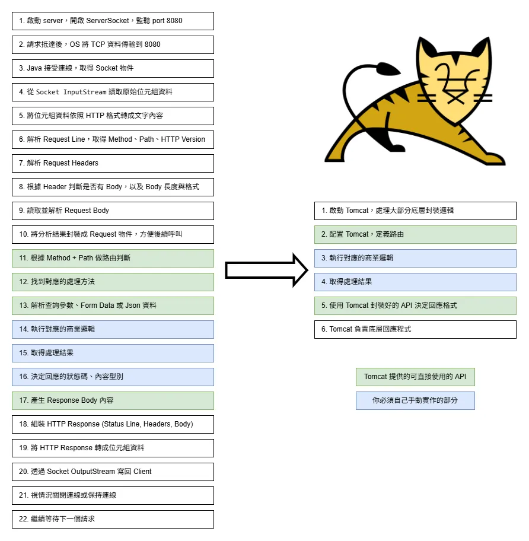
    <p style="margin-top: 10px;"><i>Tomcat 做了什麼?</i></p>
  </div>
</div>

### <a id="CH1-2-3"></a>[3. Servlet 介紹](#toc)

**📍 單元目標**
了解傳統 Java Web 開發的根本基礎技術：Servlet。

**🤔 為什麼需要它**
上一節我們知道 Tomcat 會幫我們處理底層的 HTTP 連線，但收到請求之後，要交給「誰」去執行商業邏輯？Servlet 就是那個「誰」。

**📖 核心概念**
當 Tomcat 設定好並接收到網路請求後，它需要將這些請求交給我們寫的 Java 程式來處理。
這支負責在 Server 端接收並處理網路請求的 Java 程式，就叫做 **Servlet**。

具體來說，Tomcat 收到像 `GET / HTTP/1.1` 這樣的原始 HTTP 封包後，會將它解析並封裝成兩個 Java 物件：`HttpServletRequest`（代表請求）與 `HttpServletResponse`（代表回應），再交給對應的 Servlet 來處理。

**💻 實作範例**  
**原生 Servlet 接收請求示範**

依循以下步驟，建立一個傳統的 Maven Web 專案並撰寫一支 Servlet：

1. 準備好 Maven (`mvn`) 環境。
2. 使用下方指令建立 Dynamic Web Project：
   ```cmd
   .\mvnw.cmd archetype:generate "-DgroupId=com.example" "-DartifactId=demo-web" "-DarchetypeArtifactId=maven-archetype-webapp" "-DinteractiveMode=false"
   ```
3. 在專案的 `pom.xml` 中加入 Servlet API 依賴：
   ```xml
   <dependency>
       <groupId>jakarta.servlet</groupId>
       <artifactId>jakarta.servlet-api</artifactId>
       <version>6.1.0</version>
       <scope>provided</scope>
   </dependency>
   ```
4. 手動建立目錄 `demo-web\src\main\java`，並在目錄中建立 `HelloWorld.java`，最後將範例的 Servlet 貼上：

   ```java
   // 設定此 Servlet 負責處理的請求路徑 (URL Mapping)
   @WebServlet("/hello")
   public class HelloWorld extends HttpServlet {

       @Override
       protected void doGet(HttpServletRequest req, HttpServletResponse resp) throws ServletException, IOException {
           // Servlet 容器已將客戶端的 HTTP 請求資訊封裝於 HttpServletRequest 物件中。
           // 可透過 getParameter 方法直接取得請求參數 (例如："?name=Alan")，無須自行解析查詢字串 (Query String)。
           String username = req.getParameter("name");

           // 提供 HttpServletResponse 物件作為處理回應的操作介面。
           // 1. 設定回應內容的 MIME 類型 (Content-Type) 與字元編碼。
           resp.setContentType("text/html;charset=UTF-8");
           // 2. 取得 PrintWriter 輸出串流物件，以將字串內容輸出至客戶端。
           PrintWriter out = resp.getWriter();
           out.println("<html>");
           out.println("<head><title>My Servlet</title></head>");
           out.println("<body>");
           out.println("<h1>Hello World, " + username + "!</h1>");
           out.println("</body>");
           out.println("</html>");
       }
   }
   ```

5. 使用 VS Code 熱鍵 `ALT + SHIFT + O` 自動載入相關類別。
6. 輸入指令進行編譯與打包：
   ```cmd
   .\mvnw.cmd -f demo-web\pom.xml clean package
   ```
7. 在 `demo-web\target\` 中找到 `demo-web.war`，將它放到 `tomcat\webapps` 目錄中。
8. 在 `tomcat\bin` 目錄中，執行 `startup.bat` 啟動伺服器。
9. 打開瀏覽器，輸入 `http://localhost:8080/demo-web/hello`，觀看結果。

> [!NOTE]
> 💡 **小結：Servlet 開發的初期體驗**
> 走完上面這幾個步驟後，你可能已經感受到兩件事：
>
> 1. **部署流程很繁瑣**：每次改完程式都得重新編譯、打包 WAR、丟進 Tomcat 再重啟。
> 2. **用 `out.println` 拼 HTML 實在不是辦法**：稍微複雜一點的網頁就完全無法維護。
>
> 接下來的 JSP 就是為了解決「畫面難以開發」這個問題而生的。

### <a id="CH1-2-4"></a>[4. JSP 簡介與資料呈現](#toc)

**📍 單元目標**
了解傳統架構下，如何解決 Servlet 不擅長處理網頁畫面渲染的痛點。

**🤔 為什麼需要它**
如上一節提到的，使用 `out.println` 一行行拼 HTML 實在很痛苦。只要網頁結構稍微複雜一點，程式碼就會變得難以閱讀與維護。

**📖 核心概念**
**JSP Java Server Pages** 的做法跟 Servlet 剛好相反：它讓你以寫 HTML 為主，遇到需要動態資料的地方，再把 Java 程式碼嵌進去，解決了寫畫面的痛點。

在 JSP 中，我們透過 **JSP 元素 Scripting Elements** 來嵌入 Java 程式碼，常見的標籤如下：

```html
<%@ page language="java" contentType="text/html; charset=UTF-8" %> <%-- 指令
Directive --%>

<html>
  <body>
    <%! String title = "我的 JSP 頁面"; %> <%-- 宣告 Declaration：定義類別成員
    --%> <% // 小指令 Scriptlet：撰寫一般的 Java 邏輯 String user =
    request.getParameter("user"); if (user == null) user = "訪客"; %>

    <h1><%= title %></h1>
    <%-- 運算式 Expression：印出變數內容（不加分號） --%>
    <p>歡迎您，<%= user %>！</p>
  </body>
</html>
```

雖然 JSP 解決了單純寫 Servlet 的痛苦，但若在 HTML 中嵌入大量 Java 程式碼，依然會讓頁面雜亂且難以維護。
為了讓設計更純淨，我們通常會改用 **EL 表達式 Expression Language**。

它的語法精簡了些：`${變數名稱}`。這項技術能讓 JSP 頁面完全「去 Java 化」，不需撰寫 Java 程式碼，也能印出由 Servlet 傳遞過來的資料，達成畫面與邏輯的分離。

**💻 實作範例**  
**從 Servlet 將資料轉交給 JSP 呈現**

1.  **在 Servlet 中準備資料並 Forward 轉發**

在 `demo-web\src\main\java` 目錄下建立 `Profile.java`，並將以下程式碼貼上：

```java
@WebServlet("/profile")
public class Profile extends HttpServlet {
    @Override
    protected void doGet(HttpServletRequest req, HttpServletResponse resp) throws ServletException, IOException {
        // 讀取前端傳遞過來的查詢參數
        String username = req.getParameter("name");

        // 透過 setAttribute 將變數存入 Request 作用域中，準備傳遞給視圖
        req.setAttribute("user", username);

        // 轉發 (Forward) 請求至 profile.jsp。避免使用 out.write 處理 HTML，將畫面職責轉交 JSP
        req.getRequestDispatcher("profile.jsp").forward(req, resp);
    }
}
```

2.  **在 JSP 頁面利用 EL 印出變數**

在 `demo-web\src\main\webapp` 目錄下建立 `profile.jsp`，並將以下程式碼貼上：

```html
<%@ page contentType="text/html;charset=UTF-8" language="java" %>
<!DOCTYPE html>
<html>
  <head>
    <title>個人檔案</title>
    <style>
      body {
        background-color: #f8f9fa;
        font-family: sans-serif;
        text-align: center;
        padding-top: 50px;
      }
      h1 {
        color: #007bff;
      }
    </style>
  </head>
  <body>
    <!-- 透過 EL 表達式直接讀取 Servlet 存入 Request 作用域的 user 變數 -->
    <h1>歡迎來到這個頁面： ${user}！</h1>
  </body>
</html>
```

3.  **重新編譯與測試**

按照上一節 Servlet 介紹中的編譯打包流程重新編譯打包，並重啟 Tomcat。接著在瀏覽器輸入以下網址，注意後面的 `?name=Alan` 參數：
`http://localhost:8080/demo-web/profile?name=Alan`

在畫面上你就能看見 JSP 成功讀取並印出了 Servlet 轉發過來的變數內容！

> [!NOTE]
> 💡 **小結：JSP 解決了什麼，還剩下什麼？**
> JSP 搭配 EL 確實讓畫面開發變得容易許多，我們終於不用再一行行拼 HTML 了。但走到這裡，你可能也注意到：
>
> 1. **部署流程依然繁瑣**：每次修改程式碼仍需重新編譯、打包 WAR、重啟 Tomcat。
> 2. **路由管理零散**：每條請求路徑都需要建立一支獨立的 Servlet，並手動呼叫 `forward` 來轉發到對應的 JSP。隨著功能增多，管理會越來越困難。
>
> 下一節我們會總結這些痛點，並看看 Spring MVC 是如何一口氣解決它們的。

### <a id="CH1-2-5"></a>[5. 痛點反思與 Spring MVC 解決方案](#toc)

**📍 單元目標**
回顧 Tomcat、Servlet 與 JSP 的發展軌跡與痛點，並認識 Spring MVC 框架如何用更簡潔的方式解決這些問題。

**🤔 為什麼需要它**
走過前面幾個小節，你應該已經感受到傳統 Web 開發一路累積下來的各種不便：

1. **Tomcat：解決了底層通訊，但開發體驗仍然原始**
   封裝了 TCP/IP 連線與 HTTP 封包解析過程，讓開發者免於直接操作 `InputStream` 的底層細節。不過，Tomcat 本身只負責「收發封包」，所有的商業邏輯仍需開發者自行處理。
2. **Servlet：建立了標準，但帶來了新的負擔**
   提供了解析 HTTP 的標準解決方案，但卻引入了兩大限制
   - **類別膨脹**：對應每一個「請求端點」，往往需要建立一支專屬的 Servlet 類別，導致專案體積急速臃腫。
   - **冗餘設計**：開發者必須反覆手動處理中文編碼、使用 `getParameter` 擷取字串並轉型，產生大量重複性程式碼。
3. **JSP：畫面好寫了，但路由轉發依然零散**
   解決了用字串拼湊 HTML 的維護難題。然而從 Servlet 向 JSP 傳遞資料時，開發者仍需頻繁呼叫 `forward(req, resp)` 來完成轉發，缺乏統一的路由管理機制。

**📖 核心概念**
Spring MVC 的解決方案是引進 **前端控制器模式 Front Controller Pattern**，其核心元件為 `DispatcherServlet`。

簡單來說，`DispatcherServlet` 會作為應用程式的統一入口點，攔截所有進來的連線。它會先集中處理編碼轉換、參數自動封裝等共通瑣事，最後再依據路由映射，將任務精準派發給開發者定義的 Controller 來執行商業邏輯。

<div style="display: flex; gap: 80px; margin: 10px 0 10px 0;
border: 3px solid #ccc; border-radius: 20px; padding: 10px;">
  <div style="flex: 1; text-align: center;">
    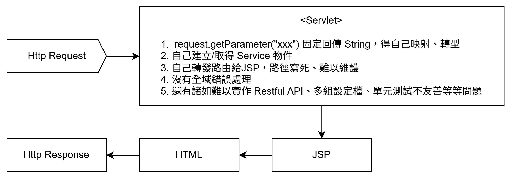
    <p style="margin-top: 10px;"><i>傳統 Servlet 流程</i></p>
  </div>
</div>

<div style="display: flex; gap: 80px; margin: 10px 0 10px 0;
border: 3px solid #ccc; border-radius: 20px; padding: 10px;">
  <div style="flex: 1; text-align: center;">
    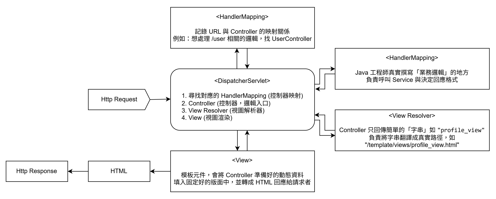
    <p style="margin-top: 10px;"><i>Spring MVC 流程：Dispatcher Servlet</i></p>
  </div>
</div>

**💻 實作範例**  
在 Spring MVC 架構下，開發者不用再繼承 `HttpServlet`，也徹底擺脫了手動拼湊 HTML 或繁冗的 `forward` 轉發語法。只要透過 `@Controller` 標註，即可專注在業務邏輯本身：

```java
import org.springframework.stereotype.Controller;
import org.springframework.web.bind.annotation.GetMapping;

@Controller
public class HelloWorldController {

    // 將使用者的請求路徑對應到這支方法
    @GetMapping("/hello")
    public String sayHello() {
        return "index"; // 回傳 HTML 視圖的名字，這時候 Spring 就會自動幫我們去尋找檔案！
    }

    // 第二個路由：一個 Controller 也可以處理多個不同的請求路徑
    @GetMapping("/about")
    public String showAboutPage() {
        return "about"; // 尋找名稱為 about.html 的檔案
    }
}
```

> [!NOTE]
> 💡 **邁向現代化開發**
> 透過 DispatcherServlet 統一接管請求，正是 Spring MVC 能大幅提升開發體驗的秘密。這也是為何現代業界會全面擁抱 Spring 生態系的原因。
> 接下來，就讓我們正式進入 Spring MVC 的環境建置吧！

### 🔁 章節回顧

|  #  | 對應小節              | 回顧問題                                     | 參考解答                                                                                                   |
| :-: | :-------------------- | :------------------------------------------- | :--------------------------------------------------------------------------------------------------------- |
|  1  | Tomcat 伺服器         | Tomcat 的核心作用為何？                      | 作為 Web Container，負責處理底層網路通訊，將 HTTP 請求轉換為 Java 物件供 Servlet 處理。                    |
|  2  | Servlet 與 JSP        | 傳統 Servlet 與 JSP 的主要職責與痛點是什麼？ | Servlet 處理邏輯但輸出畫面困難（要用 HTML 字串拼湊）；JSP 適合寫畫面但路由管理零散難維護。                 |
|  3  | 痛點反思與 Spring MVC | Spring MVC 是如何解決傳統開發痛點的？        | 透過 DispatcherServlet（前端控制器）統一接管所有請求，處理共通雜事後，再派發給 Controller 執行純業務邏輯。 |

---

## <a id="CH1-3"></a>[1-3 Spring MVC 初探與環境建置](#toc)

### <a id="CH1-3-1"></a>[1. 透過 Spring Initializr 建立專案](#toc)

**📍 單元目標**  
學會從 Spring 官方網站產生一個立即可用的 Spring Boot 專案骨架。

**🤔 為什麼需要它**  
傳統 Java Web 專案的建立過程需要手動下載多個 JAR 依賴包，還得撰寫龐雜的 XML 設定檔。
Spring 官方提供了專案產生器 Spring Initializr，只要在網頁介面上填好設定、一鍵下載，就能拿到一個立即可用的專案骨架。

**📖 核心概念**
在開始動手建立專案前，我們先來了解介面上各個區塊所代表的意義：

<div style="display: flex; gap: 80px; margin: 10px 0 10px 0;
border: 3px solid #ccc; border-radius: 20px; padding: 10px;">
  <div style="flex: 1; text-align: center;">
    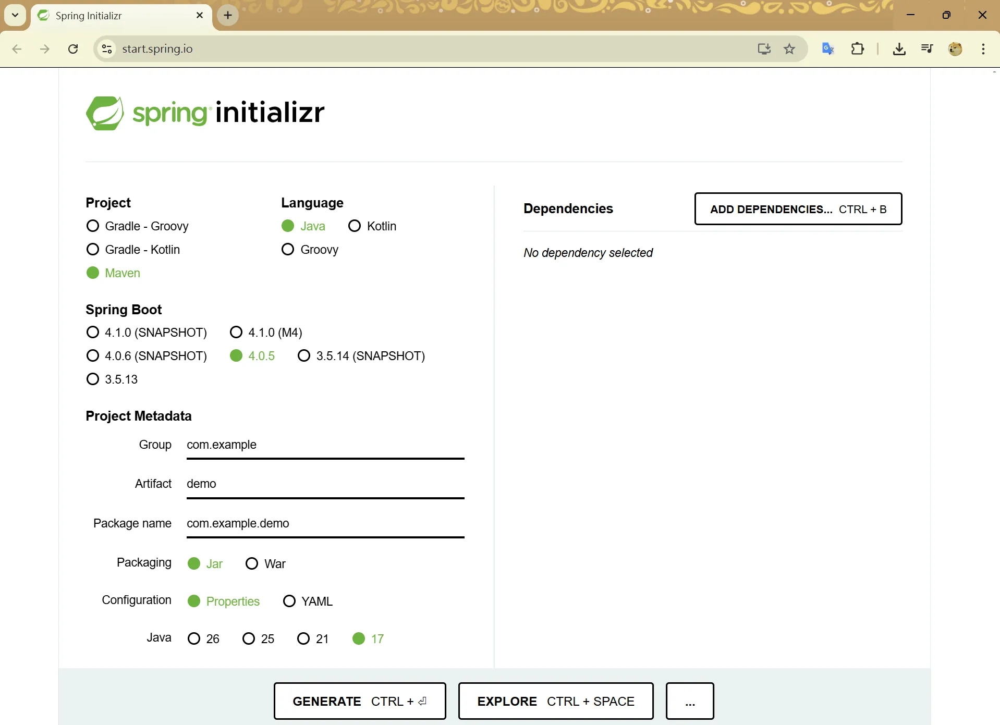
    <p style="margin-top: 10px;"><i>Spring Initializr 主要介面區塊</i></p>
  </div>
</div>

**1. 基礎開發選項 (Core Settings)**

| 欄位名稱        | 說明與用途                              | 課程使用選項            | 備註                                                                                                                                                                                     |
| :-------------- | :-------------------------------------- | :---------------------- | :--------------------------------------------------------------------------------------------------------------------------------------------------------------------------------------- |
| **Project**     | 決定專案的建置與模組管理工具。          | **Maven**               | `Gradle`是另一款常在 Android 開發或需高度客製化時使用的建置工具。<br>介面上提供 `Groovy`（傳統寫法）與 `Kotlin`（現代官方推薦寫法）兩種設定檔語法選項。                                  |
| **Language**    | 開發 Spring Boot 所使用的核心程式語言。 | **Java**                | `Kotlin` 現代化且與 Java 高度互通，為目前 Android 開發的官方主力語言。<br>`Groovy` 是發展較早的動態 JVM 語言。在現代新專案中已較少作為主力開發語言，多留存於特定的建置腳本或測試框架中。 |
| **Spring Boot** | 框架的核心版本。                        | **最新穩定版 (無尾綴)** | `SNAPSHOT`：開發中的不穩定快照版本。<br>`M / RC`：發佈前的測試里程碑 / 候選版本。                                                                                                        |
| **Java**        | 本次開發使用的 JDK 版本。               | **17 或 21 (LTS 版)**   | 選擇標註有 **LTS (長期支援)** 的版本，能確保專案獲得穩定的安全性更新。                                                                                                                   |

> [!NOTE]
> 💡 **知識補充：Maven 與 Gradle 的差異**
>
> | 比較項目     | Maven                             | Gradle                           |
> | :----------- | :-------------------------------- | :------------------------------- |
> | **設定語言** | XML (`pom.xml`)                   | Groovy / Kotlin (`build.gradle`) |
> | **建置速度** | 較慢，全量編譯為主                | 較快，支援增量編譯與快取         |
> | **主流場景** | **企業後端應用主流 (本課程使用)** | Android 開發與高度靈活自動化專案 |
>
> **Maven 依賴語法範例 (`pom.xml`)：結構嚴謹但較冗長**
>
> ```xml
> <dependency>
>     <groupId>org.springframework.boot</groupId>
>     <artifactId>spring-boot-starter-web</artifactId>
> </dependency>
> ```
>
> **Gradle 依賴語法範例 (`build.gradle` 以 Groovy 為例)：高度簡潔易讀**
>
> ```groovy
> dependencies {
>     implementation 'org.springframework.boot:spring-boot-starter-web'
> }
> ```

**2. 專案元資料 (Project Metadata)**

設定專案的基礎結構與打包方式。

| 欄位名稱          | 說明                                                                         | 課程範例設定                          | 備註                                                          |
| :---------------- | :--------------------------------------------------------------------------- | :------------------------------------ | :------------------------------------------------------------ |
| **Group**         | 組織或公司的網域名稱反寫(大到小)，作為套件結構的最底層。                     | `tw.com.ispan.eeit`                   | 即 `台灣.公司.資展國際.EEIT部門` 之意                         |
| **Artifact**      | 專案的名稱，也會成為未來產生的資料夾名稱。                                   | `demo`                                |                                                               |
| **Package name**  | 專案的基礎套件包裝路徑，預設由上述兩者自動組合。                             | 未來程式區在 `tw.com.ispan.eeit.demo` | 通常會由 2~4 個字詞組成，過多會影響閱讀                       |
| **Packaging**     | `Jar`: 內建伺服器，現代微服務主流。<br>`War`: 需部署到外部伺服器的傳統格式。 | **Jar**                               |                                                               |
| **Configuration** | 全域設定檔的格式，提供 `.properties` 與 `.yaml` 兩種選擇。                   | **Properties**                        | 實務上也常見使用 **YAML**，透過層級與縮排結構讓設定檔更易讀。 |

> [!NOTE]
> 💡 **知識補充：Properties 還是 YAML？**
> 在建立專案的頁面上，即可直接選擇你要匯出的全域設定檔格式，也可以之後再進行修改。
> 實務上常見使用 **YAML**，取代傳統 Properties 必須重複輸入相同結構文字的缺點，讓層級變得很清晰。
> 但不論使用何種格式，其意義都是相同的。
>
> **Properties 格式 (`.properties`)**
>
> ```properties
> server.port=8081
> spring.application.name=demo
> ```
>
> **YAML 格式 (`.yml` / `.yaml`)**
>
> ```yaml
> server:
>   port: 8081
> spring:
>   application:
>     name: demo
> ```

---

**💻 實作範例：建立第一個專案**

看完介面導覽後，讓我們開始動手實作吧！

1. 打開本機瀏覽器，前往 [Spring Initializr](https://start.spring.io)。
2. 在左方區域填妥以下規格：
   - **Project**：`Maven`
   - **Language**：`Java`
   - **Spring Boot**：選擇最新穩定版（無尾綴）
   - **Project Metadata**：
     - Group：`com.eeit`
     - Artifact：`demo`
     - Package name：`com.eeit.demo`
     - Packaging：`Jar`
     - Configuration：`Properties`
     - Java：`17`
3. **設定依賴模組 Dependencies**  
   接下來，點選右側的 `ADD DEPENDENCIES` 面板，為專案設定依賴模組。  
   Spring 框架最大的優勢之一就是**模組化設計**，你只需勾選專案需要的套件，Spring Boot 就會自動把相關依賴與預設設定全部準備好，不必手動搬運一堆 JAR 檔。以下為開發階段常用的模組：

   | 模組名稱                 | 說明與用途                                                                                                                                 |
   | :----------------------- | :----------------------------------------------------------------------------------------------------------------------------------------- |
   | **Spring Web**           | 包含了 Tomcat 網頁容器與接收 HTTP 請求的所有開發依賴，是開發 Web API 與網頁必備。                                                          |
   | **Spring Boot DevTools** | 讓專案支援「熱重載 Hot Reload」，修改程式並存檔時會自動重新啟動伺服器，大幅省下開發時間。                                                  |
   | **Thymeleaf**            | 現代化的模板引擎，負責將後端 Java 資料渲染到 HTML 畫面上，是傳統 JSP 的優良接班人。                                                        |
   | **Spring Data JPA**      | 將複雜的 SQL 語法化為標準的 Java API 操作，讓開發者能組合簡單的單字取代繁瑣的資料庫操作。                                                  |
   | **Spring Security**      | 強大的安全防護框架，能輕鬆實作會員登入驗證 Authentication 與權限控制 Authorization。                                                       |
   | **Lombok**               | 使開發者能透過簡單註解如 `@Data`、`@Getter`、`@Setter`、`@NoArgsConstructor`、`@AllArgsConstructor` 就能自動產生 Getter、Setter 與建構子。 |
   | **MS SQL Server Driver** | 微軟 SQL Server 資料庫的專屬連線驅動程式。各大資料庫都有自己的 Driver，要連哪家就勾選哪家。                                                |
   | **H2 Database**          | 輕巧的「記憶體資料庫」，不需要安裝任何軟體即可運作，資料存在記憶體中，非常適合初期開發階段與測試功能使用。                                 |
   | **SQLite Driver**        | SQLite 資料庫的連線驅動，適合輕量級、本機端的資料儲存需求，常見於小型專案與 Android 應用程式。                                             |
   | **MyBatis Framework**    | 另一款極受歡迎的資料庫框架，與 JPA、Hibernate 屬於不同生態圈，它允許開發者直接撰寫 SQL 語句，適合需要精細控制 SQL 的複雜專案。             |
   | **Validation**           | 提供便利的資料驗證功能如 `@NotNull`、`@Size`，幫開發者輕鬆檢驗資料是否符合規定格式。                                                       |

   > [!NOTE]  
   > 💡 **若忘記勾選依賴該如何處理？**  
   > 若專案產生後發現缺少必要套件，無須重新下載專案。只需開啟專案核心設定檔 `pom.xml`，手動補上對應模組的 Maven Dependency (XML 區塊)，經 Maven 重新建置後即可達成相同效果。

4. 這次為了展示一個最基礎的網頁，請搜尋並勾選 **`Spring Web`** 、 **`Thymeleaf`** 與 **`Spring Boot DevTools`** 這三個模組。
5. 點擊正下方的 `GENERATE` 按鈕，下載設定好的 `.zip` 壓縮包檔案！

<div style="display: flex; gap: 80px; margin: 10px 0 10px 0;
border: 3px solid #ccc; border-radius: 20px; padding: 10px;">
  <div style="flex: 1; text-align: center;">
    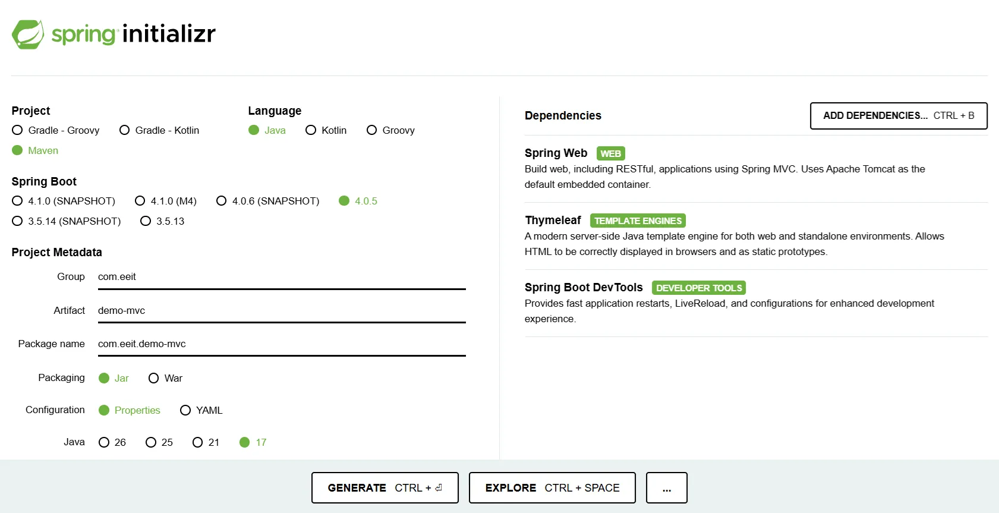
    <p style="margin-top: 10px;"><i>Spring Initializr 設定</i></p>
  </div>
</div>

### <a id="CH1-3-2"></a>[2. 專案匯入、開啟與目錄結構解析](#toc)

> [!IMPORTANT]
> 💡 **必須安裝的 VS Code 擴充套件 Extensions**
> 為了讓後續開發 Spring Boot 更加順暢，請在 VS Code 中安裝以下擴充套件：
>
> - **Extension Pack for Java**：提供 Java 語法支援、重構與除錯功能。
> - **Prettier**：程式碼自動格式化工具，維持版面整潔。
> - **Gemini Code Assist**：提供 AI 輔助開發與寫碼功能。
> - **Spring Boot Extension Pack**：提供 Spring Boot 語法提示、快速開啟與執行等開發輔助。
> - **XML**：提供 XML 檔案（如 `pom.xml`）的語法高亮與自動格式化。

**📍 單元目標**  
將下載好的專案正確放入工作區，用 VS Code 開啟，並認識 Spring Boot 專案的標準目錄結構。

**💻 實作範例**

1. 將剛才下載好的 `demo.zip` 在電腦上進行解壓縮。
2. 將解壓縮出的資料夾，移動到你專屬的程式開發目錄下，例如 `C:\spring_mvc\`。
3. **開啟 VS Code**，選擇左上角的 `File 檔案` -> `Open Folder 開啟資料夾`，然後選擇剛才的那份 `demo` 目錄。

**📖 核心概念**  
當 VS Code 順利載入專案後，你會看到左側資源管理器呈現了標準的專案目錄結構。

| 目錄或檔案名稱                              | 主要用途            | 說明                                                                                                           |
| :------------------------------------------ | :------------------ | :------------------------------------------------------------------------------------------------------------- |
| `src/main/java/`                            | 後端程式區          | 負責存放所有的 Java 類別主程式，包含控制器、商業邏輯、資料類別等等。                                           |
| `src/main/resources/static/`                | 靜態資源區          | 存放不需要伺服器動態運算的公開連線檔案，例如圖片、純 CSS 樣式表、純前端 JavaScript 等等。                      |
| `src/main/resources/templates/`             | 動態模板區          | 存放 Thymeleaf 的 HTML 網頁檔。這些網頁需要經過 Java 程式處理並替換畫面變數之後，才會傳送給前端瀏覽器。        |
| `src/main/resources/application.properties` | 全域設定檔          | 整個專案的核心設定區。可在這改變啟動 Port 號、資料庫連線或專案元資料等設定。                                   |
| `src/test/`                                 | 測試程式區          | 存放單元測試程式碼的地方。由 JUnit 等框架運作，用來驗證開發的主程式功能是否能如預期運作。                      |
| `pom.xml`                                   | 專案依賴管理檔      | Maven 專案的設定檔。記載了專案基礎資訊，並管理專案需要引入哪些外部依賴模組 (Dependencies) 與版本號。           |
| `mvnw` 與 `mvnw.cmd`                        | 內嵌 Maven 啟動腳本 | 讓開發者就算電腦沒安裝 Maven，也能透過腳本指令編譯專案。 (`mvnw` 供 Mac/Linux，`mvnw.cmd` 供 Windows)          |
| `.mvn/`                                     | 內嵌 Maven 工具包   | 存放 `mvnw` 啟動腳本運行時所需要的關聯設定與背景工具檔。                                                       |
| `.gitignore`                                | Git 忽略清單設定檔  | 告訴 Git 該忽略哪些檔案，如編譯過後的 class 檔、密碼檔案或圖片檔案等等，避免將不必要的檔案上傳到版本控制系統。 |
| `.gitattributes`                            | Git 屬性設定檔      | 用來統一跨作業系統開發時的換行符號 (CRLF 與 LF)，避免因不同系統產生的版本衝突。                                |
| `HELP.md`                                   | 專案說明幫助檔      | Spring Initializr 自動產生的說明文件，裡面整理了所選模組的官方說明與教學文件連結，可刪除。                     |

### <a id="CH1-3-3"></a>[3. 在 VS Code 中設定與啟動專案](#toc)

**📍 單元目標**  
學習如何設定與建立 `.vscode/launch.json`，讓 VS Code 能啟動 Spring Boot 的伺服器。

**🤔 為什麼需要它**  
直接點擊右上角的執行按鈕有時也能啟動專案，但手動建好 `launch.json` 設定檔有兩個好處：一是能精準指定主程式入口路徑，二是遇到 Bug 時可以搭配 Debug 偵錯模式逐步排查問題。

**💻 實作範例**

1. 在 VS Code 畫面最左側目錄，點選箭頭圖示 `Run and Debug 執行與偵錯面板`，快捷鍵：CTRL + SHIFT + D。
2. 點擊藍色字體的 `create a launch.json file (建立 launch.json 檔案)` 連結。
3. 如果上方跳出清單讓你選擇環境，請點選 `Java`，這時 VS Code 就會自動幫你在專案底下生成一個 `.vscode` 資料夾，並包含專屬的 `launch.json` 設定檔。
4. 打開 `launch.json` 觀察內容，它會根據你目前的類別名稱幫你自動產生部分設定，請調整成以下內容：

```json
{
  "version": "0.2.0",
  "configurations": [
    {
      "type": "java",
      "name": "Spring Boot-DemoApplication",
      "request": "launch",
      "mainClass": "com.eeit.demo.DemoApplication",
      "projectName": "demo",
      "args": "--spring.profiles.active=dev"
      // "args": "--spring.config.name=test",
    }
  ]
}
```

> [!NOTE]  
> 💡 **知識補充：`launch.json` 屬性介紹**
>
> 啟動設定檔中常見的設定介紹：
>
> | 屬性名稱          | 說明與常見寫法                                                                                                                                                                                                                                                                                                                                                                             |
> | :---------------- | :----------------------------------------------------------------------------------------------------------------------------------------------------------------------------------------------------------------------------------------------------------------------------------------------------------------------------------------------------------------------------------------- |
> | **`version`**     | 指定 `launch.json` 的版本號。<br>自 VS Code 推出此功能以來長年停留在 `"0.2.0"`，幾乎沒有更新過，直接維持預設值即可。                                                                                                                                                                                                                                                                       |
> | **`type`**        | 指定使用的除錯環境，此處為 `java`。                                                                                                                                                                                                                                                                                                                                                        |
> | **`name`**        | 顯示在 VS Code 執行與偵錯面板（下拉選單）中的自訂名稱。                                                                                                                                                                                                                                                                                                                                    |
> | **`request`**     | 設定此除錯配置的行為模式。<br>● **`launch`**：代表由 VS Code 負責啟動並偵錯一個全新的程式。<br>● **`attach`**：代表將 VS Code 偵錯器附加到一個「已經在幕後執行中」的程式。                                                                                                                                                                                                                 |
> | **`mainClass`**   | 標記了應用程式的啟動入口點。<br>在每個 Spring Boot 專案的 `src/main/java` 目錄深處，都會有一支帶有 `@SpringBootApplication` 標註的 Java 主類別，這支 Java 程式正是整台伺服器的啟動入口。                                                                                                                                                                                                   |
> | **`projectName`** | 對應此應用程式所在的專案名稱。                                                                                                                                                                                                                                                                                                                                                             |
> | **`args`**        | 可於伺服器啟動時傳遞的命令列參數。<br>實務上我們常會在這裡切換不同的啟動環境設定檔案，常見有兩種指定寫法：<br>1. **`--spring.profiles.active=dev`**：適用於**標準命名規則**。Spring 會自動尋找名為 `application-dev.properties` 的設定檔。<br>2. **`--spring.config.name=test`**：適用於**非標準命名規則**。若你的設定檔名稱沒有加上 `application-` 前綴，就必須使用此指令來明確指定檔名。 |

只要有了正確的 `.vscode/launch.json` 設定，接下來我們只需要按下鍵盤的 `F5` 快速鍵或點擊面板上方的綠色啟動箭頭，就能進入順利啟動你的 Spring 專案！

### <a id="CH1-3-4"></a>[4. 啟動測試與靜態資源存取](#toc)

**📍 單元目標**  
成功啟動專案，並驗證可以透過瀏覽器存取到靜態資源。

**💻 實作範例**  
我們現在可以透過撰寫一個最簡單的純 HTML 網頁，來確認 Spring Boot 背後的內嵌 Tomcat 是否已經在順利運作。

1. **準備靜態資源 HTML**  
   在左側目錄樹狀結構中找到 `src/main/resources/static`，點擊右鍵新增一個檔案，命名為 `hello.html`，並寫上一些簡單的內容：

```html
<!DOCTYPE html>
<html>
  <body>
    <h1 style="color: blue;">
      這是來自 Spring Boot 靜態目錄下的順利啟動檔案！
    </h1>
  </body>
</html>
```

2. **啟動專案伺服器**  
   進入偵錯面板，按下綠色啟動按鈕或 `F5`。接著仔細觀察畫面下方 Terminal 終端機或 Debug Console 偵錯主控台的日誌輸出：
   若主控台中出現大型 `Spring` ASCII 啟動標語，並且於日誌尾端印出 `Started DemoApplication in 1.23 seconds` 類似字樣，即代表伺服器已成功啟動並於設定的通訊埠進行監聽。
3. **打開瀏覽器測試連線**  
   請開啟瀏覽器並於網址列輸入 `http://localhost:8080/hello.html`。
   若系統順利回傳並渲染剛剛撰寫的 HTML 網頁，則驗證了專案的靜態資源路由運作正常。

> [!TIP]  
> 💡 **Spring Boot 靜態資源自動重定向機制**  
> 這是因為 Spring Boot 的內嵌 Tomcat 引擎，已預設將 `static` 資料夾設定為 Static Resource Locations 靜態檔案目錄。任何放在這個資料夾下的檔案都會自動公開為可存取的靜態資源。例如把圖片放進去，也可以直接透過 `http://localhost:8080/圖片檔名` 存取。

### 🔁 章節回顧

|  #  | 對應小節                        | 回顧問題                                                      | 參考解答                                                                                                       |
| :-: | :------------------------------ | :------------------------------------------------------------ | :------------------------------------------------------------------------------------------------------------- |
|  1  | 透過 Spring Initializr 建立專案 | 能一鍵產出 Spring Boot 專案預設骨架的線上平台為何？           | [Spring Initializr](https://start.spring.io)，可透過介面配置專案元資料後直接下載完整的專案骨架。               |
|  2  | 透過 Spring Initializr 建立專案 | Spring 框架最重要的架構設計特性為何？                         | 高度模組化、隨插即用。可按需勾選依賴，不再像傳統專案需要載入多餘且肥大的程式碼。                               |
|  3  | 專案匯入、開啟與目錄結構解析    | Spring Boot 的全域核心設定檔預設存放在哪裡？                  | 存放在 `src/main/resources/application.properties`，用於設定啟動 Port、資料庫連線等全域參數。                  |
|  4  | 在 VS Code 中設定與啟動專案     | VS Code 偵錯伺服器的設定檔存放在哪裡？如何指定啟動參數？      | 存放在 `.vscode/launch.json` 中。若需傳遞參數，可修改其中的 `args` 屬性（如 `--spring.profiles.active=dev`）。 |
|  5  | 啟動測試與靜態資源存取          | 不需伺服器運算的靜態檔案（CSS、JS、圖片）預設該放在哪個目錄？ | 必須放在 `src/main/resources/static` 內，Spring Boot 會自動將該目錄下的檔案公開為可存取的靜態資源。            |
