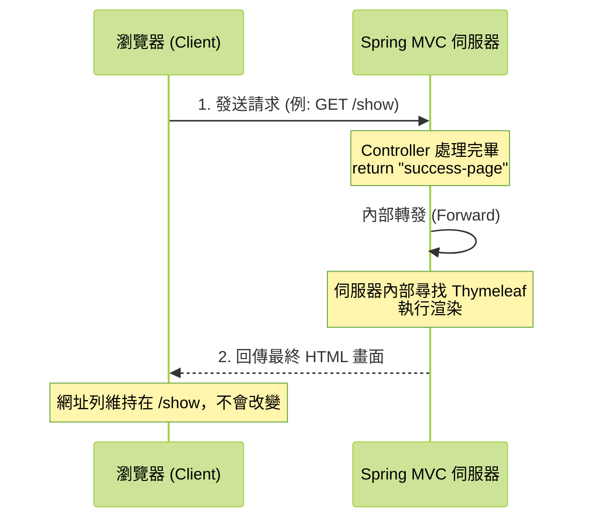
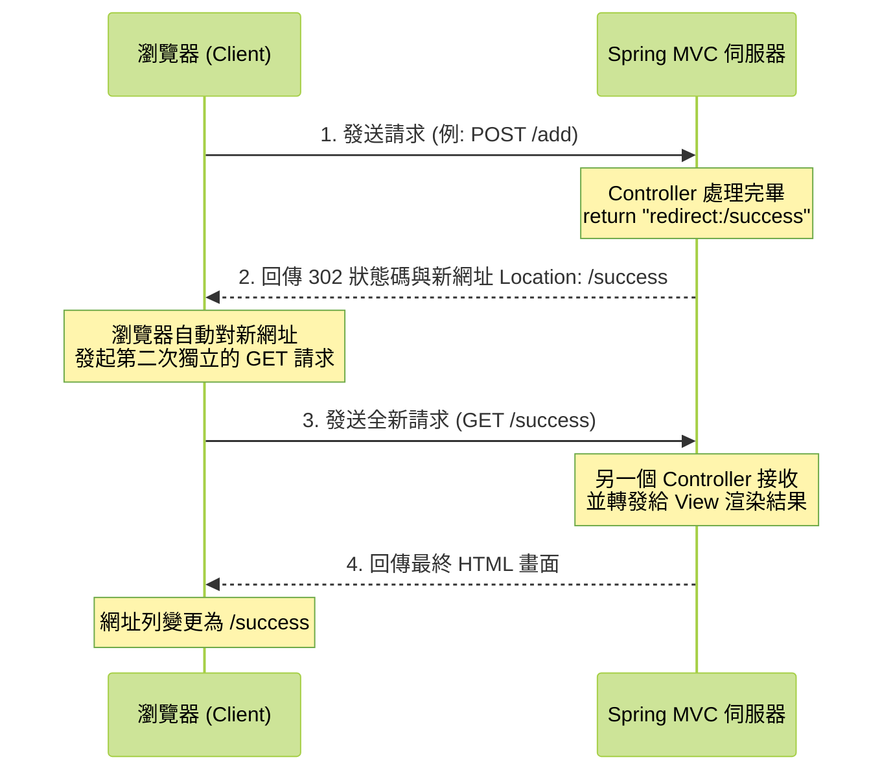
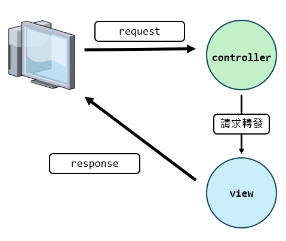
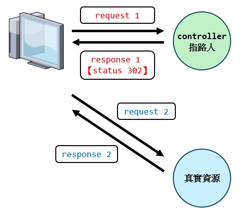
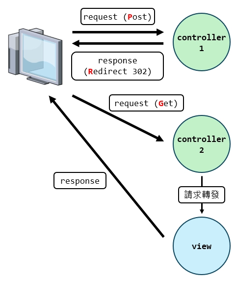
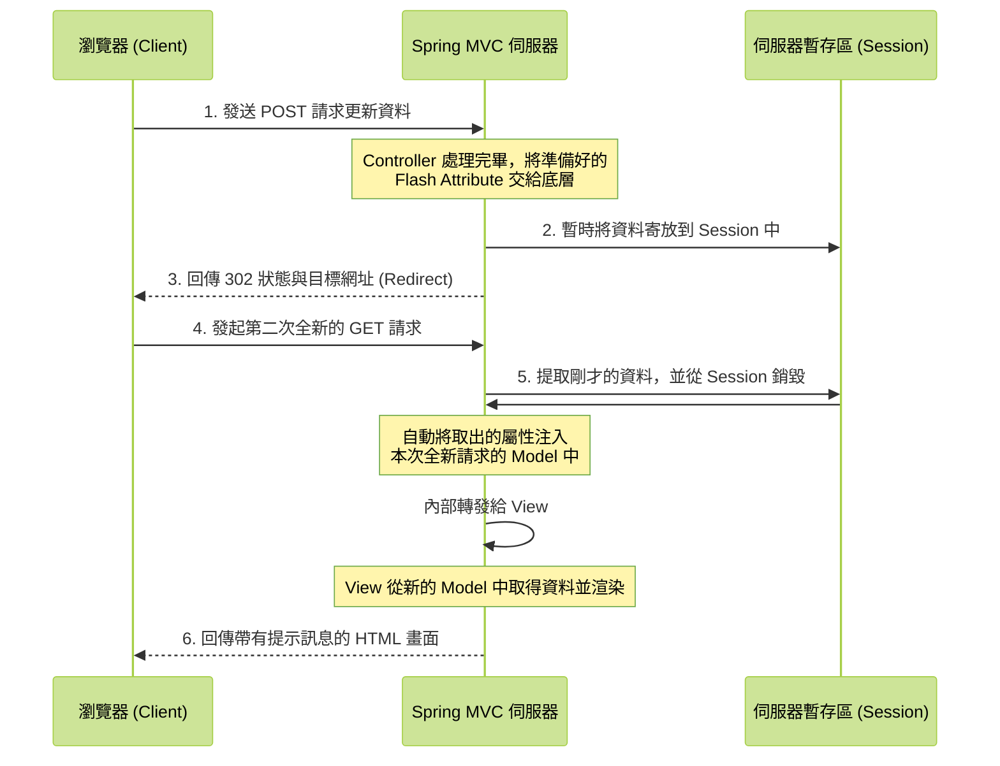
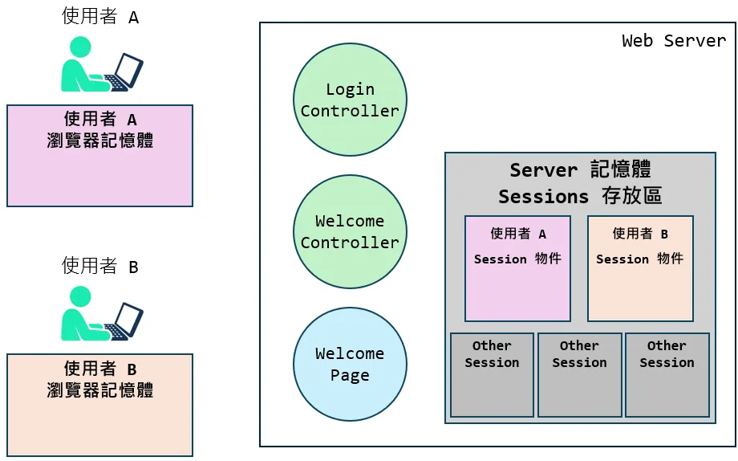

# 章節 2 ｜ 表單處理、資料封裝與狀態管理

---

## <a id="toc"></a>目錄

- [2-1 建立對外窗口：各類 Controller 與 HTTP 路由](#CH2-1)
  - [1. 定義對外入口 @Controller 與 @RestController](#CH2-1-1)
  - [2. 部署路由與動詞分流 @RequestMapping、@GetMapping、 @PostMapping](#CH2-1-2)
- [2-2 捕捉使用者的資料：網址參數與路徑變數](#CH2-2)
  - [1. 傳統查詢字串接收 @RequestParam](#CH2-2-1)
  - [2. 動態路徑變數接收 @PathVariable](#CH2-2-2)
- [2-3 複雜表單與 API 資料綁定](#CH2-3)
  - [1. 結構化資料封裝：DTO 模式與 Lombok 應用](#CH2-3-1)
  - [2. 兩大主流封裝器 @ModelAttribute 與 @RequestBody](#CH2-3-2)
- [2-4 畫面呈現的魔法：View Thymeleaf 深度講解與頁面跳轉](#CH2-4)
  - [1. 認識 Thymeleaf 基礎語法](#CH2-4-1)
  - [2. Thymeleaf 表單雙向綁定](#CH2-4-2)
  - [3. 頁面跳轉機制 Forward 與 Redirect](#CH2-4-3)
  - [4. 避免重複提交 PRG 模式與 Flash Attributes](#CH2-4-4)
  - [5. 回傳 HTTP 狀態以及圖片資源的常見處理模式](#CH2-4-5)
- [2-5 記住你是誰：Web 狀態管理 Session 與 Cookie](#CH2-5)
  - [1. 無狀態特性的 HTTP 協定](#CH2-5-1)
  - [2. 客戶端狀態管理 Cookie 的操作](#CH2-5-2)
  - [3. 伺服器端狀態 Session 的運作與設定](#CH2-5-3)
  - [4. 綜合實戰：登入、登出與記住我功能](#CH2-5-4)

---

## <a id="CH2-1"></a>[2-1 建立對外窗口：各類 Controller 與 HTTP 路由](#toc)

### <a id="CH2-1-1"></a>[1. 定義對外入口 @Controller 與 @RestController](#toc)

**📍 單元目標**  
理解 Controller 核心作用，並精確區分回傳 View 視圖與純資料格式（Data/API）的應用場景。

**🤔 為什麼需要它**  
每個應用系統都需要一個「對外收件窗口」來接收客戶端的 HTTP 請求。你可以把 Controller 想像成百貨公司的**服務台**，當顧客走進來說明需求後，服務台會判斷：是引導顧客到某樓層的專櫃逛逛（回傳 View 視圖），還是直接在櫃檯把資訊列印出來遞給你（回傳 JSON 資料）。Controller 就是負責這個「接收請求 → 處理邏輯 → 決定回傳方式」的角色。

**📖 核心概念**

| 註解標籤          | 主要用途                  | 運作說明                                                                                                                        |
| :---------------- | :------------------------ | :------------------------------------------------------------------------------------------------------------------------------ |
| `@Controller`     | 回傳 View 視圖            | 遇見此註解時，Spring MVC 預設將方法的字串回傳值視為「視圖名稱」，並搭配 `Model` 介面將資料傳遞給 Thymeleaf 等模板引擎進行渲染。 |
| `@ResponseBody`   | 回傳實體資料              | 應用於不需回傳視圖的場景，將方法的字串或物件回傳值直接寫入 HTTP Response Body 回應主體。通常配合 `@Controller` 使用。           |
| `@RestController` | RESTful 風格 API 開發首選 | 等同 `@Controller` + `@ResponseBody` 的組合。所有方法皆跳過視圖解析，直接回傳 JSON 或純文本。                                   |

> 💡 **彈性的方法參數與自動注入**
> Spring MVC 具備非常強大的**參數解析器 HandlerMethodArgumentResolver** 機制。當開發者定義 `@GetMapping` 等方法時，只需在括號內宣告需要的物件型別（例如 `Model`、`HttpServletRequest`、`HttpSession` 等），Spring 的 DispatcherServlet 就會在請求抵達時**自動發現並注入對應的實體**。這種「需要什麼就宣告什麼」的設計，大幅減少了傳統 Servlet 開發中手動解析資料的繁瑣步驟。

**💻 實作範例**

```java
import org.springframework.stereotype.Controller;
import org.springframework.ui.Model;
import org.springframework.web.bind.annotation.GetMapping;
import org.springframework.web.bind.annotation.ResponseBody;
import org.springframework.web.bind.annotation.RestController;
import org.springframework.web.servlet.ModelAndView;
import jakarta.servlet.http.HttpServletRequest;

import java.util.HashMap;
import java.util.Map;

// ====================================================================
// 範例一：傳統 Web 應用 - 指向視圖模板與資料傳遞
// ====================================================================
@Controller
public class PageController {

    // 1. 最基礎的視圖回傳
    @GetMapping("/home")
    public String showHomePage() {
        /**
         * 這裡可以處理其他邏輯，例如：
         * - 參數檢核，驗證前端傳遞的資料是否合法
         * - 呼叫 Service 層，執行核心的商業邏輯與資料庫互動
         */
        // 回傳視圖名稱，Spring 會找對應的 HTML 樣板（如 src/main/resources/templates/home.html）
        return "home";
    }

    // 2. 關於副檔名的補充 (不建議)
    @GetMapping("/about")
    public String showAboutPage() {
        // 直接寫死副檔名(.html)雖可執行，但會增加抽換視圖引擎的耦合度，實務上不建議
        return "about.html";
    }

    // 3. 傳遞資料：搭配 Model 傳遞資料至前端 (MVC 主流寫法)
    @GetMapping("/greeting")
    // 💡 Spring MVC 會自動依照宣告的型別注入實體參數
    public String showGreetingPage(Model model) {
        // 將後端運算結果放入 Model 中，準備讓前端的 Thymeleaf 進行渲染
        model.addAttribute("message", "歡迎光臨 Spring MVC！");
        return "greeting-view";
    }

    // 4. 使用 ModelAndView (較早期的寫法)
    @GetMapping("/legacy-greeting")
    public ModelAndView showLegacyGreetingPage(ModelAndView mv) {
        // ModelAndView 負責同時封裝資料與視圖名稱，在比較舊的專案中可能會見到。
        mv.addObject("message", "Hello from ModelAndView");
        mv.setViewName("greeting-view");
        return mv;
    }

    // 5. 傳遞資料：取得原生 Servlet API 資訊
    @GetMapping("/client-info")
    // 若業務需要，也能直接注入原生的 HttpServletRequest 等物件，用來取得較底層的網路資訊
    public String showClientInfo(HttpServletRequest request, Model model) {
        String clientIp = request.getRemoteAddr();
        model.addAttribute("ip", clientIp);
        return "info-view";
    }

    // 6. 重新導向 Redirect
    @GetMapping("/legacy-page")
    public String redirectToHome() {
        // 使用 "redirect:" 前綴要求客戶端瀏覽器重新發起 HTTP GET 請求跳轉至新路徑
        // 💡 關於隱藏在背後的 Forward 與 Redirect 完整跳轉機制及 PRG 模式，將於 2-4 節有深入探討
        return "redirect:/home";
    }

    // 7. Controller 中直接回應資料，而非轉向 View
    @GetMapping("/simple-data")
    @ResponseBody // 加入此註解表示「跳過 ViewResolver 視圖解析，直接將 return 內容視為資料體寫入 HTTP 回應主體」
    public String getSimpleData() {
        return "這是一段純文字資料，並非網頁標籤。";
    }
}
```

> 🔬 **課外深度選讀：Spring MVC 方法參數的「自動注入」背後到底發生了什麼事？**
> 這段屬於底層原理的延伸閱讀，課堂上不會特別講解。如果你現在只想先學會怎麼用，可以放心跳過！等未來對框架更熟悉後再回來看，會更有感覺。
>
> 在上面第 5 個範例 `showClientInfo(HttpServletRequest request, Model model)` 中，你可能會好奇：我們就只是宣告了參數而已，**到底是誰偷偷幫我們把物件塞進來的？而且一定要寫介面型別嗎？**
>
> **先釐清一個重要觀念：Controller 方法參數注入 ≠ Bean 注入**
> 你在 Controller 方法上看到的這種「自動給你物件」，跟 Service 層用 `@Autowired` 注入 Spring Bean 的機制**完全不同**。Controller 參數並不是從 IoC 容器裡面撈出來的，而是靠另一套專門的 **`HandlerMethodArgumentResolver` 方法參數解析器**。
>
> 它的運作流程大致是這樣的：
>
> 1. **掃描方法簽章**
>    當 HTTP 請求進到 `DispatcherServlet`，Spring 會用 Java 的「Reflection 反射機制」去讀取你的方法長什麼樣子，發現「喔，這個方法需要一個 `HttpServletRequest` 跟一個 `Model`」。
> 2. **逐一配對解析器**
>    Spring MVC 內部有一長串的解析器清單，它會拿著參數型別逐一詢問：「誰能負責處理 `HttpServletRequest`？誰能處理 `Model`？」
>    - `HttpServletRequest` → 由 `ServletRequestMethodArgumentResolver` 接手，直接從當前請求的執行緒中取出 Tomcat 傳進來的底層物件。
>    - `Model` → 由 `ModelMethodProcessor` 接手，它會直接 `new` 一個 `BindingAwareModelMap` 實例給你裝資料用。
> 3. **動態呼叫你的程式碼**
>    參數都準備好之後，Spring 再透過反射呼叫 `method.invoke(controllerInstance, requestInstance, modelInstance)`，你的方法就這樣被執行了。
>
> **常見迷思：「宣告類別也可以？不一定要用介面？」**
> 不少人會把「面向介面設計」的原則跟 Spring 的技術實作搞混，兩者是獨立的：
>
> - **反射機制不挑介面或類別**
>   你可以把 Java 反射想像成一種「X 光透視」，不管你傳進來的是抽象介面還是具體類別，反射都能在程式執行時動態看穿它的真實身份與內部結構。底層對應的就是 `Method.getParameterTypes()` 方法，它會回傳 `Class<?>[]`。所以當你在 Controller 宣告一個自定義 DTO 類別，Spring 解析器就能直接透過「無參數建構子」`new` 出物件，再把前端傳來的參數一一塞進去，全程不需要介面。
> - **其實標準的 Bean 注入也不強制要求介面**
>   即便跳出 Controller 來看 Service 層的 `@Autowired`，Spring 也有兩套代理策略：注入介面時，預設用 JDK Dynamic Proxy；注入具體類別時，改用 CGLIB 動態產生子類別作為代理。兩種方式都能完美支援 `@Transactional` 等 AOP 功能，所以「一定要寫介面才能注入」是個常見的誤解。

```java
// ====================================================================
// 範例二：現代化 API 專屬端點 - 直接回傳資料本體，而非視圖
// ====================================================================
@RestController // @RestController 等同於替類別內所有的 API 方法自動標記 @ResponseBody 功能
public class ApiController {

    // 1. 回傳純文本訊息
    @GetMapping("/api/status")
    public String checkSystemStatus() {

        return "System is up and running!";
    }

    // 2. 自動 JSON 序列化：回傳自訂物件或集合
    @GetMapping("/api/user")
    public Map<String, Object> getUserInfo() {
        // 在前後端分離或開發提供給手機 App 的介接 API 時，實務上通常會回傳 Map 或自訂物件 (DTO)
        Map<String, Object> userInfo = new HashMap<>();
        userInfo.put("id", 101);
        userInfo.put("name", "Alice");
        userInfo.put("role", "Admin");

        // Spring Boot 預設內建 Jackson 函式庫，會自動將各類 Java 集合或物件轉換序列化為 JSON 格式字串
        // 也就是說，客戶端最終將收到 JSON 格式的物件資料：{"id":101, "name":"Alice", "role":"Admin"}
        return userInfo;
    }
}
```

> 🚨 **常見地雷：忘記 `@ResponseBody` 導致的 404**
> 使用 `@Controller` 時，若方法回傳的字串並非視圖名稱，卻忘了加上 `@ResponseBody`，Spring 會嘗試拿該字串去尋找對應的 HTML 模板。一旦找不到，就會拋出 `404 Not Found` 或 Thymeleaf 的 `TemplateInputException`。
> 遇到這種報錯時，請先檢查：你想回傳的是「網頁畫面」還是「純資料」？若是純資料，記得加上 `@ResponseBody`，或直接改用 `@RestController`。

### <a id="CH2-1-2"></a>[2. 部署路由與動詞分流 @RequestMapping、@GetMapping、 @PostMapping](#toc)

**📍 單元目標**  
學習如何利用 HTTP 請求動詞與路徑概念，安全且具結構化地建構路由分層機制。

**🤔 為什麼需要它**  
若把不同業務邏輯全塞在同一端點，程式碼會難以維護，也可能產生安全疑慮。透過不同的 HTTP 動詞（GET、POST 等），我們可以在相同網址下實現精確的功能分離。

**📖 核心概念**  
現代 Spring 專案中提供直觀且具語義化的註解配置路由端點：

- **`@RequestMapping`**
  通常配置於 Controller 類別層級的頂部，用以定義該類別所管轄的**共用基礎路徑**，協助將路由系統模組化、結構化並防止衝突。
- **`@GetMapping`**
  專門處理 HTTP GET 請求。適用於簡單的資料查詢，通常不夾帶敏感資料或大量請求參數，常見如直接透過網址列訪問或是超連結跳轉。
- **`@PostMapping`**
  專門處理 HTTP POST 請求。適用於提交含有隱私設定及大量請求參數 Payload的資料操作，通常為前端 `<form>` 表單送出或資料建立業務。
- **`@PutMapping`、`@DeleteMapping` 與 `@PatchMapping`**
  專門應用於 RESTful API 開發風格中，負責處理資料的修改、更新與刪除操作。因傳統 HTML 表單原生不支援此類動詞，其完整應用與實體架構細節，將於後續的 RESTful API 課程中進行深度介紹。
- **其他特殊 HTTP 動詞 (`OPTIONS`、`HEAD` 等)**
  若系統需攔截非常見的 HTTP 動詞，可使用泛用註解配合屬性指定（如 `@RequestMapping(method = RequestMethod.OPTIONS)`）。此部分同屬進階的網路通訊架構範疇。

> 💡 **觀念補充：HTTP 請求方法總覽與學習地圖**
> HTTP 協定定義了一組標準動詞用以表示請求意圖。為幫助同學循序漸進，我們將依據傳統網頁與現代化 API 的學習路徑進行分類：
>
> **📚 階段一（本課程重點）**：`GET` 取得資源 + `POST` 提交資料。傳統 HTML 表單只支援這兩種動詞，也是我們這門課的核心。
>
> **🚀 階段二（未來 RESTful 課程）**：加入 `PUT`、`PATCH`、`DELETE`，完整對應 CRUD 生命週期，適用於前後端分離的 API 架構。

**💻 實作範例**

```java
import org.springframework.web.bind.annotation.*;

@RestController
// 1. 定義共用的基礎路由前綴，底下所有方法的端點路徑會自動繼承此設定
@RequestMapping("/api/users")
public class UserController {

    // 2. 處理 GET 路徑：/api/users
    @GetMapping
    public String listUsers() {
        return "獲取所有使用者列表資料";
    }

    // 3. 處理 POST 路徑：/api/users
    @PostMapping
    public String createUser() {
        return "伺服器已成功接收資料並新增使用者";
    }
}
```

> ⚠️ **常見錯誤分析：Method Not Supported 狀態碼 405**
> 當前端發送的 HTTP 請求動詞（例如使用 `<form method="post">` 送出表單）與 Controller 端點預期接收的註解動詞（如 `@GetMapping`）不匹配時，Spring 框架安全機制會阻擋請求並拋出 `405 Method Not Allowed` 狀態錯誤。開發過程務必協調確認前後端的通訊方式與介面對齊。

> 💡 **前端技術補充：送出 GET 與 POST 請求的主流方法**
> 後端定義好 Controller 路由與接收動詞後，前端通常會有以下幾種方式將請求發送至伺服器：
>
> 1. **傳統 HTML 表單 (`<form>`)**
>    網頁中最基礎的互動方式。透過設定 `method="GET"` 或 `method="POST"` 決定請求行為，並由瀏覽器原生行為觸發頁面跳轉與資料提交。
> 2. **原生 Fetch API**
>    現代瀏覽器內建的非同步請求標準。取代了早期的 `XMLHttpRequest` Ajax，基於 Promise 語法，常見於輕量級的前端非同步互動。
>    ```javascript
>    fetch("/api/users", {
>      method: "POST",
>      headers: { "Content-Type": "application/json" },
>      body: JSON.stringify(data),
>    }).then((res) => res.json());
>    ```
> 3. **Axios 套件**
>    目前業界最普遍使用的第三方 HTTP 客戶端工具庫。支援自動轉換 JSON 資料封裝、請求與回應攔截器 Interceptors 等進階功能，在 Vue 或 React 等現代前端框架生態中幾乎是標準連線配置。
>    ```javascript
>    axios.post("/api/users", data).then((res) => console.log(res.data));
>    ```

### 🔁 2-1 章節回顧

|  #  | 對應小節                       | 回顧問題                                                                                       | 參考解答                                                                                                                                            |
| :-: | :----------------------------- | :--------------------------------------------------------------------------------------------- | :-------------------------------------------------------------------------------------------------------------------------------------------------- |
|  1  | @Controller 與 @RestController | 在前後端分離的系統架構中，若後端只需提供 JSON 格式的資料，應該選擇使用哪一個 Controller 註解？ | 應直接採用 `@RestController`。它整合了 `@ResponseBody` 的特性，確保回傳值直接作為資料本體寫入回應，不會被視圖解析器誤判為模板名稱。                 |
|  2  | @Controller 與 @RestController | 使用 `@Controller` 時，若方法想回傳純文字資料卻出現了 404 錯誤，最可能的原因為何？             | 忘記標註 `@ResponseBody`，導致 Spring 將回傳字串誤判為視圖名稱去搜尋模板。應加上 `@ResponseBody`，或直接改用 `@RestController`。                    |
|  3  | @RequestMapping 與路由分流     | 將 `@RequestMapping` 應用於類別層級的優勢為何？                                                | 主要目的是定義 Controller 的基礎路徑前綴，例如 `/api/v1/products`。<br>有效收斂共用路徑，避免在個別端點重複宣告相同的路徑片段，有利於整體路由管理。 |
|  4  | @RequestMapping 與路由分流     | 在同一個 URL 路徑 `/api/users` 下，如何讓「查詢列表」與「新增使用者」兩種操作共存而不衝突？    | 透過 HTTP 動詞進行分流。查詢使用 `@GetMapping`，新增使用 `@PostMapping`，<br>兩者共用相同路徑但依據動詞區隔邏輯。                                   |

---

## <a id="CH2-2"></a>[2-2 捕捉使用者的資料：網址參數與路徑變數](#toc)

### <a id="CH2-2-1"></a>[1. 傳統查詢字串接收 @RequestParam](#toc)

**📍 單元目標**  
學會使用 `@RequestParam` 從網址的 Query String 查詢字串中接收參數。

**🤔 為什麼需要它**  
當使用者在網站上搜尋商品或篩選條件時，瀏覽器會在網址後面帶上 `?keyword=apple&price=100` 這樣的參數。後端 Controller 必須有辦法把這些參數接住，轉成 Java 變數才能進行後續的邏輯處理。

**📖 核心概念**  
只需在 Controller 方法的參數前方標上 `@RequestParam` 註解。當請求進來時，Spring 會自動從 HTTP 請求中找到同名的參數值，並注入到對應的變數裡。

> 💡 **防護機制與預設值指派**
> 使用者不一定每次都會把參數帶齊。如果某個必要參數沒傳過來，程式可能會拋出 `NullPointerException` 或回傳 `400 Bad Request` 錯誤。
> 最佳實務建議：在註解中設定 `required = false` 或 `defaultValue` 預設字串，讓應用程式在參數缺漏時也能安全運作，而不是直接崩潰。

**💻 實作範例**

```java
import org.springframework.web.bind.annotation.GetMapping;
import org.springframework.web.bind.annotation.RequestParam;
import org.springframework.web.bind.annotation.RestController;
import java.util.List;
import java.util.Map;

@RestController
public class SearchController {

    // 1. 屬性名稱不同時，須明確指定參數對應名稱
    // 請求路徑： /search?q=apple
    // 當前端傳遞的參數名稱與後端 Java 變數名稱不一致時，必須用 value 屬性宣告對應關係。
    @GetMapping("/search")
    public String searchSpecificName(@RequestParam(value = "q") String keyword) {
        return "你傳送的參數為：" + keyword;
    }

    // 2. 參數與屬性名稱相同時，可省略 value
    // 請求路徑： /search/basic?keyword=apple
    // 當前端傳遞的參數名稱與後端 Java 變數名稱相同時，可以省略 value 屬性。
    @GetMapping("/search/basic")
    public String searchBasic(@RequestParam String keyword) {
        return "你傳送的參數為：" + keyword;
    }

    // 3. 防護機制與 defaultValue
    // 請求路徑： /search/page?keyword=apple
    // 設定 required = false 防止崩潰，若前端未傳 page，將自動以 "1" 代入並轉型為 Integer。
    @GetMapping("/search/page")
    public String searchWithDefault(
            @RequestParam String keyword,
            @RequestParam(required = false, defaultValue = "1") Integer page) {

        return "你傳送的參數為：" + keyword + "，目前查看第 " + page + " 頁";
    }

    // 4. 接收多個同名參數組合為集合 List 或 Array
    // 請求路徑： /search/tags?tag=Java&tag=Spring&tag=MVC
    // 遇到前端多選框 (Checkbox) 提交的情況，能直接以 List 自動綁定所有項目。
    @GetMapping("/search/tags")
    public String searchWithList(@RequestParam List<String> tag) {
        return "你傳送的參數為：" + tag.toString();
    }

    // 5. 未知動態參數的全數攔截，封裝為 Map
    // 請求路徑： /search/dynamic?type=book&author=Alice&year=2024
    // 當系統查詢條件不確定時，宣告 Map 可一次接受所有傳遞參數的鍵值對。
    @GetMapping("/search/dynamic")
    public String searchWithMap(@RequestParam Map<String, String> allParams) {
        return "你傳送的參數為：" + allParams.toString();
    }
}
```

學會了從 Query String 中接收參數之後，接下來我們來看另一種更直觀的設計：直接把參數融入網址路徑本身。這兩種方式各有適用場景，往後實務中經常會搭配使用。

### <a id="CH2-2-2"></a>[2. 動態路徑變數接收 @PathVariable](#toc)

**📍 單元目標**  
學會從網址的動態路徑中提取變數，並了解什麼場景適合使用 Path Variable。

**🤔 為什麼需要它**  
把參數直接放進網址路徑裡（例如將 `?userId=123` 改寫為 `/users/123`），不僅讓網址更好讀、更有語義，對 SEO 搜尋引擎優化也更友善。

**📖 核心概念**  
在 `@GetMapping` 的路徑中，用大括號 `{變數名稱}` 來標記動態佔位的位置。接著在方法參數上搭配 `@PathVariable` 註解，Spring 就會自動把該段路徑的值抓出來，對應到你的變數上。

**💻 實作範例**

```java
import org.springframework.web.bind.annotation.GetMapping;
import org.springframework.web.bind.annotation.PathVariable;
import org.springframework.web.bind.annotation.RestController;

@RestController
public class ProfileController {

    // 1. 單一動態路徑變數
    // 定義 {id} 大括號為動態路徑之佔位符號
    @GetMapping("/users/{id}")
    public String findUser(@PathVariable("id") Integer userId) {

        System.out.println("使用者 ID = " + userId);
        return "使用者 ID = " + userId;
    }

    // 2. 多重動態路徑變數
    // 可以同時捕捉多個路徑變數，適用於有層級關聯的資源（如使用者→訂單），但不建議超過三層
    @GetMapping("/users/{userId}/orders/{orderId}")
    public String findUserOrder(
            @PathVariable("userId") Integer userId,
            @PathVariable("orderId") String orderId) {

        return "查詢會員訂單明細，會員 ID = " + userId + "，訂單 ID = " + orderId;
    }
}
```

### 🔁 2-2 章節回顧

|  #  | 對應小節      | 回顧問題                                                                                      | 參考解答                                                                                                                                       |
| :-: | :------------ | :-------------------------------------------------------------------------------------------- | :--------------------------------------------------------------------------------------------------------------------------------------------- |
|  1  | @RequestParam | 針對請求網址 `/products/999?discount=true`，欲分別擷取這兩項參數，應使用哪些註解？            | 數字 `999` 屬於動態路徑變數，須由 `@PathVariable` 接收解析。<br>`true` 歸屬為傳統查詢字串參數，應由 `@RequestParam` 負責映射。                 |
|  2  | @RequestParam | 如何使用 `@RequestParam` 的屬性，以防止因前端參數缺乏導致的系統崩潰？                         | 建議於註解中設定 `required = false` 或 `defaultValue`，<br>確保參數漏失時不會拋出異常，賦予應用程式較佳的安全容錯邊界。                        |
|  3  | @RequestParam | 若前端透過多選框提交同名參數如 `?tag=Java&tag=Spring`，或參數鍵值無法事前確定時，應如何接收？ | 同名參數可直接宣告 `List<String>` 等集合型態一併接收。<br>若需攔截所有未知參數，則可宣告 `Map<String, String>` 一次性提取全數鍵值對。          |
|  4  | @PathVariable | 若網址包含多重資源節點如 `/users/123/orders/A456`，能否同時擷取多個變數？                     | 可以。只需在 `@GetMapping` 路由中設置多套大括號佔位符如 `{userId}` 與 `{orderId}`，<br>並在方法中宣告對應數量的 `@PathVariable` 即可同時捕捉。 |

---

## <a id="CH2-3"></a>[2-3 複雜表單與 API 資料綁定](#toc)

### <a id="CH2-3-1"></a>[1. 結構化資料封裝：DTO 模式與 Lombok 應用](#toc)

**📍 單元目標**  
學習如何運用 DTO 資料傳輸物件的設計模式，系統化地處理包含多個欄位的複雜表單提交。

**🤔 為什麼需要它**  
當表單欄位一多，如果還在 Controller 方法裡一個一個用 `@RequestParam` 接收，參數列很快就會被淹沒。因此，我們需要一種更聰明的做法，直接用一個物件把所有欄位一次打包。

**📖 核心概念**  
在實務上，不建議把前端傳來的參數直接綁定到資料庫的 Entity 實體上，這會有過度綁定的安全風險。因此，我們通常會另外建立一個專門用來搬運資料的類別，稱為 **資料傳輸物件 Data Transfer Object**，簡稱 DTO。它只包含對應的屬性欄位和 Getter/Setter 方法，不涉及任何業務邏輯。

**💻 實作範例一：標準 Java DTO 的冗長痛點**

首先，我們建立一個專門用來接收註冊請求的 DTO 類別 `RegisterRequestDTO.java`。在傳統 Java 開發中，就算只有寥寥幾個欄位，也必須為了符合框架規範而手動寫上 Getter、Setter 和無參數建構子。這會讓程式碼變得十分臃腫：

```java
package com.eeit.demo.dto;

public class RegisterRequestDTO {
    // 💡 注意：此處宣告的屬性名稱，必須與前端 HTML 中 <input name="..."> 的名稱保持一致，以利自動綁定機制運作！
    private String username;
    private String password;
    private Integer age;

    // === 下方皆為傳統開發必須手動建立，或由 IDE 自動產生的樣板程式碼 ===

    public RegisterRequestDTO() {}

    public String getUsername() {
        return username;
    }

    public void setUsername(String username) {
        this.username = username;
    }

    public String getPassword() {
        return password;
    }

    public void setPassword(String password) {
        this.password = password;
    }

    public Integer getAge() {
        return age;
    }

    public void setAge(Integer age) {
        this.age = age;
    }
}
```

> 💡 **引入 Lombok 套件簡化開發**
> 手動寫這些重複的樣板程式碼實在太累了。我們可以引入 **Lombok** 輔助工具來解放雙手，只要加上簡單的註解，它就會在編譯階段自動幫你生成所有的 Getter/Setter。

**🛠️ Maven 專案整合 Lombok 步驟**

如果你在建立專案時沒有勾選 Lombok，請依照以下步驟手動配置：

1. **修改 `pom.xml` 加入依賴**  
   開啟專案根目錄的 `pom.xml`，找到 `<dependencies>` 區塊，並將下方的 Lombok 依賴設定貼上：
   ```xml
   	<dependency>
   		<groupId>org.projectlombok</groupId>
   		<artifactId>lombok</artifactId>
   		<!-- 標記為可選依賴：Lombok 僅在編譯期生效幫忙產生程式碼，不會被傳遞給其他引用此專案的模組 -->
   		<optional>true</optional>
   	</dependency>
   ```
2. **重新載入 Maven 設定**  
   儲存 `pom.xml` 後，請務必點擊右下角出現的 Maven 同步按鈕或執行「重新載入專案」，確保該函式庫正確下載至本地環境。

**💻 實作範例二：Lombok 簡化後的 DTO**

配置完成後，我們只需在剛剛的類別上方標註 `@Data`，即可將那幾十行的冗長程式碼全數刪除，只留下最純粹的欄位定義：

```java
package com.eeit.demo.dto;

import lombok.Data; // 引入 Lombok 註解

@Data
public class RegisterRequestDTO {
    // 💡 屬性名稱仍須與前端保持對齊。所有的 Getter、Setter 等方法都在背景被自動補齊了！
    private String username;
    private String password;
    private Integer age;
}
```

> 💡 **備註：Lombok 其他實用註解一覽**
> 雖然 `@Data` 囊括了最全面的功能（等同於一次套用 Getter、Setter、ToString、EqualsAndHashCode 等），但在嚴謹的實務架構中，為了遵循「封裝與最小權限」原則，我們時常會改用其他更精確的註解：
>
> | 註解                           | 功能說明                                                                                                                                      |
> | :----------------------------- | :-------------------------------------------------------------------------------------------------------------------------------------------- |
> | **`@Getter`** / **`@Setter`**  | 掛載於類別上會替全體屬性生成存取方法；掛載於單一屬性則只對該欄位生效。可防止如「訂單成立時間」等不可異動欄位被意外產生 Setter。               |
> | **`@NoArgsConstructor`**       | 自動生成無參數建構子。這對透過反射機制運作的框架（如 Spring MVC 參數綁定、JPA 實體映射）是不可或缺的基礎元件。                                |
> | **`@AllArgsConstructor`**      | 自動生成包含全體屬性的全參數建構子，方便在商業邏輯中透過 `new` 快速初始化完整的物件狀態。                                                     |
> | **`@RequiredArgsConstructor`** | 專門為 `final` 或 `@NonNull` 的必要屬性產生建構子。在現代 Spring 開發中，常用來實現優雅的建構子依賴注入，取代舊有的 `@Autowired` 寫法。       |
> | **`@Builder`**                 | 實作建造者設計模式 Builder Pattern，藉由鏈式呼叫建構物件，避免參數順序錯亂的風險。例如：`User.builder().username("Alice").age(25).build();`。 |

DTO 這個「資料容器」準備好之後，接下來的問題是：Spring 要怎麼知道該用什麼方式把前端送來的資料塞進去？這就要看前端是用哪種格式送資料了。

### <a id="CH2-3-2"></a>[2. 兩大主流封裝器 @ModelAttribute 與 @RequestBody](#toc)

**📍 單元目標**  
學會使用 Spring 提供的資料綁定註解，正確處理傳統網頁表單與 JSON API 兩種資料格式。

**🤔 為什麼需要它**  
上一節我們把 DTO 這個資料容器建好了，但前端送資料的格式不只一種：傳統表單提交的是 `application/x-www-form-urlencoded`，而現代 API 常用的是 JSON。Spring 必須知道「資料是用什麼格式包裝的」，才能正確拆包並塞進 DTO。這就是 `@ModelAttribute` 和 `@RequestBody` 各自負責的工作。

**📖 核心概念**

| 綁定註解標籤          | 處理目標格式                  | 運作功能與特色                                                                                                                                             |
| :-------------------- | :---------------------------- | :--------------------------------------------------------------------------------------------------------------------------------------------------------- |
| **`@ModelAttribute`** | **Form Data 或 Query String** | 接收並解析 HTML 的標準表單提交操作（`application/x-www-form-urlencoded`），利用自動資料綁定機制將參數封裝入 DTO。                                          |
| **`@RequestBody`**    | **專屬 JSON 格式**            | 現代 RESTful API 開發必備註解。用於接收客戶端傳遞的 JSON 格式字串，底層透過 Jackson 函式庫自動進行反序列化，將 JSON 解構並對應映射至指定的 Java DTO 實體。 |

**💻 實作範例**

接著，我們在 Controller 中實作整個物件的自動綁定。只要把 DTO 型別放在方法參數裡，搭配對應的註解，就能取代一個個用 `@RequestParam` 接收的麻煩寫法：

```java
import org.springframework.web.bind.annotation.*;
import com.eeit.demo.dto.RegisterRequestDTO;

@RestController
public class FormAndApiController {

    // 1. 處理傳統 HTML 表單，需標註 @ModelAttribute
    @PostMapping("/register-form")
    public String formSubmit(@ModelAttribute RegisterRequestDTO formArgs) {

        System.out.println("成功接收表單請求！帳號：" + formArgs.getUsername());
        // 內外型別轉換亦在背景自動完成
        System.out.println("提取整數型態年齡：" + formArgs.getAge());

        return "表單資料綁定與接收成功";
    }

    // 2. 處理前端的 JSON 請求，需標註 @RequestBody
    @PostMapping("/api/register")
    public String jsonSubmit(@RequestBody RegisterRequestDTO jsonArgs) {

        System.out.println("成功接收 JSON 結構化資料！帳號：" + jsonArgs.getUsername());
        return "JSON 反序列化與綁定接收成功";
    }
}
```

> 💡 **前端技術補充：送出表單參數的四種常見實作**
> 當後端設定好 `@ModelAttribute` 或 `@RequestBody` 接收參數後，前端有以下幾種主流送出方式：
>
> **1. 標準 HTML 表單**  
> 搭配 `@ModelAttribute` 使用，瀏覽器會將表單內容以 `application/x-www-form-urlencoded` 原生格式進行提交跳轉。
>
> ```html
> <form action="/register-form" method="POST">
>   <input type="text" name="username" placeholder="請輸入帳號" />
>   <input type="password" name="password" placeholder="請輸入密碼" />
>   <input type="number" name="age" placeholder="請輸入年齡" />
>   <button type="submit">送出</button>
> </form>
> ```
>
> **2. 使用 JS 建立 FormData，並用 Fetch API 送出**  
> 搭配 `@ModelAttribute` 使用。透過 FormData 模擬傳統表單封包，適用於不希望頁面跳轉的非同步（AJAX）請求。
>
> ```javascript
> const formData = new FormData();
> formData.append("username", "Alice");
> formData.append("password", "123456");
> formData.append("age", "25");
>
> fetch("/register-form", {
>   method: "POST",
>   body: formData, // Fetch 會自動依據 FormData 配置對應的 Content-Type
> })
>   .then((res) => res.text())
>   .then((data) => console.log(data));
> ```
>
> **3. 使用 JS 建立 FormData，並用 Axios 送出**  
> 搭配 `@ModelAttribute` 使用。Axios 自動處理了傳輸層設定，語法更加簡明直覺。
>
> ```javascript
> const formData = new FormData();
> formData.append("username", "Bob");
> formData.append("password", "654321");
> formData.append("age", "30");
>
> axios.post("/register-form", formData).then((res) => console.log(res.data));
> ```
>
> **4. 使用 JS 送出 JSON 字串**  
> 搭配 `@RequestBody` 使用。通常用於現代 RESTful API 架構，將前端的 JS 物件轉換為 JSON 格式字串傳送。
>
> - **Fetch API 範例**：必須明確宣告 `Content-Type` 為 `application/json` 並藉由 `JSON.stringify` 轉換物件。
>
>   ```javascript
>   const userData = { username: "Charlie", password: "pwd", age: 22 };
>
>   fetch("/api/register", {
>     method: "POST",
>     headers: {
>       "Content-Type": "application/json",
>     },
>     body: JSON.stringify(userData),
>   })
>     .then((res) => res.text())
>     .then((data) => console.log(data));
>   ```
>
> - **Axios 範例**：Axios 的物件參數預設會被內部機制序列化為 JSON，並自動掛載所需的 Header 屬性。
>
>   ```javascript
>   const userData = { username: "Dave", password: "myp", age: 28 };
>
>   axios.post("/api/register", userData).then((res) => console.log(res.data));
>   ```

### 🔁 2-3 章節回顧

|  #  | 對應小節                        | 回顧問題                                                                               | 參考解答                                                                                                                                                                         |
| :-: | :------------------------------ | :------------------------------------------------------------------------------------- | :------------------------------------------------------------------------------------------------------------------------------------------------------------------------------- |
|  1  | DTO 模式與 Lombok               | 當表單欄位很多時，為何不建議繼續用多個 `@RequestParam` 逐一接收，而要改用 DTO？        | 欄位一多，方法參數列就會嚴重膨脹、難以閱讀與維護。<br>透過 DTO 將所有欄位封裝為單一物件，不僅結構更清晰，後續要新增或調整欄位也更方便。                                          |
|  2  | DTO 模式與 Lombok               | 為什麼實務上不建議把前端參數直接綁定到資料庫的 Entity 實體？                           | 直接綁定 Entity 會有「過度綁定 Mass Assignment」的安全風險，<br>攻擊者可能在請求中夾帶額外欄位來竄改不該被修改的資料。<br>DTO 作為中間層，只暴露業務所需的欄位，有效收斂攻擊面。 |
|  3  | DTO 模式與 Lombok               | 引入 Lombok 並在 DTO 類別上加上 `@Data`，其主要效益為何？                              | 自動在編譯階段生成屬性的 Getter 與 Setter，以及 `toString`、`equals` 等基礎方法，<br>大幅減少重複性樣板程式碼的編寫時間。                                                        |
|  4  | @ModelAttribute 與 @RequestBody | 若系統端點預期接收 `application/json` 格式資料，後端應配置哪一個註解？                 | 必須使用 `@RequestBody`，以指示框架對 HTTP Body 封包執行 JSON 反序列化轉換作業。                                                                                                 |
|  5  | @ModelAttribute 與 @RequestBody | 若前端透過 Fetch API 傳遞 JSON 資料給後端 `@RequestBody`，必須手動處理哪兩項核心設定？ | ① 於請求標頭宣告 `'Content-Type': 'application/json'`。<br>② 利用 `JSON.stringify()` 將 JS 物件轉換為格式字串。<br>若改用 Axios 套件，則會由其內部機制自動完成這兩項工作。       |
|  6  | @ModelAttribute 與 @RequestBody | 當後端以 `@ModelAttribute` 接收參數，前端若不希望引發整頁跳轉，應如何處理？            | 應於 JavaScript 中實例化 `FormData` 物件裝載所有參數鍵值對，<br>並將其作為 Ajax 請求的傳輸主體，藉以模擬傳統 HTML 表單請求行為。                                                 |

---

## <a id="CH2-4"></a>[2-4 畫面呈現的魔法 View Thymeleaf 深度講解與頁面跳轉](#toc)

### <a id="CH2-4-1"></a>[1. 認識 Thymeleaf 基礎語法](#toc)

**📍 單元目標**  
學會 Thymeleaf 核心語法，將後端透過 `Model` 傳遞的資料動態渲染到 HTML 畫面上。

**🤔 為什麼需要它**  
早期的模板語法 JSP 經常將後端程式碼與 HTML 標籤混雜編寫，容易導致業務邏輯與畫面高度耦合，降低了系統可維護性與前後端團隊的協作效率。
Thymeleaf 作為現代化的解決方案，標榜 Natural Templates「自然模板」的設計理念。它完全透過擴展標準的 HTML 屬性來實現動態渲染，這意味著樣板檔案即使在沒有啟動伺服器的情況下，也能直接用瀏覽器開啟並正常檢視排版。

**📖 核心概念與實作**  
Thymeleaf 的運作核心在於「**變數表達式 `${...}`**」與「**專屬 HTML 屬性 `th:`**」的相互配合。伺服器在執行路徑轉發時，會掃描這些帶有 `th:` 屬性的標籤，並將 Model 容器內對應的資料填補進去。

為了更具體展示 Thymeleaf 的語法運用，我們假設後端已經準備好了一個 `MemberDto` 物件，並交由 Controller 放入 `Model` 中傳遞給前端視圖：

```java
// 1. 定義資料傳輸物件 MemberDto
@Data
public class MemberDto {
    private Integer id;
    private String name;
    private Integer age;
    private String avatarUrl;
}

// 2. Controller 準備資料並轉發
@Controller
public class MemberProfileController {

    @GetMapping("/member/profile")
    public String showProfile(Model model) {

        // 模擬從資料庫撈取單一會員資料
        MemberDto member = new MemberDto();
        member.setId(101);
        member.setName("Alice");
        member.setAge(25);
        member.setAvatarUrl("/images/alice.png");

        // 模擬撈取多筆會員清單
        List<MemberDto> memberList = List.of(member, new MemberDto(102, "Bob", 17, "/images/bob.png"));

        // 將實體資料綁定至 Model 容器，鍵值為 "currentMember" 與 "memberList"
        model.addAttribute("currentMember", member);
        model.addAttribute("memberList", memberList);

        return "profile-view"; // 轉發給 Thymeleaf 樣板渲染
    }
}
```

接著，我們來看看在 `profile-view.html` 樣板中，如何利用以上準備好的 `MemberDto` 進行資料綁定。以下為實用的基礎指令與特性一覽：

- **1. 動態文字替換 `th:text`**  
  基礎且最常見的用法。伺服器渲染時，標籤內原本寫死的佔位文字，將會被後端傳來的物件屬性完全覆寫。優點是直接在瀏覽器雙擊開啟 HTML 檔案時，畫面會安全地顯示原有的靜態假文案。

  ```html
  <!-- 存取 currentMember 中的 name 屬性。最終原始碼結果為 <span>Alice</span> -->
  <span th:text="${currentMember.name}"
    >此處的靜態文字將於伺服器執行時被覆寫</span
  >
  ```

- **2. 內聯表示式 Inline Expression `[[${...}]]`**  
  有時候我們只是想在一段文字描述中間，安插幾個小變數；如果為每一個變數都額外包裹一層帶有 `th:text` 的 `<span>` 標籤會顯得非常繁瑣。此時可以直接使用 `[[...]]` 的語法，要求引擎直接在該處印出該屬性的文字。

  ```html
  <!-- 最終結果為 <div>哈囉你好，Alice，歡迎登入系統！</div> -->
  <div>哈囉你好，[[${currentMember.name}]]，歡迎登入系統！</div>
  ```

- **3. 動態屬性綁定 `th:href` 與 `th:src`**  
  除了文字，HTML 原生的屬性如 src、href、id 等也能被 Thymeleaf 動態控制。
  此外，在實務開發中，建議**只要是路徑網址，外面都必須包覆一層 `@{...}` 路徑表達式**。這是因為伺服器在部署時，經常會被設定全域的應用程式路徑 `Context-Path`（例如 `/demo`）；使用 `@` 符號能讓框架在轉譯時，自動把專案的根路徑補進網址最前方，避免 404 跑板。

  假設我們的 Spring Boot 專案設定了 `server.servlet.context-path=/demo`，請對比有加 `@` 與沒加 `@` 的渲染差異：

  ```html
  <!-- ⚠️ 未使用 @：編譯後維持原樣，導致部署時遺失專案前綴而找不到資源 -->
  
  <!-- 瀏覽器最終收到的原始碼： -->

  <!-- ✅ 使用 @：系統自動補齊專案 Context-Path '/demo' -->
  
  <!-- 瀏覽器最終收到的原始碼： -->

  <!-- 應用於動態網址串接：生成會員專屬連結 -->
  <a th:href="@{'/profile/edit?id=' + ${currentMember.id}}">前往編輯會員資料</a>
  <!-- 瀏覽器最終收到的原始碼：<a href="/demo/profile/edit?id=101">前往編輯會員資料</a> -->
  ```

- **4. 集合迭代渲染 `th:each`**  
  針對 Controller 傳遞過來的集合，可利用「迴圈」的概念有規律地產生相同的 HTML 清單結構元素。

  ```html
  <ul>
    <!-- "member" 為執行迴圈時的暫存變數，該 <li> 標籤將依據 memberList 的長度自動重複產生 -->
    <li th:each="member : ${memberList}">
      會員姓名：[[${member.name}]]，年齡：<span th:text="${member.age}"></span>
    </li>
  </ul>
  ```

- **5. 條件渲染控制 `th:if` 與 `th:unless`**  
  兩者為邏輯相反的條件判斷。當表示式內的邏輯判斷為 `true` 時，該 HTML 元素區塊才會被渲染並送出到網頁原始碼中；若為 false，整個 DOM 節點會被直接從畫面上移除。
  ```html
  <!-- 依據會員的年齡屬性進行顯示邏輯判斷 -->
  <div th:if="${currentMember.age >= 15}">您已符合條件，可執行核心功能。</div>
  <div th:unless="${currentMember.age >= 15}">您未符合條件，請重新登入。</div>
  ```

### <a id="CH2-4-2"></a>[2. Thymeleaf 表單雙向綁定](#toc)

**📍 單元目標**  
學習應用 Thymeleaf 的物件綁定特性，降低 HTML 表單開發的重複結構，並實現表單狀態自動回填的機制。

**🤔 為什麼需要它**  
在傳統 HTML 表單開發中，收集表單資料必須手動為每個 `<input>` 標籤設定 `id` 與 `name` 屬性。若是表單送出後驗證失敗退回原頁面，為了將剛才輸入的資料「回填」以免被清空，還必須手動為每個標籤設定 `value="..."` 屬性。這不僅繁瑣容易出錯，也會造成大量重複的程式碼。

Thymeleaf 的雙向綁定能自動處理「資料繫結」與「狀態回填」，大幅減少開發冗餘並保證使用者操作的流暢性。

**📖 核心概念**  
Thymeleaf 的物件綁定主要是透過三大核心屬性完成：

- **1. 指向路徑 `th:action`**  
  指定表單送出的目標路徑，並會自動為路徑補上系統的 Context-Path。
- **2. 綁定實體 `th:object`**  
  宣告此表單關聯的「基礎資料模型」，通常是由 Controller 透過 `Model` 傳遞過來的 DTO 物件。
- **3. 星號表達式 `th:field`**  
  寫法為 `*{屬性名}`，用於 `<input>` 或 `<select>` 等輸入控制項。它會自動尋找外層 `th:object` 宣告的物件，並針對該物件的屬性執行綁定。

> 💡 **自動補齊機制的妙用**
> 當你在輸入框寫下 `th:field="*{email}"` 時，Thymeleaf 會在網頁編譯時自動轉換成：
> `id="email" name="email" value="後端物件目前的email值"`。
> 這套機制也涵蓋了 `<select>` 的預設選取，以及 `Radio/Checkbox` 的 `checked` 狀態等複雜的 DOM 渲染邏輯，無需開發者手動判斷。

**💻 建立表單專用的資料模型 (DTO)**  
為了讓前端的 `th:field` 有物件可以綁定，我們必須先在後端準備好對應的 DTO 類別。

```java
@Data
public class UserUpdateDto {
    private Integer id;
    private String username;
    private String password;
    private String email;
    private LocalDate birthday;   // 對應 <input type="date">
    private String gender;        // 對應 Radio Button
    private boolean subscribe;    // 對應單選 Checkbox (是否訂閱)
    private List<String> hobbies; // 對應複選 Checkbox
    private String city;          // 對應下拉選單 (單選)
    private List<String> skills;  // 對應下拉選單 (複選)
    private String remark;        // 對應 Textarea
}
```

**💻 Controller 準備表單物件 (GET)**  
在使用者進入修改資料頁面之前，我們必須先在 Controller 的 GET 方法中，預先塞入一個帶有既有資料的物件供 Thymeleaf 綁定。

```java
@Controller
public class UserUpdateController {

    @GetMapping("/profile/update")
    public String showUpdateForm(Model model) {
        // 實務上通常是從資料庫撈出會員既有資料，這裡我們先以寫死的值模擬回填
        UserUpdateDto userDto = new UserUpdateDto();
        userDto.setId(101);
        userDto.setUsername("Alice");
        userDto.setGender("M");
        userDto.setCity("TPE");

        model.addAttribute("userDto", userDto);
        return "profile-update";
    }
}
```

**💻 前端 Thymeleaf 表單配置**  
這是一個涵蓋所有常見 HTML 控制項的完整修改資料表單，透過綁定 `${userDto}`，畫面上再也看不到冗長的 `id` 與 `name`：

```html
<form th:action="@{/profile/update}" method="post" th:object="${userDto}">
  <!-- 1. 處理標準文字、密碼與 Email -->
  <div>
    <label>帳號與電子郵件：</label>
    <input type="text" th:field="*{username}" placeholder="帳號" />
    <input type="password" th:field="*{password}" />
    <input type="email" th:field="*{email}" placeholder="電子郵件" />
  </div>

  <!-- 2. 處理日期控制項 (Date) -->
  <div>
    <label>生日日期：</label>
    <input type="date" th:field="*{birthday}" />
  </div>

  <!-- 3. 處理單選按鈕：系統會比對 value 與物件屬性，自動判定是否加上 checked -->
  <div>
    <label>性別(單選 Radio)：</label>
    <input type="radio" th:field="*{gender}" value="M" /> 男
    <input type="radio" th:field="*{gender}" value="F" /> 女
  </div>

  <!-- 4. 處理單一勾選框：對應 Java 的 boolean 型別 -->
  <div>
    <label>是否訂閱電子報 (單選 Checkbox / Boolean)：</label>
    <input type="checkbox" th:field="*{subscribe}" /> 我願意接收最新資訊
  </div>

  <!-- 5. 處理複選框：對應 Java 的 List 或 Array，多個選項會自動組合 -->
  <div>
    <label>興趣愛好 (複選 Checkbox / List)：</label>
    <input type="checkbox" th:field="*{hobbies}" value="Reading" /> 閱讀
    <input type="checkbox" th:field="*{hobbies}" value="Coding" /> 寫程式
    <input type="checkbox" th:field="*{hobbies}" value="Travel" /> 旅遊
  </div>

  <!-- 6. 處理單選下拉選單：對應個別屬性值 -->
  <div>
    <label>居住城市 (單選下拉選單 Select)：</label>
    <select th:field="*{city}">
      <option value="">請選擇縣市...</option>
      <option value="TPE">台北市</option>
      <option value="TXG">台中市</option>
      <option value="KHH">高雄市</option>
    </select>
  </div>

  <!-- 7. 處理複選下拉選單：對應 Java 的 List -->
  <div>
    <label>掌握技術 (複選下拉選單 Select Multiple)：</label>
    <select th:field="*{skills}" multiple="multiple">
      <option value="Java">Java</option>
      <option value="Spring">Spring</option>
      <option value="SQL">SQL</option>
    </select>
  </div>

  <!-- 8. 處理 Textarea -->
  <div>
    <label>備註說明 (Textarea)：</label>
    <textarea
      th:field="*{remark}"
      rows="3"
      placeholder="請輸入備註..."
    ></textarea>
  </div>

  <button type="submit">儲存修改</button>
</form>
```

**💻 Controller 接收表單提交 (POST)**  
當表單按下送出後，Spring MVC 會負責將畫面上輸入的值整包封裝回 DTO 中，開發者無需再手動使用 `request.getParameter()` 逐一取值。

```java
@Controller
public class UserUpdateController {
    // 接收表單送出：Spring 會自動將前端剛剛修改的值封裝回 DTO
    @PostMapping("/profile/update")
    public String processUpdate(@ModelAttribute("userDto") UserUpdateDto userDto) {
        System.out.println("接收到更新的使用者資訊：" + userDto);
        return "success";
    }
}
```

> 💡 **關於未來的前端技術**
> 這裡所學習到的 `th:field`「雙向綁定」概念非常重要。未來在你學習前端框架 **Vue.js** 時，會接觸到極其相似的 **`v-model`** 指令。雖然一個是在伺服器端渲染 SSR，一個是在客戶端渲染 CSR，但它們解決的核心痛點都是「讓程式變數與 HTML 畫面狀態保持一致」。掌握了現在的邏輯，未來轉職全端開發時將會無縫接軌。

### <a id="CH2-4-3"></a>[3. 頁面跳轉機制 Forward 與 Redirect](#toc)

**📍 單元目標**  
了解 Forward 請求轉發與 Redirect 重新導向兩種跳轉方式的底層機制差異與適用場景。

**🤔 為什麼需要它**  
Controller 處理完請求後，要把結果畫面送給使用者有「兩種方法」可以走。選錯方法不只會讓網址列顯示錯誤，嚴重的話還會導致使用者按 F5 重新整理時不小心重複提交表單。搞懂這兩種機制，才能在不同情境下做出正確的選擇。

**📖 核心概念**  
在 Controller 常見的 `return "success-page";` 寫法，實際上隱含呼叫了 Spring 的 **請求轉發 Forward** 機制。相對應的另一主流機制為 **重新導向 Redirect**。兩者的底層運作流程與特性截然不同：

**➡️ Forward 請求轉發 (內部切換)**  
這是 Spring MVC 的預設行為。當 Controller 處理完後，伺服器會**在內部**直接將任務交接給 View 進行渲染。整個過程都在伺服器內部完成，對瀏覽器而言，它只知道發出了一次請求並收到一次回應。因此，**瀏覽器的網址列不會改變**。

<div align="center" >
<div style="background-color: white; border-radius: 20px; width: 60%;">



</div>
</div>

**🔀 Redirect 重新導向 (外部跳轉)**  
當 Controller 回傳 `redirect:/xxx` 時，伺服器會向瀏覽器發送一個 **HTTP 302 重新導向** 回應，並附上新的目標網址。瀏覽器收到後，會自動對新的網址發起一次**全新的 GET 請求**。因為這是藉由瀏覽器發動的全新獨立連線，所以**網址列會自動更新**為新的路徑，且前一次請求留在 `Model` 中的資料會全部遺失。

<div align="center" >
<div style="background-color: white; border-radius: 20px; width: 60%;">



</div>
</div>

**💻 深入底層：手動實作 Redirect 回應**

雖然 Spring MVC 提供了 `return "redirect:/xxx"` 的便捷寫法，但 Redirect 的底層機制很單純，伺服器只是向瀏覽器回傳一個 **HTTP 302 狀態碼**，並在回應中夾帶目標網址的 **`Location` 標頭 Response Header**。

為了更深入理解這個機制，我們可以不靠框架的自動處理，改成自己動手直接在 Controller 方法中注入原生的 `HttpServletResponse` 物件，手動設定 HTTP 狀態碼來達成完全相同的跳轉效果：

```java
import jakarta.servlet.http.HttpServletResponse;
import org.springframework.web.bind.annotation.GetMapping;
import org.springframework.web.bind.annotation.RestController;

@RestController
public class ManualRedirectController {

    @GetMapping("/manual-redirect")
    public void performManualRedirect(HttpServletResponse response) {
        // 直接操控 HTTP Response 底層屬性以發動重新導向
        response.setStatus(302); // 1. 設定 HTTP 狀態碼：302 Found
        response.setHeader("Location", "/success");       // 2. 設定 Location 標頭，指示跳轉目標網址

        // 💡 實務補充：上述兩行指令，其實也等同於呼叫原生 API 封裝好的便捷方法：
        // response.sendRedirect("/success");
    }
}
```

> 💡 **備註：常見 HTTP 狀態碼總覽**
> 在 Web 開發中，HTTP 狀態碼是伺服器與瀏覽器溝通處理結果的重要協議。了解這些狀態碼對除錯與日後的 API 設計皆至關重要：
>
> **【2xx 成功系列】**
>
> - **`200 OK`**：請求成功，伺服器已回傳結果。是最常見的狀態碼。
> - **`201 Created`**：請求成功且已建立新資源，常見於 POST 新增資料後。
> - **`204 No Content`**：處理成功但無需回傳內容，常見於 DELETE 或無畫面的非同步操作。
>
> **【3xx 重新導向系列】**
>
> - **`301 Moved Permanently`**：資源已永久搬遷，搜尋引擎會更新索引。
> - **`302 Found`**：暫時性重新導向（早期標準），實務上瀏覽器幾乎都會自動轉為 GET。
> - **`303 See Other`**：明確要求瀏覽器以 GET 前往新網址，是 PRG 模式的最佳搭檔。
> - **`304 Not Modified`**：快取仍有效，瀏覽器直接用本地暫存即可，不必重新下載。
> - **`307 Temporary Redirect`**：類似 302 但更嚴格，要求保留原始 HTTP 動詞，不准把 POST 降為 GET。
>
> 💡 **進階比較：302、303 與 307 的差異**
> 早期 `302` 對「POST 遇到重新導向該不該轉 GET」定義模糊，各家瀏覽器做法不一（但幾乎都轉了 GET）。HTTP/1.1 為此拆分出兩個更明確的狀態碼：
>
> | 狀態碼                       | 遇到 POST 時的行為                   | 實務常見情境                                                          |
> | :--------------------------- | :----------------------------------- | :-------------------------------------------------------------------- |
> | **`302 Found`**              | 行為模糊，但現今瀏覽器皆預設轉為 GET | 一般暫時性頁面跳轉                                                    |
> | **`303 See Other`**          | **強制轉為 GET**                     | 結帳完成後跳至訂單頁，完美符合 **PRG 模式**                           |
> | **`307 Temporary Redirect`** | **嚴格保持 POST**                    | API 端點暫時更換網址，需確保客戶端以原 POST 將 Payload 完整送至新目標 |
>
> **【4xx 客戶端錯誤系列】**
>
> - **`400 Bad Request`**：請求語法錯誤或參數無效。
> - **`401 Unauthorized`**：尚未登入或憑證過期，身分驗證失敗。
> - **`403 Forbidden`**：身分驗證通過但權限不足，伺服器拒絕執行。
> - **`404 Not Found`**：找不到目標資源，最常見原因是網址拼錯。
> - **`405 Method Not Allowed`**：端點不支援該 HTTP 動詞，例如只接受 POST 卻收到 GET。
> - **`409 Conflict`**：請求與當前狀態衝突，常見於重複 ID 或同時更新的阻擋。
> - **`415 Unsupported Media Type`**：資料格式不符，例如要求 JSON 卻送了表單格式。
>
> **【5xx 伺服器端錯誤系列】**
>
> - **`500 Internal Server Error`**：後端發生未預期例外而中斷。開發期間常見，但正式上線後不應該出現。
> - **`502 Bad Gateway`**：代理伺服器從上游收到無效回應，常見於 Nginx 連不上 Spring Boot。
> - **`503 Service Unavailable`**：伺服器暫時無法服務，通常是停機維護或負載過重。

**📊 特性比較總覽**

| 比較項目                  | Forward 請求轉發 (預設行為)                                           | Redirect 重新導向                                                     |
| :------------------------ | :-------------------------------------------------------------------- | :-------------------------------------------------------------------- |
| **語法格式範例**          | `return "xxx";`                                                       | `return "redirect:/xxx";`                                             |
| **實際運作發起地**        | 內部伺服器架構暗中切換分配                                            | 伺服器要求客戶端瀏覽器發起一次全新的 HTTP 請求前往目標端點            |
| **客戶網址列呈現**        | 網址列不因轉發發生改變                                                | 網址列 會自動更新為新的目標位址                                       |
| **HTTP Request 生命週期** | 視為同一請求延續，原裝載於 `Model` 的資料可傳遞至下一階段視圖作渲染。 | 屬於全新的獨立連線，上一個端點存放於 `Model` 內的資料將失效並被清除。 |
| **典型應用場景**          | 資料檢索、查詢等不變更狀態且適合直接將結果渲染供閱覽的流程            | 涉及資料庫寫入的操作（如新增、更新、刪除）後的跳轉                    |

<div style="display: flex; justify-content: center; align-items: end; gap: 80px; margin: 10px 0 10px 0;
border: 3px solid #ccc; border-radius: 20px; padding: 10px;"> 
  <div style="text-align: center;">
    
    <p style="margin-top: 10px;"><i>Forward 請求轉發</i></p>
  </div>
  <div style="text-align: center;">
    
    <p style="margin-top: 10px;"><i>Redirect 重新導向</i></p>
  </div>
</div>

### <a id="CH2-4-4"></a>[4. 避免重複提交 PRG 模式與 Flash Attributes](#toc)

**📍 單元目標**  
理解防範表單重複提交的標準做法：PRG Post-Redirect-Get 設計模式。

**🤔 為什麼需要它**  
若在處理寫入資料的 POST 方法後，直接預設將畫面 Forward 給使用者（例如 `return "checkout-success"`），雖然當下瀏覽器顯示成功頁面，但其底層路由依舊停留在帶有執行寫入指令的 POST 端點 `/checkout`。
此時若客戶端按下「瀏覽器重新整理（F5）」按鈕，瀏覽器將基於其保留的狀態，**強制再次送出該 POST 請求**。這將引發危險的「雙重扣款」或「訂單重複建立」等業務災難與資料庫異常。

**📖 核心概念**  
為了徹底避免這個問題，業界普遍採用 **PRG Post-Redirect-Get** 模式作為防護準則。核心規範很簡單：**凡是會修改資料的 POST 請求，處理完後一律禁止使用 Forward 直接顯示結果畫面，必須改用 Redirect，讓瀏覽器發起全新的 GET 請求來載入結果頁。** 換句話說：

1. GET 請求可使用 Forward 與 Redirect。
2. POST 請求只能使用 Redirect。

<div style="display: flex; flex-direction: column; justify-content: center; align-items: center;  margin: 10px 0 10px 0;
border: 3px solid #ccc; border-radius: 20px; padding: 10px;"> 
  <div style="background-color:#FFFFFF; border-radius: 10px; width:80%;text-align: center;">
    
  </div>
  <p style="margin-top: 10px;"><i>PRG 模式示意圖</i></p>
</div>

**💡 關於 PRG 模式下，顯示訊息的技術：Flash Attributes**  
採用 PRG 模式後，會遇到一個問題：Redirect 是一次全新的請求，原本放在 `Model` 裡想傳給成功畫面的提示訊息，會在跳轉時被清空。
要解決這個問題，我們需要改用 `RedirectAttributes` 介面提供的 **Flash Attributes** 機制。

既然 Redirect 是一次全新的獨立請求，這些資料究竟被藏在哪裡？實際上，Spring MVC 在底層會暫時借用伺服器的「**會話記憶體（稍後章節會詳細介紹的 Session 機制）**」來保管這些 Flash Attributes。
當瀏覽器發起第二次的 GET 請求並抵達目標端點時，Spring 會自動將這些資料從會話記憶體中取出，並**立即銷毀**原有的暫存紀錄（這也是被稱為 Flash 快閃的原因），最後乾淨俐落地將資料轉移進這次全新的 `Model` 中供 View 渲染。

<div align="center" >
<div style="background-color: white; border-radius: 20px; width: 80%;">



</div>
</div>

**💻 使用情境與實作範例：提示修改使用者資訊成功**  
最常見的使用情境便是「表單送出成功後，跳轉回主頁面並顯示一次性的成功提示文字」。我們以更新使用者資料為例：

**1. 後端 Controller 實作**

```java
import org.springframework.stereotype.Controller;
import org.springframework.web.bind.annotation.PostMapping;
import org.springframework.web.bind.annotation.GetMapping;
import org.springframework.web.servlet.mvc.support.RedirectAttributes;

@Controller
public class UserProfileController {

    // 階段一：受理來自客戶端的表單更新 POST 請求
    @PostMapping("/profile/update")
    public String updateProfile(RedirectAttributes redirectAttrs) {

        // 1. 執行業務邏輯，將新資料存入資料庫...

        // 2. 由於即將採用 Redirect，必須捨棄 Model，改用 Flash Attributes 挾帶提示文字
        redirectAttrs.addFlashAttribute("successMsg", "個人資料已成功更新！");

        // 3. 嚴謹遵守 PRG 模式規範，重新導向回個人主頁 (GET)
        return "redirect:/profile";
    }

    // 階段二：獨立負責呈現畫面的 GET 端點
    @GetMapping("/profile")
    public String showProfile() {

        // 此處不需針對 Flash Attribute 特別撰寫接收邏輯，
        // Spring 會自動從底層暫存區提取 "successMsg" 並轉存入 Model 中供視圖解析。
        return "profile-view";
    }
}
```

**2. 前端 Thymeleaf 接收與渲染**
在 `profile-view.html` 樣板中，我們可以搭配 `th:if` 條件判斷式。只有當 Flash Attribute 中確實存在 `successMsg` 這個變數時，才將提示的 HTML 標籤區塊渲染出來。一旦使用者再次刷新此頁面，因為 Flash Attribute 已被清空，該提示框就會自動消失。

```html
<!-- 使用 th:if 檢查變數是否存在，若存在則顯示綠色提示橫幅 -->
<div
  th:if="${successMsg}"
  style="color: green; border: 1px solid green; padding: 10px; margin-bottom: 20px;"
>
  [[${successMsg}]]
</div>

<!-- 正常的個人資料顯示區塊... -->
<div>
  <h3>會員中心</h3>
  <p>歡迎回來！</p>
</div>
```

### <a id="CH2-4-5"></a>[5. 回傳 HTTP 狀態以及圖片資源的常見處理模式](#toc)

**📍 單元目標**  
在熟悉了標準的 MVC 視圖渲染流程後，作為補充，學會如何處理自訂的 HTTP Response 狀態，以及如何在後端處理與回傳二進位資源給前端介面。

**🤔 為什麼需要它**  
雖然傳統 MVC 以渲染 HTML 畫面為主，但在許多實務場景中（例如動態產生圖形驗證碼 CAPTCHA、從伺服器特定資料夾讀取照片直接展示），我們無法單靠靜態路由 `` 存取。這時需要在後端透過程式邏輯，將圖片轉換為二進位資料流或是文字編碼後，再傳遞給前端顯示。

**📖 核心概念與實作**  
實務上，處理圖片回傳有兩種常見的模式：

**模式一：透過 `@ResponseBody` 與 `byte[]` 直接回傳二進位流 (適用於大檔或常規圖片)**  
當我們在 Controller 方法加上 `@ResponseBody` 註解時，Spring MVC 就不會去尋找 HTML 樣板，而是將方法的 return 內容直接寫入 HTTP Response Body 中。
透過方法宣告 `produces = "image/png"` 去改變 HTTP 標頭中的 MIME Type，明確告知瀏覽器「這是一張圖片，請用內建圖片引擎解碼渲染，而不是當成網頁的亂碼字串顯示」。前端透過一般的 `` 即可正常顯示圖片。

**模式二：轉換為 Base64 字串封裝於 DTO，併同其他資料交由 View 渲染 (適用於小圖或圖形驗證碼)**  
若是圖片體積不大，可以將其二進位陣列轉換成一長串純文字格式。這樣做的好處是能將其當作一般文字屬性放入 DTO 中，連同其他會員資料（如姓名、年齡）一起交由 Thymeleaf 轉發渲染。前端不需額外發起 HTTP 請求載入圖片，只需在 `` 接收該字串即可正常顯示。缺點是編碼後檔案體積會膨脹約 33%。
實務轉換上分為三個關鍵步驟：

1. **猜測 MimeType：** 利用 Java 內建的 `URLConnection.guessContentTypeFromName()` 來動態判斷圖片的正確格式（如 `image/png`、`image/jpeg`）。
2. **轉換為 Base64 字串：** 先將實體圖片讀取為 `byte[]` 陣列，接著使用 Java 內建的 `Base64.getEncoder().encodeToString(byte[])` 將位元陣列轉為 Base64 的純文字編碼。
3. **組裝 Data URI Scheme**
   為了讓前端標籤能正常解析該字串，必須將 MimeType 與 Base64 字串組合成 `data:[mimetype];base64,[內容]` 的標準格式，再置入 DTO 中傳遞。

**💻 實作範例**

```java
import org.springframework.http.HttpStatus;
import org.springframework.http.ResponseEntity;
import org.springframework.stereotype.Controller;
import org.springframework.ui.Model;
import org.springframework.web.bind.annotation.GetMapping;
import org.springframework.web.bind.annotation.ResponseBody;

import java.io.File;
import java.io.IOException;
import java.net.URLConnection;
import java.nio.file.Files;
import java.util.Base64;

@Controller
public class FileResponseController {

    // 1. 自訂 HTTP 狀態碼與標頭的 ResponseEntity
    // 不僅能回傳純文字資料，還能介入 HTTP 協議底層，宣告 201 Created 等狀態
    @GetMapping("/custom-response")
    @ResponseBody
    public ResponseEntity<String> getCustomResponse() {
        return ResponseEntity
            .status(HttpStatus.CREATED) // 回應狀態碼：201 Created
            .header("Custom-Hint", "SpecialDataCode") // 塞入自訂的 Response Header
            .body("伺服器端已順利建檔並完成客製化封包回傳！");
    }

    // =================================================================

    // 2. 影像回傳模式一：直接回傳位元陣列 (需指定 MimeType)
    // 透過 produces = "image/png" 告知瀏覽器如何渲染這串二進位資料
    @GetMapping(value = "/image/stream", produces = "image/png")
    @ResponseBody // 跳過 Thymeleaf 解析，直接將 byte[] 寫入 HTTP Response
    public byte[] returnImageStream() throws IOException {

        File imgFile = new File("src/main/resources/static/images/cat.png");

        // 直接利用 NIO 讀取檔案轉為 byte[] 陣列
        return Files.readAllBytes(imgFile.toPath());
    }

    // 3. 影像回傳模式二：將影像轉為 Base64 字串，放入 DTO / Model 中交由 View 渲染
    @GetMapping(value = "/image/base64-view")
    public String returnImageBase64View(Model model) throws IOException {

        File imgFile = new File("src/main/resources/static/images/cat.png");

        // 步驟 1：利用 URLConnection 依據檔案名稱動態猜測 MimeType (例如: image/png, image/jpeg)
        String mimeType = URLConnection.guessContentTypeFromName(imgFile.getName());
        if (mimeType == null) {
            mimeType = "image/jpeg"; // 若猜測失敗這給予預設 MimeType
        }

        // 步驟 2：讀取檔案為 byte[] 陣列
        byte[] fileBytes = Files.readAllBytes(imgFile.toPath());

        // 步驟 3：利用 Java 內建 Base64 工具將 byte[] 轉型為 Base64 字串
        String base64Str = Base64.getEncoder().encodeToString(fileBytes);

        // 步驟 4：將 MimeType 與 Base64 字串組合成 Data URI Scheme 標準長相
        String dataUriScheme = "data:" + mimeType + ";base64," + base64Str;

        // 實務上會將此長長的字串封裝入 DTO (例如 MemberDto 的 avatarBase64 屬性)，這裡示範直接放入 Model
        model.addAttribute("avatarBase64", dataUriScheme);

        // 返回視圖名稱，轉發給 Thymeleaf 渲染
        // 前端 HTML 可寫為： 
        return "profile-view";
    }
}
```

> 💡 **實務補充：如果不知道圖片格式怎麼辦？**
> 在上述「模式一」的範例中，為了演示方便我們直接於 `@GetMapping` 使用 `produces = "image/png"` 將輸出格式寫死。
> 然而在實務上，若我們要撰寫動態下載多種檔案格式的 API（例如同個端點要處理 jpg, png 等不同圖片），當然無法把格式寫死。此時，我們通常會讓控制器方法改為回傳 `ResponseEntity<byte[]>`，並在程式內部同樣利用 `URLConnection.guessContentTypeFromName()` 猜測出正確的 MimeType 後，再手動將其賦值進 HTTP Response Header 中回傳給瀏覽器。

### 🔁 2-4 章節回顧

|  #  | 對應小節                | 回顧問題                                                                                          | 參考解答                                                                                                                                                                                                                                                                  |
| :-: | :---------------------- | :------------------------------------------------------------------------------------------------ | :------------------------------------------------------------------------------------------------------------------------------------------------------------------------------------------------------------------------------------------------------------------------ |
|  1  | Thymeleaf 基礎語法      | 開發 Thymeleaf 模板時若需動態輸出集合清單的列結構，應選用哪個屬性？                               | 須使用 `th:each="item : ${list}"` 對元素進行迴圈覽與重複渲染。                                                                                                                                                                                                            |
|  2  | Thymeleaf 基礎語法      | 在 Thymeleaf 模板中撰寫路徑網址時，為什麼建議一律使用 `@{...}` 路徑表達式包覆？                   | 因為伺服器在部署時可能會設定全域的應用程式路徑 `Context-Path`。<br>使用 `@{...}` 能讓框架在轉譯時自動補上專案根路徑前綴，避免因路徑缺漏導致 404 錯誤。                                                                                                                    |
|  3  | Thymeleaf 表單雙向綁定  | Thymeleaf 表單雙向綁定需搭配哪三個核心屬性？`th:field="*{email}"` 在編譯後會自動產生什麼？        | 需搭配 `th:action`（指定送出路徑）、`th:object`（綁定 DTO 物件）、`th:field`（綁定個別屬性）。<br>`th:field="*{email}"` 編譯後會自動展開為 `id="email" name="email" value="目前的email值"`，實現狀態自動回填。                                                            |
|  4  | Forward 與 Redirect     | 為什麼在執行完 POST 寫入作業後，系統要求使用 Redirect 而非 Forward？                              | 為遵循 PRG 模式，此舉能阻斷瀏覽器停留在高危險的執行狀態端點，<br>杜絕使用者不慎刷新頁面致使表單重複提交的風險。                                                                                                                                                           |
|  5  | PRG 與 Flash Attributes | 在 PRG 模式中，Redirect 會導致 Model 資料遺失。若仍需在跳轉後顯示一次性提示訊息，應使用什麼機制？ | 應使用 `RedirectAttributes` 的 `addFlashAttribute()` 方法。<br>Spring 會將資料暫存於 Session，待第二次 GET 請求抵達時自動取出並注入新的 Model，同時立即銷毀暫存紀錄。                                                                                                     |
|  6  | 回傳圖片資源            | 若後端需回傳圖片資源給前端顯示，通常有哪兩種常見作法？動態處理多種副檔名時寫法有何差異？          | ① 直接回傳 `byte[]` 二進位流。格式固定可用 `produces` 指定；需支援多種格式則改回傳 `ResponseEntity<byte[]>`，利用 `URLConnection` 動態猜測 MIME Type 後手動賦予至 Header。<br>② 將位元陣列經 Base64 編碼轉為字串，封裝於 DTO 及 Model 內，再轉發交由 Thymeleaf 視圖渲染。 |

---

## <a id="CH2-5"></a>[2-5 記住你是誰：Web 狀態管理之 Session 與 Cookie](#toc)

### <a id="CH2-5-1"></a>[1. 無狀態特性的 HTTP 協定](#toc)

**📍 單元目標**  
了解 HTTP 無狀態特性帶來的業務限制，以及為何需要引入 Cookie 與 Session 兩種狀態管理機制。

**🤔 為什麼需要它**  
以電商網站為例，顧客在不同頁面將商品加入購物車，最後在結帳頁面一次付款。這對使用者來說非常自然，但對伺服器來說，這些操作之間沒有連續性。

**📖 核心概念與痛點**  
HTTP 是一種**無狀態協定 Stateless Protocol**。伺服器回傳資料後即結束連線，不會記住使用者的任何資訊。即使是同一位使用者的連續操作，對伺服器來說都是毫無關聯的獨立事件。

不記錄狀態的好處是減輕伺服器負擔，有助於應付大量連線。但這也導致我們無法實作需要「連續記憶」的業務功能，例如購物車或會員登入。為了突破這個限制，我們必須依賴 **Cookie** 與 **Session** 這兩種機制進行狀態管理。

### <a id="CH2-5-2"></a>[2. 客戶端狀態管理 Cookie 的操作](#toc)

**📍 單元目標**  
學會在 Spring MVC 中建立、讀取與設定 Cookie 的基本操作。

**📖 核心概念**  
Cookie 是一種由伺服器主動建立、交由瀏覽器保管的小型文字資料。當使用者第一次發送請求時，伺服器可以將資料封裝在 **Cookie** 標頭中，要求瀏覽器儲存。此後只要再次造訪同一個網站，瀏覽器都會「**自動**」把對應的 Cookie 夾帶在請求中發送給伺服器。

| 特性項目         | 說明                                                                     |
| :--------------- | :----------------------------------------------------------------------- |
| **儲存位置**     | 使用者設備的瀏覽器中                                                     |
| **容量限制**     | 單筆上限 4KB，且僅能儲存文字                                             |
| **預設存活時間** | 關閉瀏覽器即刪除                                                         |
| **適用場景**     | 儲存不涉及隱私的輔助資訊，例如深色模式偏好、語言選擇，或用於廣告流量追蹤 |

> ⚠️ **安全警告**
> 因為資料存放在客戶端，有被竄改或竊取的風險，**絕對不能把密碼、信用卡號等敏感資料存在 Cookie 中。**

**💻 實作範例片段**  
在 Spring MVC 中，可以使用 `HttpServletResponse` 派發 Cookie，並使用 `@CookieValue` 讀取 Cookie。

```java
import jakarta.servlet.http.Cookie;
import jakarta.servlet.http.HttpServletResponse;
import org.springframework.web.bind.annotation.CookieValue;
import org.springframework.web.bind.annotation.GetMapping;
import org.springframework.web.bind.annotation.RestController;

@RestController
public class CookieDemoController {

    // 【情境一：建立 Cookie 並發送給瀏覽器】
    @GetMapping("/give-me-cookie")
    public String generateCookie(HttpServletResponse response) {

        // 1. 建立名為 themeColor 的 Cookie，值為 dark
        Cookie themeCookie = new Cookie("themeColor", "dark");

        // 2. 設定存活時間。由於單位是秒，這裡設定為 7 天
        themeCookie.setMaxAge(60 * 60 * 24 * 7);

        // 3. 設定作用路徑，"/" 代表整個網站都能攜帶此 Cookie
        themeCookie.setPath("/");

        // 4. 將 Cookie 加入回應標頭，發送給前端
        response.addCookie(themeCookie);
        return "Cookie 已成功建立並發送給客戶端";
    }

    // 【情境二：讀取瀏覽器回傳的 Cookie】
    @GetMapping("/read-cookie")
    // 使用 @CookieValue 自動取得對應參數，並設定 defaultValue 防止發生 Null 錯誤
    public String readCookie(@CookieValue(value = "themeColor", defaultValue = "light") String colorStr) {

        System.out.println("使用者的主題偏好為：" + colorStr);
        return "已接收並解析 Cookie 狀態";
    }
}
```

> 🛡️ **資安防護補充：認識 HttpOnly 屬性**
>
> 在實務開發上，為防止惡意指令碼（例如跨站腳本攻擊 XSS）透過 JavaScript 的 `document.cookie` 竊取使用者的身分認證 Cookie，建議包含敏感資訊的 Cookie 都應加上 **`HttpOnly`** 屬性。
>
> ```java
> Cookie secureCookie = new Cookie("userToken", "abc123xyz");
> secureCookie.setHttpOnly(true); // 啟用 HttpOnly 防護
> response.addCookie(secureCookie);
> ```
>
> 當 Cookie 被標示為 `HttpOnly` 時，它依然會隨著 HTTP 請求自動發送給後端伺服器，但前端的任何 JavaScript 皆無法讀取或修改它，從而大幅提升應用程式的安全性。

### <a id="CH2-5-3"></a>[3. 伺服器端狀態 Session 的運作與設定](#toc)

**📍 單元目標**  
了解 Session 機制的運作原理與核心 API，掌握在 Spring MVC 中管理伺服器端使用者狀態的方法。

**📖 核心概念**  
與存放在瀏覽器的 Cookie 相對，伺服器提供了更安全的 **Session** 機制來保管重要資料。資料完全保存在伺服器端，使用者無法直接接觸或竄改。

| 特性項目         | 說明                                                                 |
| :--------------- | :------------------------------------------------------------------- |
| **儲存位置**     | 伺服器端的記憶體中                                                   |
| **容量限制**     | 不受瀏覽器 4KB 限制，可儲存任意 Java 物件                            |
| **預設存活時間** | 30 分鐘未操作即自動銷毀                                              |
| **適用場景**     | 儲存高敏感度的重要資訊，例如會員登入狀態、權限驗證資料，或購物車內容 |

> 💡 **進階架構知識：JSESSIONID 的運作原理**
> 既然 Session 是保存在伺服器端，當成千上萬的使用者同時連線時，伺服器怎麼知道哪一份資料屬於哪一個使用者？
> 這裡巧妙地利用了 Cookie 的輔助。當伺服器為使用者建立 Session 空間時，會順便產生一組專屬的亂數識別碼，稱為 **`JSESSIONID`**。伺服器會要求瀏覽器把這組 `JSESSIONID` 當作 Cookie 存起來。
> 以後使用者再次發出請求時，會自動帶上這把叫做 `JSESSIONID` 的鑰匙，伺服器核對後，就能調出專屬於該使用者的記憶體資料。

<div style="display: flex; gap: 80px; margin: 10px 0 10px 0;
border: 3px solid #ccc; border-radius: 20px; padding: 10px;">
  <div style="flex: 1; text-align: center;">
    
    <p style="margin-top: 10px;"><i>Session 與 Cookie 運作機制</i></p>
  </div>
</div>

> ⚙️ **實務設定：替換 JSESSIONID 預設名稱**
>
> 在實務上，預設的 `JSESSIONID` 名稱會直接暴露我們使用的是 Java 架構，進而增加受到特定框架漏洞攻擊的風險。因此為了隱藏技術棧、降低被針對性攻擊的風險，我們通常會在專案的 `application.properties` 中修改這個預設的 Cookie 名稱：
>
> ```properties
> # 將專案發派的 Session ID 名稱更改為自訂名稱
> server.servlet.session.cookie.name=MYSESSIONID
> ```

**📖 Session 基本操作 API 總覽**  
在 Controller 中，我們只需要在參數宣告 `HttpSession`，Spring 就會自動幫我們處理底層金鑰配對的細節。以下是操作 Session 空間最核心的 4 個方法：

| 方法                            | 功能說明                                                                                                                        |
| :------------------------------ | :------------------------------------------------------------------------------------------------------------------------------ |
| **`setAttribute(name, value)`** | 建立或修改資料。將資料存入 Session 空間。如果鍵名已存在，則會覆寫舊資料。                                                       |
| **`getAttribute(name)`**        | 透過鍵名取出資料。由於回傳型態為 `Object`，取出後必須自行**強制轉換型別**。若查無此屬性，則回傳 `null`。                         |
| **`removeAttribute(name)`**     | 刪除特定鍵名的單一資料。                                                                                                        |
| **`invalidate()`**              | 立即註銷並銷毀該使用者的整個 Session 空間。這是實作登出功能最標準且安全的做法。                                                  |

### <a id="CH2-5-4"></a>[4. 綜合實戰：登入、登出與記住我功能](#toc)

**📍 單元目標**  
整合 Session 與 Cookie 技術，實作網站中不可或缺的會員身分驗證流程與「記住我」自動登入機制。

**🤔 為什麼需要它**  
為了節省伺服器記憶體，Session 預設的存活時間只有 30 分鐘，一旦過期，使用者就必須重新輸入帳號密碼，這會造成使用者體驗不佳。實務上，我們會利用生命週期更長且不怕瀏覽器關閉的 Cookie 來輔助延續狀態，讓使用者下次造訪時能達成自動登入。

**📖 核心邏輯架構**

即使我們延長了伺服器端 Session 的壽命，若不同時延長 `JSESSIONID` Cookie 的存活期，一旦瀏覽器關閉、鑰匙消失，使用者照樣無法自動登入。因此，記住我功能必須「雙管齊下」，將Cookie 與 Session 同時延長。

- **登入**
  驗證身分後存入 Session。若勾選「記住我」，則主動介入伺服器派發的 `JSESSIONID` Cookie，將其從「關閉瀏覽器即刪除」改為長效期，並同步延長伺服器端的 Session 壽命。
- **狀態檢查**
  進入會員個人頁面時直接檢查 Session 登入狀態。由於 `JSESSIONID` 已經被延長，即使重新開啟瀏覽器也會自動帶上這把鑰匙，讓伺服器順利認出使用者並接續先前的狀態。
- **登出**
  註銷伺服器端 Session，同時將客戶端的 `JSESSIONID` Cookie 設定為過期並予以清除。

> ⚠️ **教學提示：極簡版「記住我」的實務風險**
> 為了方便初學者理解狀態延續的概念，我們在此採用**最簡單明瞭**的方式：直接延長原生 JSESSIONID 與 Session 的壽命為 7 天。
>
> 在真實的業界專案中，**絕對避免**這樣做：
> 不建議延長 Session 壽命，長時間存活的 Session 若持續累積，會吃掉大量伺服器的記憶體，甚至導致伺服器當機。業界常規作法是維持 Session 預設的 30 分鐘短壽命，並額外派發獨立的 UUID 亂數憑證 Token 交給瀏覽器保管，等待使用者回訪時再啟動自動重建 Session 的機制。

**💻 實作範例**

```java
import jakarta.servlet.http.Cookie;
import jakarta.servlet.http.HttpServletResponse;
import jakarta.servlet.http.HttpSession;
import org.springframework.web.bind.annotation.GetMapping;
import org.springframework.web.bind.annotation.RequestParam;
import org.springframework.web.bind.annotation.RestController;

@RestController
public class AuthController {

    // 【1. 登入與發放憑證】
    // 教學簡化：實務上登入應使用 @PostMapping 並驗證密碼，此處以 GET 方便瀏覽器直接測試
    @GetMapping("/login")
    public String login(
            @RequestParam String account,
            @RequestParam(defaultValue = "false") boolean rememberMe,
            HttpSession session,
            HttpServletResponse response) {

        // 步驟一：正常執行 Session 登入
        session.setAttribute("currentUser", account);

        // 步驟二：若勾選「記住我」，則進行狀態延續操作
        if (rememberMe) {
            // A. 攔截並覆寫預設的 JSESSIONID Cookie，將其壽命設定為發放後 7 天
            Cookie jsessionCookie = new Cookie("JSESSIONID", session.getId());
            jsessionCookie.setMaxAge(60 * 60 * 24 * 7); // Cookie 存活 7 天
            jsessionCookie.setHttpOnly(true);           // 啟用防 XSS 竊取保護
            jsessionCookie.setPath("/");
            response.addCookie(jsessionCookie);

            // B. 同時將伺服器上的 Session 空間存活時間延長至 7 天
            session.setMaxInactiveInterval(60 * 60 * 24 * 7);

            return "登入成功！已啟用記住我自動登入功能。";
        }

        return "登入成功！";
    }

    // 【2. 狀態檢查】
    @GetMapping("/profile")
    public String checkProfile(HttpSession session) {

        // 由於 JSESSIONID 被延長，即使重開瀏覽器，依然能直接命中原先的 Session
        String account = (String) session.getAttribute("currentUser");

        if (account != null) {
            return "身分驗證通過！歡迎來到會員中心：" + account;
        }

        // 查無資料，表示根本沒登入，或是長達 7 天未上線導致 Session 已經由伺服器自動銷毀
        return "存取拒絕，您尚未登入或登入已過期！";
    }

    // 【3. 登出與雙重註銷】
    @GetMapping("/logout")
    public String logout(HttpSession session, HttpServletResponse response) {

        // 步驟一：呼叫 invalidate 徹底註銷伺服器端的整個 Session 空間
        session.invalidate();

        // 步驟二：將瀏覽器的 JSESSIONID Cookie 設定過期，以要求瀏覽器清空
        Cookie clearCookie = new Cookie("JSESSIONID", "");
        clearCookie.setMaxAge(0);
        clearCookie.setPath("/");
        response.addCookie(clearCookie);

        return "已安全登出！所有狀態皆已清除乾淨。";
    }
}
```

### 🔁 2-5 章節回顧

|  #  | 對應小節               | 回顧問題                                                                                         | 參考解答                                                                                                                                                                                                                                   |
| :-: | :--------------------- | :----------------------------------------------------------------------------------------------- | :----------------------------------------------------------------------------------------------------------------------------------------------------------------------------------------------------------------------------------------- |
|  1  | HTTP 無狀態特性        | HTTP 被稱為「無狀態協定」，這對實作購物車或會員登入等功能帶來什麼根本性的挑戰？                   | 伺服器回傳資料後即結束連線，不會記住使用者的任何資訊。即使是同一位使用者的連續操作，對伺服器來說都是毫無關聯的獨立事件，因此需要 Cookie 與 Session 機制來補足狀態管理。                                                                       |
|  2  | Cookie 的操作          | 在 Spring MVC 中，建立 Cookie 與讀取 Cookie 分別使用什麼 API？                                   | 建立 Cookie 須透過 `HttpServletResponse` 的 `addCookie()` 方法派發。<br>讀取 Cookie 可在方法參數上標註 `@CookieValue` 註解，Spring 會自動從請求中擷取對應的值。                                                                             |
|  3  | Cookie 的操作          | 為什麼建議為包含身分認證資訊的 Cookie 加上 `HttpOnly` 屬性？                                     | 加上 `HttpOnly` 後，該 Cookie 依然會隨 HTTP 請求自動發送給後端，但前端的 JavaScript 將無法透過 `document.cookie` 讀取或修改它，能有效防範 XSS 跨站腳本攻擊竊取使用者憑證。                                                                  |
|  4  | Session 的運作與設定   | Session 內部存放資料的識別流程，是依賴哪一項機制才得以運作？                                     | 依賴伺服器發給瀏覽器的 `JSESSIONID` Cookie 識別碼。<br>藉由比對瀏覽器回傳的這把鑰匙，伺服器才能找到對應的使用者專屬空間。                                                                                                                  |
|  5  | Cookie 與 Session      | 以功能定位來看，Cookie 與 Session 分別最適用於存放哪些資料？                                     | **Session（伺服器端）**：適合儲存會員登入狀態、權限驗證，或容量較大的購物車資料。<br>**Cookie（瀏覽器端）**：適合儲存較無資安疑慮的輔助資訊，例如深色模式偏好、瀏覽語系或廣告追蹤碼。                                                      |
|  6  | 登入、登出與記住我功能 | 若要實作簡易版的「記住我」自動登入功能，可以透過調整什麼機制來達成？                               | 可延長伺服器派發的 `JSESSIONID` Cookie 存活期，並同步延長伺服器端 Session 壽命。<br>即使關閉瀏覽器，只要未超過設定天數，系統就能依賴這把鑰匙接續先前的登入狀態。<br>⚠️ 需注意無上限延長 Session 會帶來伺服器記憶體極大負擔，實務中應避免。 |
|  7  | 登入、登出與記住我功能 | 實作安全的登出功能時，為什麼必須同時處理伺服器端與客戶端？                                       | 僅呼叫 `session.invalidate()` 只會銷毀伺服器端的資料，但瀏覽器仍保留著 `JSESSIONID` Cookie。<br>必須同時將該 Cookie 設定為過期清除，才能徹底斷開使用者與舊 Session 的關聯，防止殘留鑰匙被濫用。                                             |

---
