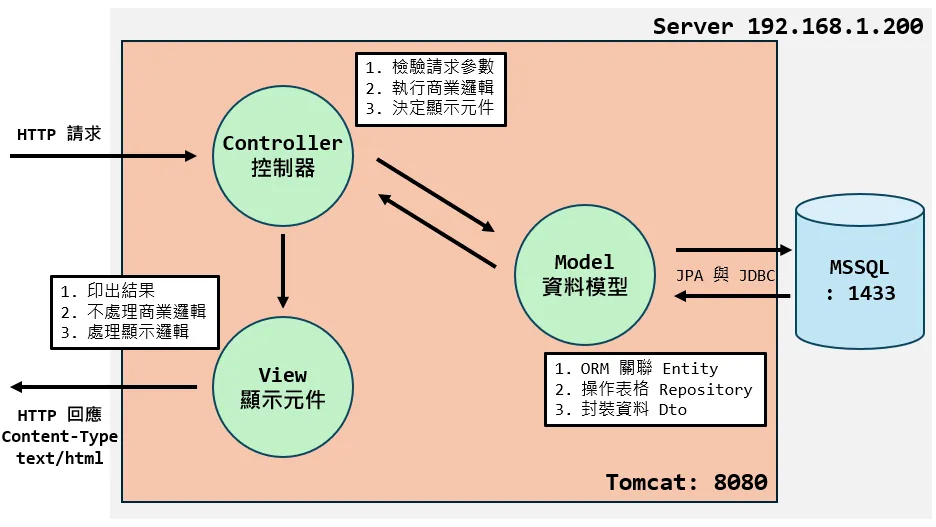
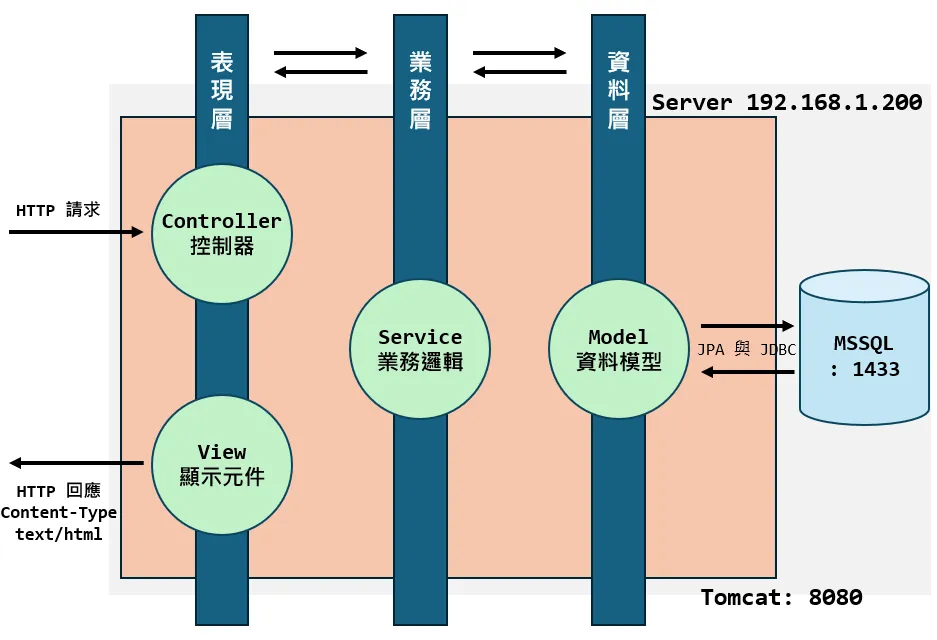

# 章節 3 ｜ MVC 整合資料庫與 CRUD 實戰

---

## <a id="toc"></a>目錄

- [3-1 專案底層建置：資料庫連線與環境初始化](#CH3-1)
  - [1. 建立連線：引入 Maven 依賴與 application.properties 配置](#CH3-1-1)
  - [2. 資料庫初始化：使用 SQL 腳本建表與寫入測試資料](#CH3-1-2)
  - [3. 建構操作模型：Entity 實體類別與 Repository 介面](#CH3-1-3)
  - [4. 圖片資料預載：實作 ApplicationRunner 進行二進位檔案初始化](#CH3-1-4)
- [3-2 阻絕資料外洩風險：Entity 與 DTO 的安全隔離](#CH3-2)
  - [1. 資料傳輸危機：Entity 的暴露風險與 DTO 防護機制](#CH3-2-1)
  - [2. 轉換實作技巧：開發常見五大策略推演](#CH3-2-2)
- [3-3 企業級開發模式：從 MVC 到三層架構](#CH3-3)
  - [1. 什麼是 MVC (Model-View-Controller)？](#CH3-3-1)
  - [2. 進入企業級開發：三層架構 (Three-Tier Architecture)](#CH3-3-2)
- [3-4 處理二進位資料：檔案上傳與儲存策略](#CH3-4)
  - [1. 表單 enctype 設定與 MultipartFile 介面操作](#CH3-4-1)
  - [2. 實作：將圖片轉為 byte[] 存入資料庫](#CH3-4-2)
  - [3. 補充：存入伺服器實體硬碟與靜態資源映射](#CH3-4-3)
- [3-5 MVC 綜合實戰：打造會員管理系統](#CH3-5)
  - [1. 實作會員登入與權限分級](#CH3-5-1)
  - [2. 實作會員表格 CRUD 與權限控管](#CH3-5-2)
  - [3. 登入後可察看個人頁面，並替換自己的大頭貼](#CH3-5-3)

---

## <a id="CH3-1"></a>[3-1 專案底層建置：資料庫連線與環境初始化](#toc)

### <a id="CH3-1-1"></a>[1. 建立連線：引入 Maven 依賴與 application.properties 配置](#toc)

**📍 單元目標**  
學會在原始的 Web 專案中掛載資料庫所需套件，並設定環境變數成功連接至本地端 SQL Server。

**🤔 為什麼需要它**  
Spring Boot 預設建立的 Web 專案並未包含資料庫工具，也無從得知要連線到哪裡。因此開發首要步驟便是：

1. **補足依賴**：引用「Spring Data JPA」來操作資料庫，以及負責底層通訊的「MSSQL JDBC Driver」。
2. **設定連線對象**：在 `application.properties` 配置連線字串與帳號密碼，供應用程式於啟動時尋找並配對。

**💻 實作範例：第一步、加入 Maven 依賴**

請開啟專案根目錄底下的 `pom.xml`，在 `<dependencies>` 區塊內加入以下依賴，並重新載入 Maven：

```xml
        <!-- Spring Data JPA 依賴：提供強大的資料庫抽象操作層 -->
        <dependency>
            <groupId>org.springframework.boot</groupId>
            <artifactId>spring-boot-starter-data-jpa</artifactId>
        </dependency>

        <!-- Microsoft SQL Server JDBC 驅動：讓應用程式可連線到 MSSQL -->
        <dependency>
            <groupId>com.microsoft.sqlserver</groupId>
            <artifactId>mssql-jdbc</artifactId>
            <scope>runtime</scope>
        </dependency>
```

> [!NOTE]
> 💡 **知識補充：資料庫操作層的階層關係**
> 上述引入的套件在系統底層是層層遞進的合作關係。我們所使用的 Repository 實際上是透過以下架構與資料庫溝通的：
>
> <div align="center">
>
> ```mermaid
> graph TD
>     %%{init: { 'theme': 'forest' } }%%
>     A[Spring Data JPA] -->|提供 Repository 介面<br>與高階 CRUD 封裝| B[Hibernate<br/>JPA 核心實作]
>     B -->|自動生成 SQL 語句<br>並處理 ORM 映射| C[JDBC API<br/>Java 內建連線標準介面]
>     C -->|呼叫特定廠商實作<br>以建立實際連線| D[MSSQL JDBC Driver<br/>微軟提供的資料庫驅動程式]
>     D -->|透過微軟專屬 TDS 協定<br>傳輸資料| E[(Microsoft SQL Server<br/>實際的資料庫)]
>     linkStyle default stroke:#ffffff,stroke-width:2px;
> ```
>
> </div>

**💻 實作範例：第二步、配置連線設定**

請開啟專案目錄下的 `src/main/resources/application.properties`，並加入以下設定檔。本範例假設我們已經在本機建立好一個名為 `DemoDB` 資料庫為例：

```properties
# 1. 指定連線的資料庫驅動與 URL
spring.datasource.url=jdbc:sqlserver://localhost:1433;databaseName=DemoDB;encrypt=false
spring.datasource.driverClassName=com.microsoft.sqlserver.jdbc.SQLServerDriver

# 2. 資料庫的管理員帳號與密碼
spring.datasource.username=sa
spring.datasource.password=your_password

# 3. 開發助手：將 Hibernate 產生的底層 SQL 語法列印在 Console 面板上
spring.jpa.show-sql=true
spring.jpa.properties.hibernate.format_sql=true

# 4. 指定資料庫初始化模式
# 當專案剛建立或是需要測試環境時，通常有兩種常見的資料庫結構與資料初始化方式：
#
# 【方式一】由 Hibernate 自動對映 Entity 產生資料表，可用參數為
# - none        : 預設值，關閉自動建表功能。
# - validate    : 驗證現有資料表結構是否與 Entity 吻合，若不符合將拋出錯誤終止啟動，不會擅自修改資料庫結構。
# - update      : 保留現有測試資料，僅自動更新已被修改的 Entity 欄位結構。
# - create      : 每次專案啟動時，都會刪除舊有表格並重新建立。
# - create-drop : 啟動時自動建表，而當專案關閉時，便自動刪除這些表格，常用於單元測試驗證環境。
spring.jpa.hibernate.ddl-auto=none

# 【方式二】結合 Spring 原生機制，執行自定義的 SQL 腳本，可用參數為
# - always   : 每次專案啟動時皆會執行指定的 SQL 檔案。適合初期開發階段，幫助我們每次重啟都能擁有一份乾淨的測試資料。
# - embedded : 預設值，僅在使用記憶體資料庫 (如 H2) 時才會執行腳本。若連線的是真實資料庫則不會觸發。
# - never    : 關閉執行腳本功能，通常用於正式環境防止意外覆蓋資料。
spring.sql.init.mode=always

# 指定負責建立表格結構 Schema 與寫入測試資料 Data 的腳本位置
# classpath 前綴代表路徑起始於專案的 src/main/resources 目錄
spring.sql.init.schema-locations=classpath:schema.sql
spring.sql.init.data-locations=classpath:data.sql
```

設定項目看起來很多，不過別擔心，大部分都是一次配好就不太需要再動的，重點先掌握連線字串和初始化模式這兩項就好。

連線建立成功後，接下來需建立資料庫的初始化 SQL 腳本，以及 Java 物件與資料庫之間的映射關係，也就是 ORM 映射。

> [!WARNING]
> ⚠️ **環境安全須知：嚴禁於正式環境啟用自動初始化**
> 無論採用上述哪一種資料庫初始化機制，在**正式環境**或是**團隊共用測試伺服器**中，切記皆不可開啟自動建表或 SQL 執行腳本功能，務必確認為 `ddl-auto=none` 與 `init.mode=never`，否則極易導致線上資料被清空或意外覆寫！
> 實務上，建議透過**多重設定檔分離**，例如將配置切分為開發專用的 `application-dev.properties` 與上線用的 `application-prod.properties`來達到最安全的防護。

### <a id="CH3-1-2"></a>[2. 資料庫初始化：使用 SQL 腳本建表與寫入測試資料](#toc)

**📍 單元目標**  
學會使用 `schema.sql` 與 `data.sql` 自動化建立資料表與初始資料。

**🤔 為什麼需要它**  
在專案開發過程中，除了可以依賴 JPA 的 `ddl-auto` 自動建表機制來建立資料表以外，我們也可以透過 Spring Boot 提供的 `spring.sql.init.mode` 配置搭配原生 SQL 腳本來進行資料庫的初始化。
使用腳本能讓我們更精確地管控資料庫結構的異動，它能在每次專案啟動時自動為我們建好所需的表單並寫入測試資料，幫助我們快速建立一個穩定且可預測的開發環境。

**💻 實作範例：第一步、建立表格腳本**

請在 `src/main/resources/` 目錄下建立 `schema.sql` 檔案，內容如下：

```sql
DROP TABLE IF EXISTS [cart_item], [member], [product];

CREATE TABLE [member] (
    [member_id] INT IDENTITY(1,1) PRIMARY KEY,
    [is_admin] BIT DEFAULT 0,
    [email] NVARCHAR(255),
    [password] NVARCHAR(255),
    [member_name] NVARCHAR(255),
    [member_photo] VARBINARY(MAX)
);

CREATE TABLE product (
    [product_id] INT IDENTITY(1,1) PRIMARY KEY,
    [product_name] NVARCHAR(255),
    [price] INT,
    [color] NVARCHAR(255),
    [product_photo] VARBINARY(MAX)
);

CREATE TABLE cart_item (
    [cart_item_id] INT IDENTITY(1,1) PRIMARY KEY,
    [member_id] INT NOT NULL,
    [product_id] INT NOT NULL,
    [quantity] INT,
    FOREIGN KEY ([member_id]) REFERENCES [member]([member_id]),
    FOREIGN KEY ([product_id]) REFERENCES [product]([product_id])
);
```

**💻 實作範例：第二步、建立資料腳本**

有了表格結構後，接下來我們準備一些測試用的假資料，讓系統一啟動就有東西可以操作。同樣在 `src/main/resources/` 目錄下建立 `data.sql` 檔案：

```sql
INSERT INTO [member] (
        [is_admin], [email], [password], [member_name]
    )
VALUES
    (1, 'alice@example.com', '1234', N'愛麗絲'),
    (0, 'bob@example.com', '1234', N'鮑伯'),
    (0, 'charlie@example.com', '1234', N'查理'),
    (0, 'dave@example.com', '1234', N'大衛'),
    (0, 'eve@example.com', '1234', N'伊芙'),
    (0, 'zoe@example.com', '1234', N'柔伊');

INSERT INTO [product] ([product_name], [price], [color])
VALUES
    ('asus ROG Phone 9', 39900, N'黑色'),
    ('asus ROG Phone 9 Pro Edition', 45990, N'黑色'),
    ('asus Zenfone 12 Ultra', 29900, N'黑色'),
    ('asus Zenfone 12 Ultra', 29900, N'綠色'),
    ('asus Zenfone 12 Ultra', 29900, N'粉色'),
    ('google Pixel 9a', 16490, N'黑色'),
    ('google Pixel 9a', 16490, N'藍色'),
    ('google Pixel 9a', 16490, N'粉色'),
    ('google Pixel 9a', 16490, N'白色'),
    ('google Pixel 9 pro', 36490, N'黑色'),
    ('google Pixel 9 pro', 36490, N'灰色'),
    ('google Pixel 9 pro', 36490, N'粉色'),
    ('google Pixel 9 pro', 36490, N'白色'),
    ('google Pixel Pro Fold', 56990, N'黑色'),
    ('google Pixel Pro Fold', 56990, N'白色'),
    ('iphone 15 plus', 29900, N'藍色'),
    ('iphone 15 plus', 29900, N'綠色'),
    ('iphone 15 plus', 29900, N'粉色'),
    ('iphone 15 plus', 29900, N'黃色'),
    ('iphone 16e', 21900, N'白色'),
    ('iphone 16 pro max', 44900, N'黑色'),
    ('iphone 16 pro max', 44900, N'灰色'),
    ('iphone 16 pro max', 44900, N'銀色'),
    ('iphone 16 pro max', 44900, N'白色'),
    ('samsang S25 Edge', 37900, N'黑色'),
    ('samsang S25 Edge', 37900, N'藍色'),
    ('samsang S25 Edge', 37900, N'銀色'),
    ('samsang S25 Ultra', 47900, N'黑色'),
    ('samsang S25 Ultra', 47900, N'藍色'),
    ('samsang S25 Ultra', 47900, N'綠色'),
    ('samsang S25 Ultra', 47900, N'灰色'),
    ('samsang S25 Ultra', 47900, N'粉色'),
    ('samsang S25 Ultra', 47900, N'白色'),
    ('Xiaomi 14T', 12999, N'黑色'),
    ('Xiaomi 14T', 12999, N'藍色'),
    ('Xiaomi 14T', 12999, N'綠色'),
    ('Xiaomi 15 Ultra', 32999, N'黑色'),
    ('Xiaomi 15 Ultra', 32999, N'白色');
```

### <a id="CH3-1-3"></a>[3. 建構操作模型：Entity 實體類別與 Repository 介面](#toc)

**📍 單元目標**  
學習定義 JPA `Entity` 實體，使其精確映射剛剛建立的 SQL 表格，並配置 `Repository` 介面以獲得資料操作能力。

**🤔 為什麼需要它**  
有了資料庫連線和初始化腳本，接下來的關鍵是如何讓 Java 程式碼「認識」資料表？我們需要建立 Entity 與 Repository 的映射關係，讓程式碼和資料庫之間搭起溝通的橋樑。

**📖 核心概念**

1. **Entity**
   開發人員定義好 Java 類別的屬性並打上 `@Entity` 標註，藉由精確指定 `@Table` 與 `@Column`，讓 JPA 知道如何對應資料表的每一個欄位。
2. **Repository**
   雖然我們有表格實體，但還必須撰寫一個繼承 `JpaRepository` 的介面，讓我們能直接在程式中呼叫 `save()`, `findById()` 等基礎查詢語法。

**💻 實作範例：第一步、建立 Entity 實體**

以我們剛剛建立的 `product` 表格為例：

```java
import jakarta.persistence.*;
import lombok.Data;

@Data // Lombok 幫忙自動生成 Getter/Setter 等輔助工具
@Entity // 宣告這是一個需要對應至資料庫表格的 JPA 實體類別
@Table(name = "product") // 精準指定對映的資料表名稱
public class Product {

    @Id // 宣告這個屬性是 Primary Key 主鍵
    @GeneratedValue(strategy = GenerationType.IDENTITY) // 自動遞增產生流水號
    @Column(name = "product_id") // 遵循著 Spring 哲學：「約定大於配置」，若名稱符合「約定」，則可省略 @Column
    private Integer productId;

    private String productName;

    private Integer price;

    private String color;
}
```

**💻 實作範例：第二步、建立 Repository 操作介面**

只需要建立一個 Java `interface` 並繼承 `JpaRepository` 即可：

```java
import org.springframework.data.jpa.repository.JpaRepository;
import org.springframework.stereotype.Repository;

// 泛型的左邊放 Entity 的「類別名稱」，右邊放 Entity 取代為主鍵 (ID) 的「資料型別」
@Repository
public interface ProductRepository extends JpaRepository<Product, Integer> {

    // 內部暫時空著即可。框架在執行階段會自動提供包含 save(), findAll(), findById(), delete() 等各項底層基礎 CRUD 方法。
}
```

### <a id="CH3-1-4"></a>[4. 圖片資料預載：實作 ApplicationRunner 進行二進位檔案初始化](#toc)

**📍 單元目標**  
學習如何透過實作 `ApplicationRunner` 介面，在 Spring Boot 應用程式啟動完成時，自動讀取本地資源中的圖片，並將其轉換為 byte[] 存入資料庫中。

**🤔 為什麼需要它**  
為了期末專案，除了文字資料外，系統通常還需要預先載入一些二進位檔案，像是預設的會員大頭貼或商品展示圖。SQL 腳本擅長處理純文字資料，但如果要匯入圖片等二進位檔案就力不從心了。因此我們需要一個機制，讓 Spring Boot 在啟動完畢後，自動執行一段 Java 程式來幫我們讀取圖片並寫入資料庫。這就是 `ApplicationRunner` 介面的用途。

**💻 實作範例：建立自動初始化元件**

請在你的專案中建立一個名為 `Initialize` 的類別，並參考以下程式碼：

```java
import lombok.RequiredArgsConstructor;
import lombok.extern.slf4j.Slf4j;
import org.springframework.boot.ApplicationArguments;
import org.springframework.boot.ApplicationRunner;
import org.springframework.core.io.ClassPathResource;
import org.springframework.stereotype.Component;
import org.springframework.transaction.annotation.Transactional;
import org.springframework.util.StreamUtils;

import java.io.InputStream;
import java.util.List;

@Slf4j // 寫入日誌所需要的 Lombok 輔助註解
@Component // 將此類別註冊為 Spring 容器中的 Bean，讓 Spring Boot 知道它的存在
@RequiredArgsConstructor
public class Initialize implements ApplicationRunner { // 實作 ApplicationRunner，Spring Boot 在啟動完成後會自動執行 run() 方法

    // 注入資料庫操作 Repository
    private final MemberRepository memberRepository;
    private final ProductRepository productRepository;

    @Override
    @Transactional(rollbackFor = Exception.class) // 開啟交易管理，確保初始化過程順利，發生錯誤時可復原
    public void run(ApplicationArguments args) {
        try {
            initMemberPhotos();
            initProductPhotos();
        } catch (Exception e) {
            log.error("圖片初始化過程發生未預期的錯誤", e);
        }
    }

    private void initMemberPhotos() throws Exception {
        // 先行檢查防呆：如果資料庫中已經存在任何圖片，則跳過初始化避免覆蓋或重複作業
        if (memberRepository.existsByMemberPhotoIsNotNull()) {
            log.info("初始化檢查: 會員資料庫中已有圖片，跳過會員圖片初始化。");
            return;
        }

        List<Member> members = memberRepository.findAll();
        for (Member m : members) {
            // 若會員已有圖片，跳過初始化
            if (m.getMemberPhoto() != null) continue;

            Integer id = m.getMemberId();
            ClassPathResource imgRes = new ClassPathResource("initialization_data/image/member/" + id + ".webp");

            if (imgRes.exists()) {
                // 透過 Stream 開啟該圖片檔案，並轉換為 byte array
                try (InputStream is = imgRes.getInputStream()) {
                    m.setMemberPhoto(StreamUtils.copyToByteArray(is));
                }
            } else {
                log.warn("找不到會員圖片: {}", id);
            }
        }

        // 將更新過圖片的會員清單重新寫入資料庫
        memberRepository.saveAll(members);
        log.info("會員圖片初始化完成");
    }

    private void initProductPhotos() throws Exception {
        if (productRepository.existsByProductPhotoIsNotNull()) {
            log.info("初始化檢查: 商品資料庫中已有圖片，跳過商品圖片初始化。");
            return;
        }

        List<Product> products = productRepository.findAll();
        for (Product p : products) {
            if (p.getProductPhoto() != null) continue;

            Integer id = p.getProductId();
            ClassPathResource imgRes = new ClassPathResource("initialization_data/image/phone/" + id + ".webp");

            if (imgRes.exists()) {
                try (InputStream is = imgRes.getInputStream()) {
                    p.setProductPhoto(StreamUtils.copyToByteArray(is));
                }
            } else {
                log.warn("找不到商品圖片: {}", id);
            }
        }
        productRepository.saveAll(products);
        log.info("商品圖片初始化完成");
    }
}
```

---

### 🔁 3-1 章節回顧

|  #  | 對應小節                         | 回顧問題                                                                           | 參考解答                                                                                                                                     |
| :-: | :------------------------------- | :--------------------------------------------------------------------------------- | :------------------------------------------------------------------------------------------------------------------------------------------- |
|  1  | Maven 依賴與配置                 | 在 Spring Boot 專案中使用 SQL Server，必須在 `pom.xml` 中引入哪兩個關鍵依賴？     | `spring-boot-starter-data-jpa` 用於 ORM 操作，以及 `mssql-jdbc` 用於資料庫底層連線。                                                        |
|  2  | application.properties 配置      | 如果要關閉 SSL 憑證加密驗證，應該如何處理？                                        | 在連線網址 `spring.datasource.url` 的末端字串附加 `;encrypt=false` 即可。                                                                    |
|  3  | application.properties 配置      | `spring.jpa.hibernate.ddl-auto` 設為 `update` 與 `create` 的差異為何？正式環境該使用哪個值？ | `update` 保留現有資料僅同步結構變更；`create` 每次啟動會清除所有資料重建表格。正式環境應設為 `none` 防止資料被覆寫。 |
|  4  | SQL 腳本初始化                   | `spring.sql.init.mode` 設為 `always` 時，Spring Boot 會在何時執行 SQL 腳本？腳本應放在哪個目錄下？ | 每次專案啟動時都會執行。SQL 腳本需放在 `src/main/resources/` 目錄下，並透過 `schema-locations` 和 `data-locations` 指定路徑。 |
|  5  | Entity 實體類別                  | 在 JPA 中，一個合法的實體類別必定要具備哪兩個基本註解？                            | `@Entity` 宣告為資料表對映實體，以及 `@Id` 宣告主鍵。                                                                                        |
|  6  | Entity 實體類別                  | `@Column` 註解在什麼情況下可以省略？                                               | 當 Java 屬性名稱符合 Spring 的「約定大於配置」命名規則時可省略。例如屬性 `productName` 會自動對應欄位 `product_name`。                        |
|  7  | Repository 介面                  | `JpaRepository<Product, Integer>` 泛型傳入的兩個參數分別代表什麼意義？             | 第一個參數是它專門負責管理的 Entity 類別型態，第二個參數則是該 Entity 所宣告之 ID 主鍵的資料型態。                                            |
|  8  | ApplicationRunner 初始化         | 為什麼不用 SQL 腳本來初始化圖片，而要另外實作 `ApplicationRunner`？                | SQL 腳本擅長處理純文字資料，無法方便地匯入圖片等二進位檔案。`ApplicationRunner` 能在專案啟動完成後，透過 Java 程式讀取圖檔並以 byte[] 寫入資料庫。 |

---

## <a id="CH3-2"></a>[3-2 阻絕資料外洩風險：Entity 與 DTO 的安全隔離](#toc)

### <a id="CH3-2-1"></a>[1. 資料傳輸危機：Entity 的暴露風險與 DTO 防護機制](#toc)

**📍 單元目標**  
理解單靠 `Entity` 物件於前後端直傳的危險性，並學會運用 `DTO` 建立安全邊界。

**🤔 為什麼不能直接傳遞 Entity？**  
部分開發者為了圖方便，會將查詢出的 `@Entity` 實體直接拋給 Controller 甚至前端畫面，或直接拿 `@Entity` 來接收表單資料。
這是實務上**必須避免的 Anti-Pattern 反模式**，它會引發以下三大架構、安全危機：

1. 潛在機密暴露：埋下 RESTful 轉型的地雷
   在傳統 Spring MVC 中，只要畫面沒寫出 `${user.password}`，密碼確實就不會顯示。但現代系統多半會面臨**前後端分離的 RESTful API** 轉型。若習慣直接拋出 Entity，未來只要轉為 JSON 回應，底層的**密碼 Hash** 與**權限標記**將全數隨封包送出。只要按下 F12，機密即刻見光死。

2. 過度綁定：引發 Over-Posting 安全漏洞
   若接收表單時直接以 `@Entity` 作為容器，惡意使用者只需在 HTTP 請求中偷偷夾帶 `is_admin=true` 或 `balance=9999` 等隱藏參數。後端一旦照單全收並存入資料庫，普通會員就能瞬間「升級為管理員」，輕易駭入系統。

3. 職責混亂：視圖邏輯與資料層嚴重耦合
   畫面經常需要特定的資料格式，像是**將姓與名合併**或是**轉換日期格式**。若強迫共用 Entity 傳遞，會導致資料庫實體被迫去承擔與 UI 排版相關的屬性與設計，使得系統結構混亂不堪。

**📖 核心觀念：Service 層的邊界**  
為防範上述系統性的風險，建議在資料傳遞時遵循以下原則：

> [!IMPORTANT]
> **始終記得觀念：「只要資料離開 Service 層，就必須轉型為 DTO！」**

所有由 Service 往外輸出給 Controller 的物件，都必須是一個結構解耦、專為當下需求量身打造的全新載體，我們稱之為 Data Transfer Object (DTO，資料傳輸物件)。

**🛠️ 實戰解析：DTO 的常見情境與優勢**

在實務中，DTO 可以幫我們解決哪些棘手的問題？以下展示三種常見應用情境：

**1. 基本資料過濾：移除敏感資訊**  
過濾掉不該對外曝光的資訊，建立純粹且安全的傳輸載體。

```java
// ❌ Entity: 包含了密碼與內部備註，不宜外流
@Entity
public class Member {
    private Integer id;
    private String username;
    private String passwordHash;
    private String adminNote;
}

// ✅ DTO: 拔除敏感欄位，僅保留前端「真正能看的資訊」
public class MemberProfileDto {
    private Integer id;
    private String username;
}
```

**2. 多張表格資料合併：扁平化設計**  
前端畫面常需要顯示**跨資料表**的綜合資訊。與其讓畫面去處理複雜的物件關聯層級，不如利用 DTO 先在後端將多張表的重點欄位「合併」，除了能大幅提升畫面綁定的便利性，更能藉此避開 Hibernate 常見的「延遲載入例外 (Lazy Loading Exception)」。

```java
// ✅ DTO: 整合了 Order, Member, Product 三個 Entity 中必要的檢視欄位
public class OrderDetailDto {
    private String orderNumber;      // 來自 Order 表格
    private String buyerName;        // 來自 Member 表格
    private String productName;      // 來自 Product 表格
    private Integer totalAmount;
}
```

> [!NOTE]
> 💡 **知識補充：什麼是延遲載入例外 Lazy Loading Exception？**
> JPA 為了節省效能，查詢資料時，預設不會把「關聯的表格內容」一併撈出。例如，我們查了一筆訂單，系統不會主動去抓這筆訂單的會員與商品細節，這個機制被稱為「延遲載入」。
>
> 如果我們偷懶把這個 Entity 直接丟給 Thymeleaf 渲染，當畫面寫到 `${order.member.name}` 試圖印出會員名字時，災難就會發生，因為程式執行到 Controller 或 View 層級時，後端管理資料庫連線的交易早就已經關閉；JPA 沒有連線可以用，自然無法回頭去補撈資料，就會當場拋出 `LazyInitializationException` 錯誤。
>
> **DTO 的完美救援**
> 只要我們確實遵守規範，在 Service 層資料庫連線還暢通時，先把該讀的資料都拿出來、再放進 DTO 裡面。這麼一來，DTO 傳送給 View 時，它就成了一個乾淨單純的資料載體，不會再去觸發任何資料庫查詢，徹底避免了這個經典錯誤！

**3. 資料預先格式化：符合 UI 視圖需求**  
資料庫儲存的通常是「原始資料」，如 0 和 1、或是系統時間戳記，但畫面往往需要「經過排版的字串」。我們可以利用 DTO 提前做好轉換，免除 View 層繁雜的判斷設定。

```java
// ✅ DTO: 透過裝載轉換後的字串，讓前端套版時能「直接印出」
public class EventItemDto {
    private String eventTitle;

    // 將資料庫的狀態碼 status = 1 提早轉換為友善文字"報名中"
    private String statusText;

    // 將資料庫的 LocalDateTime 提早轉換為 "2026/04/20 14:00" 字串
    private String formattedTime;
}
```

### <a id="CH3-2-2"></a>[2. 轉換實作技巧：開發常見五大策略推演](#toc)

**💻 實作重點**

那我們該如何將 Entity 合理轉換為 DTO？實務上有幾種不同層級的做法，它們各自有適合的情境，以下將循序漸進介紹五種常見的轉換策略：

> [!TIP]
> 💡 **學習指引**
> 初學者建議先從「選項一到選項三」的手動轉換開始練習，確實感受資料流動與物件封裝的過程；等到專案規模變大，覺得寫賦值程式碼很煩躁時，再來學習「選項五：MapStruct」一勞永逸。

#### 選項一：最簡單的映射方式：逐一屬性手動綁定

最單純也最直觀的方式，就是在 Service 中實作轉換方法，透過手動調用 Getter / Setter，逐一將有價值的內部屬性執行賦予。

```java
public UserDTO convertToDtoSafe(User entity) {
    // 建立一個防堵密碼外流、專為查詢而生的安全 DTO 實體
    UserDTO dto = new UserDTO();

    // 將欄位手動進行個別賦值
    dto.setId(entity.getId());
    dto.setUsername(entity.getUsername());
    dto.setEmail(entity.getEmail());
    // 💡 關鍵：我們未提供 dto.setPassword() 操作，從基礎層面隔離了重要機密的意外輸出

    return dto;
}
```

- **優點**：效能最好，轉換過程完全由開發者掌控，不依賴外部套件，適合剛接觸架構設計的新手。
- **缺點**：如果物件欄位有二三十個，過於冗長的 set、get 程式碼將無意義地嚴重污染 Service 層的版面。

#### 選項二：封裝進 DTO 內部轉換 (高耦合，小專案限定)

為了解決 Service 層變得冗長的問題，有些開發者會選擇將轉換邏輯「寫進 DTO 裡面」，例如透過 DTO 的建構子直接接收一個 Entity，或者設計例如 `UserDTO.fromEntity(User)` 的工廠方法。

```java
public class UserDTO {
    private Integer id;
    private String username;
    private String email;

    // 將轉換邏輯封裝在建構子內
    public UserDTO(User entity) {
        this.id = entity.getId();
        this.username = entity.getUsername();
        this.email = entity.getEmail();
    }
}
```

- **優點**：呼叫端的程式碼會變得非常簡潔，只需要 `new UserDTO(user)` 即可。
- **缺點（致命傷）**：產生了**高耦合**。DTO 理應是純淨的跨層傳輸資料載體，一旦它「認識」了 Entity，就等於它同時承擔了「資料載體」與「資料轉換」兩個職責。實務上我們**不建議**這麼做，除非這只是非常微型的小專案。

#### 選項三：抽離為獨立的 MapperUtil

為兼顧解耦合與 Service 乾淨，比較進階的手法是建立一個專門負責轉換的工具類（例如 `UserMapperUtil`）。

```java
public class UserMapperUtil {

    // 將方法宣告為靜態 (static)，方便全域呼叫
    public static UserDTO toDTO(User entity) {
        UserDTO dto = new UserDTO();
        dto.setId(entity.getId());
        dto.setUsername(entity.getUsername());
        dto.setEmail(entity.getEmail());
        return dto;
    }
}
```

在這之後，Service 只要調用 `UserMapperUtil.toDTO(user)` 即可。它完美做到了職責分離與乾淨架構，是手動 Mapping 中最推薦的結構做法。

#### 選項四：使用 Spring BeanUtils 動態複製

就算抽離為 MapperUtil，依然要手寫那幾十行的 `set()` 與 `get()`。於是，開發者將目光投向了自動化工具。Spring 原生內建了 `BeanUtils`，能透過 Java 的 Reflection（反射）機制，在執行時動態比對並將兩個物件中「名稱一樣的屬性」複製過去。

```java
import org.springframework.beans.BeanUtils;

public UserDTO convertWithBeanUtils(User entity) {
    UserDTO dto = new UserDTO();
    // 只要來源與目標的「屬性名稱」一樣，BeanUtils 就會自動幫你倒過去！
    BeanUtils.copyProperties(entity, dto);

    return dto;
}
```

- **優點**：程式碼簡潔，不用自己手寫一堆 set、get。
- **缺點**：
  1. **效能隱患**：Reflection 機制在底層運作成本較高，若是處理大量資料的列表轉換，會顯著拖慢系統速度。
  2. **型別盲點**：若 Entity 的 id 是 `Integer`，但 DTO 卻打錯寫成 `String`，`BeanUtils` 因為缺乏編譯檢查，在 Runtime 時也會默默忽略，很容易產生難以查找的 Bug。

#### 選項五：業界主流自動生成工具 MapStruct

在專案規格複雜化後，業界實務上通常會導入成熟的第三方模型映射機制，而 **MapStruct** 更是目前 Java 企業級生態圈中最受推崇的標竿。
它的開發理念相當巧妙：它會在編譯階段，自動幫你產生實作程式碼。

**1. 引入必要依賴 (pom.xml)**

要使用 MapStruct，我們需要在專案的 `pom.xml` 中加入它本身的核心函式庫，以及負責在編譯期產生程式碼的 Processor（記得要跟 Lombok 搭配配置）：

```xml
<dependencies>
    <!-- MapStruct 核心標註庫 -->
    <dependency>
        <groupId>org.mapstruct</groupId>
        <artifactId>mapstruct</artifactId>
        <version>1.5.5.Final</version>
    </dependency>
</dependencies>

<build>
    <plugins>
        <plugin>
            <groupId>org.apache.maven.plugins</groupId>
            <artifactId>maven-compiler-plugin</artifactId>
            <configuration>
                <annotationProcessorPaths>
                    <!-- 加上 Lombok 的 Processor，確保 Getter/Setter 先被產生出來 -->
                    <path>
                        <groupId>org.projectlombok</groupId>
                        <artifactId>lombok</artifactId>
                    </path>
                    <!-- MapStruct 的編譯期程式碼生成器 -->
                    <path>
                        <groupId>org.mapstruct</groupId>
                        <artifactId>mapstruct-processor</artifactId>
                        <version>1.5.5.Final</version>
                    </path>
                </annotationProcessorPaths>
            </configuration>
        </plugin>
    </plugins>
</build>
```

**2. 宣告 Mapper 介面**

你只需要定義一個 `interface` 介面，不需要寫任何實作方法：

```java
import org.mapstruct.Mapper;

// componentModel = "spring" 會讓 MapStruct 產生的實作類別自動加上 @Component 成為 Spring Bean
@Mapper(componentModel = "spring")
public interface UserMapper {
    // 你只需要給定方法的「輸入與輸出」規範，其他的 MapStruct 會幫你搞定！
    UserDTO toDTO(User entity);
}
```

**3. 基本用法：在 Service 中調用**

由於我們宣告了 `componentModel = "spring"`，現在可以像使用 Repository 一樣，直接在 Service 中依賴注入這個 Mapper 並呼叫它：

```java
import org.springframework.stereotype.Service;
import lombok.RequiredArgsConstructor;

@Service
@RequiredArgsConstructor
public class UserService {

    private final UserRepository userRepository;

    // 直接以依賴注入方式，引入 MapStruct 自動生成的實體
    private final UserMapper userMapper;

    public UserDTO getUserInfo(Integer id) {
        User entity = userRepository.findById(id).orElseThrow();

        // 就像呼叫一般方法一樣簡單，轉換邏輯都封裝好了！
        return userMapper.toDTO(entity);
    }
}
```

**4. 進階實戰用法：@Mapping 與集合轉換**

除了屬性名稱完全一樣會自動對應外，實務上常遇到名稱不同、需要過濾或是要轉換整個 `List` 清單的情境，MapStruct 都能加個簡單標記就搞定：

```java
import org.mapstruct.Mapper;
import org.mapstruct.Mapping;
import java.util.List;

@Mapper(componentModel = "spring")
public interface UserMapper {

    // 基本對應：同名屬性自動拷貝
    UserDTO toDTO(User entity);

    // 情境 A：名稱不同時的結合。當 Entity 叫做 'adminNote'，但 DTO 預期叫做 'remarks'
    @Mapping(source = "adminNote", target = "remarks")
    // 情境 B：忽略特定屬性。強制不把密碼等敏感機密寫入 DTO 中
    @Mapping(target = "password", ignore = true)
    // 情境 C：預設值設定。如果 Entity 中的狀態欄位為空，自動帶給 DTO 預設值
    @Mapping(target = "status", defaultValue = "ACTIVE")
    UserDetailDTO toDetailDTO(User entity);

    // 情境 D：集合自動轉換！只要聲明好泛型的 List，它就會自動幫你做內部迴圈寫入，不用再寫又臭又長的 stream().map() 了！
    List<UserDTO> toDtoList(List<User> entities);
}
```

這就是編譯生成技術強大的地方！透過這幾個直觀的 `@Mapping` 宣告，MapStruct 就會在幕後生成效能極好、且自帶 `null` 安全檢查以及迴圈迭代的純 Java `get/set` 原始程式碼。

> [!NOTE]
> 💡 **知識補充：MapStruct 為何效能頂尖？**
> 很多人會疑惑，這不就跟 BeanUtils 類似嗎？其實不然。它**不會**在系統「執行期間(Runtime)」去慢慢比對 Reflection，而是在 Java 程式碼「編譯期間(Compile Time)」的階段，自動幫你讀懂這個 Interface 接口，然後在幕後建立 `.class` 檔，「偷偷幫你寫出選項三的 `MapperUtil`」的手動 Mapping 程式碼。

- **優點**：兼具了 `BeanUtils` 的「免手寫便利」以及選項一的「高效能」與「型別安全機制」。能大幅度消弭瑣碎的轉換程式碼實作，是往後深入企業級系統與微服務架構時，非常關鍵的技能！
- **缺點**：當然就是要多學一個技術棧，並且要注意 `pom.xml` 中它與 Lombok 載入順序的配置，會增加些許認知負擔。但隨著專案經驗的累積，這點額外學習成本很快就會被它帶來的效率提升抵消掉。

### 🔁 3-2 章節回顧

|  #  | 對應小節                 | 回顧問題                                                                                                        | 參考解答                                                                                                                                                                                                                                               |
| :-: | :------------------------- | :-------------------------------------------------------------------------------------------------------------- | :------------------------------------------------------------------------------------------------------------------------------------------------------------------------------------------------------------------------------------------------------------------- |
|  1  | Entity 的暴露風險與 DTO    | 直接使用 Entity 作為資料載體，可能會引發哪兩大安全風險？                                                       | **機密暴露風險**：將 Entity 直接輸出給前端時，可能將密碼 Hash、內部權限註記等機密資料一併隨封包外洩。<br>**Over-Posting 漏洞**：惡意竄改的隱藏表單參數可能被 Controller 照單全收並直接更新進資料庫。                                                                                                                     |
|  2  | Entity 的暴露風險與 DTO    | Entity 直接暴露的第三項風險「職責混亂」指的是什麼？                                                           | 前端畫面常需要特定格式的資料，如姓名合併或日期格式化。若強迫共用 Entity 傳遞，會迫使資料庫實體去承擔 UI 排版相關的屬性設計，導致資料層與視圖層嚴重耦合。 |
|  3  | Entity 的暴露風險與 DTO    | 把 Entity 拋回給前端畫面渲染時，為何會觸發 `LazyInitializationException`？該如何解決？                     | JPA 預設不會主動抓取關聯表格細節。當畫面試圖讀取關聯欄位時，資料庫連線早已被 Service 關閉。正確做法是在 Service 層連線活躍時，提早將必要的關聯資料調用出來，封裝進 DTO 再交給畫面。                                                                                    |
|  4  | Entity 的暴露風險與 DTO    | 資料在何時必須從 Entity 轉換為 DTO？                                                                          | 當資料離開 Service 層時。所有由 Service 往外輸出給 Controller 的物件，都必須是專為當下需求量身打造的 DTO，確保安全隔離。 |
|  5  | 轉換實作技巧               | 將轉換邏輯直接寫在 DTO 的建構子中有什麼壞處？                                                                 | 會導致過度耦合。DTO 應為無狀態的單純跨層傳輸載體，必須避免與資料庫專用的 Entity 實體產生依賴綁定，否則會徹底破壞分層隔離的初衷。                                                                                                                     |
|  6  | 轉換實作技巧               | 為什麼實務企業專案傾向使用 MapStruct 而非 Spring 內建的 `BeanUtils`？                                   | `BeanUtils` 基於 Reflection 運作，大量列表資料時效能差且無法在編譯期檢查型別不一致。MapStruct 在編譯階段直接產生最高效的「手刻映射原生碼」，完美兼具極致效能與強型別防護。 |

---

## <a id="CH3-3"></a>[3-3 企業級開發模式：從 MVC 到三層架構](#toc)

我們已經學會了資料庫連線、Entity 定義，也理解了為何要用 DTO 做安全隔離。接下來要拼上最關鍵的一塊拼圖——職責分層。許多新手常將 MVC 與三層架構混淆，我們必須在此釐清它們的涵義與各自的職責邊界。

### <a id="CH3-3-1"></a>[1. 什麼是 MVC (Model-View-Controller)？](#toc)

**📍 單元目標**  
理解經典的 MVC 設計模式，以及它如何處理使用者與 Web 應用程式的互動。

**📖 核心概念**  
MVC 是一種軟體架構模式，主要用於區分「使用者介面」與「底層資料操作」。在現代的 Spring MVC 框架中，它們的職責如下：

1. **Model 模型**
   負責攜帶資料的載體。在我們先前的章節中，`DTO`、`Entity` 或是傳遞資料用的 `Model` 容器物件都屬於資料模型的範疇。
2. **View 視圖**
   負責呈現資料的使用者介面。通常是前端的 `HTML` 頁面或 `Thymeleaf` 樣板，它只負責「印出結果」，不包含任何商業邏輯。
3. **Controller 控制器**
   負責接收使用者的網路請求，驗證參數後決定要呼叫哪個 Model，最後將結果交給對應的 View 來渲染。

<div style="display: flex; gap: 80px; margin: 10px 0 10px 0;
border: 3px solid #ccc; border-radius: 20px; padding: 10px;">
  <div style="flex: 1; text-align: center;">
    
    <p style="margin-top: 10px;"><i>MVC 架構</i></p>
  </div>
</div>

### <a id="CH3-3-2"></a>[2. 進入企業級開發：三層架構 (Three-Tier Architecture)](#toc)

**🤔 只有 MVC 夠用嗎？**  
在早期的簡單系統中，Controller 除了接收請求，還常得兼顧「複雜的商業運算規則 (如折扣計算)」，甚至親自去「存取資料庫」。這會導致 Controller 膨脹成所謂的「上帝類別 (God Class)」，使得程式碼難以維護與重用。

為了解決這個問題，業界演進出了**三層架構** 規範，將系統解耦為「表現層、邏輯層及資料層」。**MVC 實際上只涵蓋了三層架構中的「Web 表現層」！**

**📖 設計職責與介面邊界**

| 階層結構           | 對應元件      | 核心職責                                                                     | 注意事項                                                                                 |
| :----------------- | :------------ | :--------------------------------------------------------------------------- | :--------------------------------------------------------------------------------------- |
| **Web 表現層**     | `@Controller` | （對應 MVC 模式）針對請求表單做驗證與轉發，收集並組裝視圖需要的 DTO 或模型。 | 避免在 Controller 撰寫商業邏輯，或直接撰寫存取資料庫的程式碼。                           |
| **Service 業務層** | `@Service`    | 處理核心業務邏輯判斷，並掌控資料庫交易 `@Transactional`。                    | 避免將 HTTP 專屬的物件如 `HttpServletRequest` 或 `Session`，跨層穿透至此，導致嚴重耦合。 |
| **Data 資料層**    | `@Repository` | 負責封裝對關聯式資料庫的 CRUD，如 JPA `JpaRepository`。                      | 避免在此實作複雜的業務或條件審查，這層只能有單純的資料庫操作指令。                       |

<div style="display: flex; gap: 80px; margin: 10px 0 10px 0;
border: 3px solid #ccc; border-radius: 20px; padding: 10px;">
  <div style="flex: 1; text-align: center;">
    
    <p style="margin-top: 10px;"><i>三層架構</i></p>
  </div>
</div>

> [!NOTE]
> 💡 **知識補充：常見的 Package 分類方法**
>
> 在實務開發中，我們通常不會將所有程式碼放在同一個路徑下，而是透過套件（Package）來將不同職責的程式碼分門別類。以下是業界常見的分層分類法，**這並非絕對的標準或規定，而是團隊開發時為了保持架構清晰的常見約定：**
>
> ```text
> tw.com.eeit.demo/       # 頂層 Package，通常為網域反寫加上專案名稱
> ├── model/              # 存放資料載體相關物件
> │   ├── dto/request/    # 負責接收前端傳入，封裝請求參數的 DTO
> │   ├── dto/response/   # 負責回傳給前端或視圖，封裝呈現資料的 DTO
> │   ├── entity/         # 與資料表對應映射的實體類別
> │   ├── enums/          # 存放系統中使用的列舉型態，例如狀態碼或層級定義
> │   └── mapper/         # 存放負責在 Entity 與 DTO 之間轉換的工具，或 MapStruct 介面
> ├── repository/         # 存放繼承 JpaRepository，專職與資料庫互動的介面
> ├── service/            # 負責處理核心商業邏輯的服務層
> ├── utils/              # 存放共用的輔助工具類別，如字串、密碼或日期轉換工具，不寫商業邏輯或與資料庫互動
> ├── config/             # 存放系統啟動或環境設定類別
> │   ├── security/       # 存放 Spring Security 的保護與登入權限設定檔
> │   └── init/           # 存放應用程式啟動時即觸發的初始化元件與腳本
> ├── controller/         # 負責接收 HTTP 請求與路由轉發的表現層
> └── exception/          # 存放專案自定義的例外錯誤與全域例外攔截處理器
> ```
>
> 📂 **專案結構較大時：功能驅動分類**
>
> 上方的「依職責分層（Package by Layer）」適合中小型專案。當專案結構極大、擁有很多獨立功能模組時，團隊可以考慮改採**依功能分類（Package by Feature）**，讓每個模組的關聯程式碼集中一處，方便獨立維護甚至拆分微服務：
>
> ```text
> (依功能分類範例)
> ├── order/              # 以訂單模組為例，將相關元件集中一塊
> │   ├── OrderController.java
> │   ├── OrderService.java
> │   ├── OrderRepository.java
> │   └── dto/            # 存放訂單專屬的傳輸物件
> └── common/             # 跨模組的共用邏輯或元件
>     └── config/         # 全域或共用的設定檔
> ```

### 🔁 3-3 章節回顧

|  #  | 對應小節                | 回顧問題                                                                     | 參考解答                                                                                                                                                                                                                   |
| :-: | :------------------------ | :----------------------------------------------------------------------------- | :--------------------------------------------------------------------------------------------------------------------------------------------------------------------------------------------------------------------------------------- |
|  1  | MVC 架構                  | MVC 中的 Model、View、Controller 各自的職責為何？                        | Model 負責攜帶資料，View 負責呈現畫面，Controller 負責接收請求並協調兩者。                                                                                                                                                          |
|  2  | 三層架構                  | 為什麼光靠 MVC 不夠，還需要三層架構？                                   | 因為 MVC 只涵蓋了 Web 表現層。若 Controller 兼顧商業運算與資料庫存取，會膨脹成「上帝類別 God Class」而難以維護。三層架構將系統解耦為表現層、業務層與資料層，讓各層專責。                                            |
|  3  | 三層架構                  | `@Service` 層最核心的禁忌是什麼？                                          | 避免將 HTTP 專屬的物件如 `HttpServletRequest` 或 `Session` 跨層穿透至 Service 層，否則會導致業務層與 Web 層嚴重耦合，影響重用性與可測試性。                                                                                  |
|  4  | 三層架構                  | 在三層架構中，`@Controller` 層應避免做哪些事？                             | 避免在 Controller 中撰寫商業邏輯運算，或直接撰寫存取資料庫的程式碼。Controller 只負責接收請求、驗證參數，以及將結果轉發給對應的 View。                                                                             |

---

## <a id="CH3-4"></a>[3-4 處理二進位資料：檔案上傳與儲存策略](#toc)

### <a id="CH3-4-1"></a>[1. 表單 enctype 設定與 MultipartFile 介面操作](#toc)

**📍 單元目標**  
學會如何透過前端表單傳送二進位檔案，並在 Spring Controller 中使用 `MultipartFile` 介面接收檔案。

**🤔 為什麼需要它**  
現代應用程式通常需要讓使用者上傳個人頭像、商品圖片或各式文件夾檔。傳統表單只能傳遞純文字，無法應付圖片等二進位資料。我們必須修改表單編碼格式，並透過 Spring 提供的專屬介面來接收這些二進位包裹。

**📖 核心概念**

| 核心元件                            | 功能描述                                                                                |
| :---------------------------------- | :-------------------------------------------------------------------------------------- |
| **`enctype="multipart/form-data"`** | HTML 表單屬性，宣告表單提交的內容將被分割為多個部分，允許同時夾帶文字與二進位檔案資料。 |
| **`MultipartFile`**                 | Spring 提供的核心介面，負責在 Controller 封裝並接收前端傳送過來的檔案實體。             |

> [!NOTE]
> 💡 **知識補充**
> 客戶端提交檔案時，檔案是以二進位串流方式傳輸。`MultipartFile` 介面將這個過程高度抽象化，讓我們能輕鬆呼叫 `.getOriginalFilename()` 取得檔名，或是 `.getSize()` 取得檔案容量。

> [!IMPORTANT]
> 💡 **深度解析：為什麼必須使用 `multipart/form-data`？**
>
> HTML 表單預設的編碼格式是 `application/x-www-form-urlencoded`。在這種格式下，瀏覽器會把所有欄位轉換成類似 `name=John&age=25` 的「純文字鍵值對」。因此，如果在預設格式下上傳圖片，**伺服器就只會收到圖片的檔名字串，完全無法取得實際的二進位圖檔內容！**
>
> 而 `multipart/form-data` 顧名思義，就是能將表單請求分割成多個獨立區塊 Multi-part。它會在 HTTP 傳輸包中動態帶入一組邊界符號 Boundary，將一般欄位的純文字，與圖片所屬的二進位內容徹底隔開。有了這個編碼機制，單一網路請求才能同時、安全地攜帶不同性質的傳輸資料。

**💻 實作範例**

```html
<!-- Thymeleaf 表單配置 -->
<form th:action="@{/upload}" method="post" enctype="multipart/form-data">
  <label>選擇圖片：</label>
  <!-- type="file" 提供使用者選擇檔案的互動介面 -->
  <input type="file" name="userImage" />
  <button type="submit">上傳</button>
</form>
```

```java
import org.springframework.web.bind.annotation.PostMapping;
import org.springframework.web.bind.annotation.RequestParam;
import org.springframework.stereotype.Controller;
import org.springframework.web.bind.annotation.ResponseBody;
import org.springframework.web.multipart.MultipartFile;

@Controller
public class FileUploadController {

    @PostMapping("/upload")
    @ResponseBody
    public String handleFileUpload(@RequestParam("userImage") MultipartFile file) {
        // 檢查是否真的有選擇檔案
        if (file.isEmpty()) {
            return "檔案上傳失敗，請選擇檔案";
        }

        // 取得原始檔案名稱與大小
        String originalName = file.getOriginalFilename();
        long size = file.getSize();

        return "上傳成功！檔名：" + originalName + "，大小：" + size + " bytes";
    }
}
```

> [!WARNING]
> ⚠️ **常見地雷**  
> 忘記在 `<form>` 標籤中加上 `enctype="multipart/form-data"`。如果遺漏這個屬性，表單會使用預設的純文字編碼，此時後端的 `MultipartFile` 將會接收到 `null` 或拋出錯誤。

### <a id="CH3-4-2"></a>[2. 實作：將圖片轉為 byte[] 存入資料庫](#toc)

**📍 單元目標**  
學習如何將 `MultipartFile` 轉換為二進位陣列，並直接儲存進資料庫的欄位中。

**🤔 為什麼需要它**  
在**期末專題**中，直接將圖片轉為 byte 陣列存入資料庫是最簡單且快速的解決方案，能大幅減輕檔案路徑管理的負擔。然而請注意，**實務上的企業專案通常不會將圖片存放在關聯式資料庫中**。基於資料庫的連線效能與高昂的儲存成本考量，實務上大多會交由專屬的檔案伺服器或雲端儲存空間（如 AWS S3）來集中管理。

**💻 實作範例：上傳與儲存**

在 3-1 專案建置時，我們已在資料庫將圖片欄位定義為 `VARBINARY(MAX)`，在 Java 的 Entity 中對應的型別即為 `byte[]`。為了確保程式碼的可維護性，我們必須遵守 **3-3** 介紹的三層架構規範，將圖片儲存的邏輯封裝至 `Service` 層，並由 `Controller` 來接收前端的檔案並進行路由轉發。

```java
// 1. Service 層：負責資料庫互動與業務邏輯
@Service
@RequiredArgsConstructor
public class MemberService {
    
    private final MemberRepository memberRepository;

    @Transactional
    public void updateMemberPhoto(Integer memberId, byte[] photoBytes) {
        Member member = memberRepository.findById(memberId)
                .orElseThrow(() -> new RuntimeException("找不到會員"));
        
        // 將 byte 陣列存入 Entity 物件並寫入資料庫
        member.setMemberPhoto(photoBytes);
        memberRepository.save(member);
    }
}
```

```java
// 2. Controller 層：負責接收檔案並呼叫 Service
@Controller
@RequiredArgsConstructor
public class MemberController {

    private final MemberService memberService;

    @PostMapping("/upload-to-db")
    public String uploadAndSaveToDb(@RequestParam("userImage") MultipartFile file) {
        try {
            // 利用 getBytes() 將 MultipartFile 轉為位元組陣列
            byte[] photoBytes = file.getBytes();

            // 呼叫 Service 完成資料儲存 (此處防呆假設更新 ID 為 1 的會員)
            memberService.updateMemberPhoto(1, photoBytes);

            // 伺服器網頁重新導向 (Redirect) 回個人頁面
            return "redirect:/profile";
        } catch (IOException e) {
            return "redirect:/upload-error";
        }
    }
}
```

**💻 實作範例：提供圖片存取端點**

將圖片存進資料庫後，我們需要開設一個專屬的 API，讓前端的 `` 能夠請求這段二進位內容。同樣遵循三層架構規範，我們在 `Service` 先新增查詢邏輯：

```java
    // 在 MemberService 中新增查詢方法
    @Transactional(readOnly = true)
    public byte[] getMemberPhoto(Integer memberId) {
        Member member = memberRepository.findById(memberId)
                .orElseThrow(() -> new RuntimeException("找不到會員"));
        return member.getMemberPhoto();
    }
```

接著在 `Controller` 新增端點，呼叫 `Service` 取得圖片陣列，並透過 `ResponseEntity` 回傳。這個機制在第二章靜態資源時有簡單提及過：

```java
import org.springframework.web.bind.annotation.GetMapping;
import org.springframework.web.bind.annotation.PathVariable;
import org.springframework.http.ResponseEntity;
import org.springframework.http.MediaType;

@Controller
@RequiredArgsConstructor
public class MemberPhotoController {

    private final MemberService memberService;

    @GetMapping("/api/members/{id}/photo")
    @ResponseBody
    public ResponseEntity<byte[]> getMemberPhoto(@PathVariable Integer id) {
        
        // 透過 Service 取出圖片的 byte 陣列
        byte[] photoBytes = memberService.getMemberPhoto(id);

        // 透過 ResponseEntity 回傳二進位資料，並標示響應的內容型態 Content-Type 為圖片
        return ResponseEntity.ok()
                .contentType(MediaType.IMAGE_JPEG)
                .body(photoBytes);
    }
}
```

> [!NOTE]
> 💡 **知識補充：防範破圖狀態**
> 若會員未曾上傳照片，`member.getMemberPhoto()` 將為 `null`，直接回傳給前端會導致 `` 破圖。實務上我們可提早判斷 `if (photoBytes == null)`，並利用 `ClassPathResource` 讀取一張專案內建預設圖片（如 `default-avatar.webp`）轉為 byte[] 返還。

如此一來，前端只要給定這個 API 網址，瀏覽器就會自動將收到的資料庫 byte 陣列渲染成圖片！

```html

```

### <a id="CH3-4-3"></a>[3. 補充：存入伺服器實體硬碟與靜態資源映射](#toc)

除了存入資料庫，針對較大的圖片或影片檔案，通常會採用另一種做法：**寫入伺服器的實體硬碟資料夾（例如 `C:/uploads`）**。
這種做法的好處是不會占用資料庫的昂貴儲存空間與連線效能。

**實作簡介一：寫入實體硬碟**  
透過 `UUID` 自動產生一組隨機不重複的字串作為新檔名，並搭配 Java 原生 `Files.copy` 進行寫入動作：

```java
Path storageLocation = Paths.get("C:/uploads");

// 為了防範不同使用者上傳同名檔案導致覆寫，更要防止惡意路徑穿越攻擊 Director Traversal Attack，
// 一律使用 UUID 作為新檔名儲存，千萬不要直接使用 file.getOriginalFilename()！
String targetName = UUID.randomUUID().toString() + ".jpg";

Files.copy(file.getInputStream(), storageLocation.resolve(targetName), StandardCopyOption.REPLACE_EXISTING);
```

**實作簡介二：靜態資源映射**  
基於安全性考量，Spring MVC 預設只允許外界讀取 `src/main/resources/static` 內的資源。若我們將圖片存放在專案外的工作目錄 `C:/uploads`，必須實作 `WebMvcConfigurer` 建立「虛擬路由映射」來搭起安全的橋樑：

```java
@Configuration
public class WebMvcConfig implements WebMvcConfigurer {
    @Override
    public void addResourceHandlers(ResourceHandlerRegistry registry) {
        // 設定當網址出現 /images/** 的特徵時，將其背後導向實體硬碟的 C:/uploads/
        registry.addResourceHandler("/images/**")
                .addResourceLocations("file:///C:/uploads/");
    }
}
```

---

### 🔁 3-4 章節回顧

|  #  | 對應小節                     | 回顧問題                                                                                                 | 參考解答                                                                                                                                                                                           |
| :-: | :--------------------------- | :------------------------------------------------------------------------------------------------------------- | :--------------------------------------------------------------------------------------------------------------------------------------------------------------------------------------------------------------- |
|  1  | enctype 與 MultipartFile     | 若要讓表單同時支援傳送文字與二進位圖片檔案，必須在 `<form>` 標籤加上什麼屬性？               | 必須加上 `enctype="multipart/form-data"`，否則後端無法順利接收 `MultipartFile` 導致拋出錯誤。                                                                                                                 |
|  2  | byte[] 存入資料庫              | 針對中小型專案，為什麼會選擇將圖片轉為 `byte[]` 存入資料庫，而不是存在伺服器實體硬碟？             | 因為實作簡單一致。且日後伺服器橫向擴展或容器化遷移時，能避免圖檔因為散落在不同伺服器的硬碟而導致資料遺失或讀取異常。                                                                                  |
|  3  | byte[] 存入資料庫              | 圖片存入資料庫後，前端 `` 標籤要如何取得並渲染這張圖片？                                    | 後端需開設一個專屬的 API 端點，在 Controller 透過 `ResponseEntity<byte[]>` 回傳圖片的二進位內容，並標示 `Content-Type` 為圖片類型。前端 `` 的 `src` 屬性指向該 API 路徑即可自動渲染。 |
|  4  | 存入伺服器實體硬碟            | 將檔案存入實體硬碟時，為什麼絕對不能直接使用 `file.getOriginalFilename()` 的檔名？            | 為了避免同名檔案互相覆寫，更要防範「惡意路徑穿越攻擊 Directory Traversal Attack」造成資安破口。通常會搭配 UUID 重新產生隨機且唯一的檔名。 |
|  5  | 存入伺服器實體硬碟            | 若將檔案存放在專案外部的目錄，為何瀏覽器預設無法直接存取？該如何解決？                        | Spring MVC 預設只允許讀取 `src/main/resources/static` 內的資源。必須實作 `WebMvcConfigurer` 的 `addResourceHandlers` 方法，建立虛擬路由映射，將外部目錄橋接為可存取的靜態資源路徑。 |

---

## <a id="CH3-5"></a>[3-5 MVC 綜合實戰：打造會員管理系統](#toc)

拼圖湊齊了。現在我們要結合前面學過的所有技術——Controller 路由、Thymeleaf 視圖、三層架構、JPA Repository 以及檔案上傳，完成一套完整的 **「會員管理系統」**。

這個實戰將整合以下知識點，建議先確認自己對每一項都有基本概念後再動手：

| 整合技術                | 對應章節 | 在本實戰中的角色                         |
| :------------------------ | :------: | :--------------------------------------- |
| JPA Entity + Repository   |   3-1    | 會員資料的 CRUD 存取                       |
| DTO 安全隔離               |   3-2    | 避免密碼等機密外洩、防範 Over-Posting |
| 三層架構                    |   3-3    | Controller → Service → Repository 分層 |
| MultipartFile 檔案上傳     |   3-4    | 會員大頭貼上傳與替換                       |
| Session 狀態管理           |   2-5    | 登入狀態保持與權限判斷                   |

**專案實作目標：**

1. 實作會員表格 CRUD。
2. 登入功能，非管理員只能查看清單、管理員可對會員表格進行 CRUD。
3. 登入後可察看個人頁面，並上傳替換自己的大頭貼。

### <a id="CH3-5-1"></a>[1. 實作會員登入與權限分級](#toc)

**📍 任務目標**：建立登入機制，將使用者資訊存入 Session 中，並根據使用者的管理員身分 (`isAdmin`) 決定其操作權限。

首先在 `Service` 實作登入驗證邏輯：

```java
@Service
public class MemberService {

    private final MemberRepository memberRepository;

    public MemberService(MemberRepository memberRepository) {
        this.memberRepository = memberRepository;
    }

    public MemberDto login(String email, String password) {
        // 從資料庫尋找使用者，實務上密碼應進行雜湊比對
        Member member = memberRepository.findByEmailAndPassword(email, password)
                .orElseThrow(() -> new RuntimeException("帳號或密碼錯誤"));

        // 轉換為安全的 DTO，包含權限標記
        MemberDto dto = new MemberDto();
        dto.setMemberId(member.getMemberId());
        dto.setMemberName(member.getMemberName());
        dto.setIsAdmin(member.getIsAdmin());
        return dto;
    }
}
```

接著在 `Controller` 接收表單並操作 Session：

```java
@Controller
public class LoginController {

    private final MemberService memberService;

    public LoginController(MemberService memberService) {
        this.memberService = memberService;
    }

    @PostMapping("/login")
    public String doLogin(@RequestParam String email,
                          @RequestParam String password,
                          HttpSession session) {
        try {
            MemberDto loginUser = memberService.login(email, password);
            // 登入成功，將使用者資訊存入 Session
            session.setAttribute("loginUser", loginUser);
            return "redirect:/members"; // 跳轉至會員清單
        } catch (Exception e) {
            return "redirect:/login?error";
        }
    }
}
```

### <a id="CH3-5-2"></a>[2. 實作會員表格 CRUD 與權限控管](#toc)

**📍 任務目標**：顯示所有會員清單；非管理員僅能查看清單，具備管理員權限者可執行新增 (Create)、修改 (Update) 與刪除 (Delete)。

**Controller 權限控管與對接**：

```java
@Controller
@RequestMapping("/members")
public class MemberController {

    private final MemberService memberService;

    public MemberController(MemberService memberService) {
        this.memberService = memberService;
    }

    @GetMapping
    public String listMembers(Model model, HttpSession session) {
        // 確認是否已登入
        MemberDto loginUser = (MemberDto) session.getAttribute("loginUser");
        if (loginUser == null) return "redirect:/login";

        // 將所有會員 DTO 清單交給 Thymeleaf 渲染
        List<MemberDto> members = memberService.getAllMembers();
        model.addAttribute("members", members);

        // 前端 Thymeleaf 即可利用 ${session.loginUser.isAdmin} 來決定是否顯示編輯、刪除按鈕
        return "member/list";
    }

    @PostMapping("/delete/{id}")
    public String deleteMember(@PathVariable Integer id, HttpSession session) {
        MemberDto loginUser = (MemberDto) session.getAttribute("loginUser");

        // 🛡️ 後端把關：非管理員直接阻擋刪除操作
        if (loginUser == null || !loginUser.getIsAdmin()) {
            throw new RuntimeException("權限不足：僅管理員可執行刪除！");
        }

        memberService.deleteMember(id);
        return "redirect:/members";
    }

    // (新增與修改的路由同理，需加入 Admin 權限判斷)
}
```

> [!IMPORTANT]
> **前後端雙重防護原則**
> 前端 Thymeleaf 利用 `th:if="${session.loginUser.isAdmin}"` 隱藏 CRUD 按鈕只是為了「使用者體驗 (UX)」，惡意使用者依然可以透過 Postman 直接打你的後端 API。因此在 `Controller` 操作資料前，**務必再次檢查 Session 內的權限標記**，不要單純只依賴畫面的防護！

**Thymeleaf 前端範例片段 `member/list.html`**

以下為簡化版的會員清單頁面，展示 `th:each` 迴圈渲染與 `th:if` 權限判斷如何搭配後端 Controller 串接：

```html
<!-- 會員清單表格 -->
<table>
    <thead>
        <tr>
            <th>ID</th>
            <th>姓名</th>
            <th>Email</th>
            <!-- 僅管理員可見「操作」欄位 -->
            <th th:if="${session.loginUser.isAdmin}">操作</th>
        </tr>
    </thead>
    <tbody>
        <!-- 透過 th:each 迴圈渲染 Controller 傳入的 members 清單 -->
        <tr th:each="member : ${members}">
            <td th:text="${member.memberId}"></td>
            <td th:text="${member.memberName}"></td>
            <td th:text="${member.email}"></td>
            <!-- 管理員專屬的刪除按鈕 -->
            <td th:if="${session.loginUser.isAdmin}">
                <form th:action="@{/members/delete/{id}(id=${member.memberId})}" method="post">
                    <button type="submit">刪除</button>
                </form>
            </td>
        </tr>
    </tbody>
</table>
```


### <a id="CH3-5-3"></a>[3. 登入後可察看個人頁面，並替換自己的大頭貼](#toc)

**📍 任務目標**：會員可以進入專屬的個人首頁，在上傳圖片後可以直接替換自己的大頭貼；此任務將運用上一節所學，將圖片轉化為 Byte Array 並存入資料庫。

**Service 圖片更新實作**：

```java
    @Transactional
    public void updateMemberPhoto(Integer memberId, byte[] photoBytes) {
        if (photoBytes == null || photoBytes.length == 0) return;

        Member member = memberRepository.findById(memberId)
                .orElseThrow(() -> new RuntimeException("找不到會員"));

        // 將 MultipartFile 轉換而來的 byte 陣列存入 Entity 中
        member.setMemberPhoto(photoBytes);
        memberRepository.save(member);
    }
```

**Controller 處理 MultipartFile 上傳**：

```java
    @PostMapping("/profile/photo")
    public String uploadPhoto(@RequestParam("file") MultipartFile file,
                              HttpSession session) {
        MemberDto loginUser = (MemberDto) session.getAttribute("loginUser");
        if (loginUser == null) return "redirect:/login";

        try {
            // 利用剛剛學到的：透過 MultipartFile 的 getBytes() 將圖片轉為二進位陣列，存入資料庫
            memberService.updateMemberPhoto(loginUser.getMemberId(), file.getBytes());
        } catch (IOException e) {
            e.printStackTrace();
        }

        return "redirect:/profile"; // 重新導向回個人頁面
    }
```

### 🔁 3-5 章節回顧

|  #  | 對應小節               | 回顧問題                                                                                                    | 參考解答                                                                                                                                                                                                  |
| :-: | :----------------------- | :-------------------------------------------------------------------------------------------------------------- | :---------------------------------------------------------------------------------------------------------------------------------------------------------------------------------------------------------------------- |
|  1  | 會員登入與權限分級          | 登入成功後，Controller 如何記住「這個使用者已經登入」？                                                      | 呼叫 `session.setAttribute("loginUser", memberDto)` 將轉換好的安全 DTO 存入 Session。後續請求只需從 Session 取出這個屬性，即可判斷使用者是否已登入及其身分。                                                   |
|  2  | 會員登入與權限分級          | 為什麼登入驗證的 `login()` 方法要放在 Service 層，而非直接寫在 Controller 中？                              | 依照三層架構原則，帳號密碼的查詢與比對屬於商業邏輯，應由 `@Service` 層負責。Controller 僅負責接收請求參數並將結果轉發給視圖，不應直接操作 Repository 存取資料庫。 |
|  3  | CRUD 與權限控管            | 處理資料庫刪除或新增時，為何不能只依賴前端 Thymeleaf 將按鈕隱藏起來？                                      | 前端隱藏只影響一般使用者的視覺效果，惡意使用者仍可手動發送 HTTP 請求。後端 Controller **必須再次檢查 Session 中的管理員權限**才能執行操作。                                                                     |
|  4  | 大頭貼上傳               | Controller 接收到前端的 `MultipartFile` 後，如何將內容儲存到資料庫實體類別的欄位中？ | 呼叫 `file.getBytes()` 取出 byte 陣列，作為參數傳給 Service。Service 撈出實體類別後，使用 `member.setMemberPhoto()` 賦值，最後透過 Repository 配合 `@Transactional` 儲存進資料庫。 |
